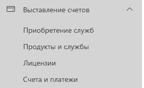

# Назначение лицензий Microsoft Teams для учебных заведенийAssign Microsoft Teams licenses for EDU

Microsoft Teams — это объединенное цифровое рабочее пространство для бесед, содержимого и приложений.Microsoft Teams is a digital hub that brings conversations, content, and apps together in one place. Поскольку это пространство встроено в Office 365, интеграция с ним дает преимущества учебным заведениям, знакомым с приложениями и службами Office.Because it's built on Office 365, schools benefit from integration with their familiar Office apps and services. Microsoft Teams может использоваться в вашем учебном заведении для того, чтобы создавать аудитории для совместной работы, объединяться в профессиональные образовательные сообщества и общаться с персоналом учебного заведения с помощью единого интерфейса в Office 365 для образовательных учреждений.Your institution can use Microsoft Teams to create collaborative classrooms, connect in professional learning communities, and communicate with school staff all from a single experience in Office 365 for Education.

Чтобы начать работу, ИТ-администратору необходимо через центр администрирования Microsoft 365 [включить Microsoft Teams для вашего учебного заведения](https://docs.microsoft.com/microsoft-365/education/intune-edu-trial/enable-microsoft-teams).To get started, IT administrators need to use the Microsoft 365 Admin Center to [enable Microsoft Teams for your school](https://docs.microsoft.com/microsoft-365/education/intune-edu-trial/enable-microsoft-teams).
После подключения необходимо назначить лицензии учетным записям пользователей, чтобы ваши преподаватели, сотрудники и учащиеся получили доступ к службам Office 365, в том числе Microsoft Teams.Once complete, you must assign licenses to user accounts so your faculty, staff, and students can access Office 365 services, such as Microsoft Teams.

Назначать лицензии для учетных записей пользователей можно либо для каждой по отдельности, либо автоматически через членство в группах.You can assign licenses to user accounts either individually or automatically through group membership. В этой статье приводится пошаговое описание процесса назначения лицензий Office 365 для отдельного пользователя или для небольшого числа учетных записей пользователей через Центр администрирования Microsoft 365.This article will walk you through how to assign Office 365 licenses to an individual or a small set of user accounts via the Microsoft 365 admin center. О том, как назначать лицензии автоматически через членство в группах, можно узнать из указанных далее статей.To assign licenses automatically through group membership, see one of our supporting articles:

- [Office 365 PowerShellOffice 365 Powershell](https://docs.microsoft.com/office365/enterprise/powershell/assign-licenses-to-user-accounts-with-office-365-powershell)
- [Назначение лицензий пользователям в соответствии с членством в группах в Active DirectoryGroup-based Licensing in Active Directory](https://docs.microsoft.com/azure/active-directory/users-groups-roles/licensing-groups-assign)

Лицензии пользователям можно назначать на странице **Лицензии** или на странице **Активные пользователи**.You can assign licenses to users on either the **Licenses** page, or on the **Active Users** page. Выбор метода зависит от того, нужно ли назначить лицензии на продукты определенным пользователям или назначить пользователям лицензии на определенные продукты.Which method you use depends on whether you want to assign product licenses to specific users, or assign users licenses to specific products.

> [!NOTE]
> Если вы не используете новый Центр администрирования Microsoft 365, можно включить его с помощью переключателя **Попробовать новый Центр администрирования**, расположенного в верхней части главной страницы.If you're not using the new Microsoft 365 admin center, you can turn it on by selecting the **Try the new admin center** toggle located at the top of the Home page.

## Назначение лицензий пользователям на странице "Лицензии"Assign licenses to users on the Licenses page

> [!NOTE]
> Необходимо иметь права глобального администратора, администратора выставления счетов, администратора лицензий или администратора управления пользователями. Дополнительные сведения см. в статье [Роли администраторов в Office 365](https://docs.microsoft.com/microsoft-365/admin/add-users/about-admin-roles).You must be a Global admin, Billing admin, License admin, or User management admin. For more information, see [About Office 365 admin roles](https://docs.microsoft.com/microsoft-365/admin/add-users/about-admin-roles).

Через страницу **Лицензии** можно назначить лицензии на определенный продукт для не более чем 20 пользователей.When you use the **Licenses** page to assign licenses, you assign licenses for a specific product for up to 20 users. На странице **Лицензии** отображается список всех продуктов, на которые у вас есть подписки, а также общее количество лицензий для каждого продукта, количество назначенных и доступных лицензий.On the **Licenses** page, you see a list of all the products you have subscriptions for, together with the total number of licenses for each product, how many licenses are assigned, and how many are available.

1. В Центре администрирования выберите **Выставление счетов** > на странице[Лицензии](https://go.microsoft.com/fwlink/p/?linkid=842264).In the admin center, go to the **Billing** > [Licenses](https://go.microsoft.com/fwlink/p/?linkid=842264) page.

   
2. Выберите продукт, для которого нужно назначить лицензии.Select a product for which you want to assign licenses. Microsoft Teams входит в бесплатную версию SKU Office 365 A1 для учащихся.Microsoft Teams is part of the free Office 365 A1 for Students SKU.

   
3. Нажмите **Назначение лицензий**.Select **Assign licenses**.

   
4. В панели **Назначение лицензий пользователям** начните вводить имя, благодаря чему отобразится список имен.In the **Assign licenses to users** pane, begin typing a name, which should generate a list of names. Выберите среди результатов имя, которое вы ищете, и добавьте его к списку.Choose the name you're looking for from the results to add it to the list. Вы можете добавить до 20 пользователей одновременно.You can add up to 20 users at a time.

   
5. Выберите **Включение и отключение приложений и служб**, чтобы назначить или удалить доступ к определенным элементам, например, к Microsoft Teams.Select **Turn apps and services on or off** to assign or remove access to specific items, such as Microsoft Teams. Убедитесь в том, что выбраны **Microsoft Teams** и **Office в Интернете (для образовательных учреждений)**.Ensure **Microsoft Teams** and **Office for the web (Education)** are selected.
6. После завершения нажмите **Назначить**, а затем — **Закрыть**.When you're finished, select **Assign**, then select **Close**.

Изменение приложений и служб, к которым у пользователя есть доступ:To change the apps and services a user has access to:

1. Выберите строку с пользователем.Select the row that contains the user.
1. В области справа выберите приложения и службы, к которым нужно предоставить доступ, или отмените выбор, чтобы удалить соответствующий доступ.In the right pane, select or deselect the apps and services that you want to give access to, or remove access from.
1. После завершения нажмите **Сохранить**, а затем — **Закрыть**.When you're finished, select **Save**, then select **Close**.

## Назначение лицензий одному или нескольким пользователям на странице "Активные пользователи"Assign licenses to an individual or multiple users on the Active users page

1. В Центре администрирования откройте страницу **Пользователи**  >  [Активные пользователи](https://go.microsoft.com/fwlink/p/?linkid=834822).In the admin center, go to the **Users** > [Active users](https://go.microsoft.com/fwlink/p/?linkid=834822) page.

   
2. Установите флажки рядом с именем (именами) пользователя (пользователей), которому (которым) вы хотите назначить лицензии.Select the circles next to the name(s) of the user(s) you want to assign license(s) to.

   
3. Нажмите вверху **Управление лицензиями на продукты**.At the top select **Manage product licenses**.

   
4. На панели **Управление лицензиями на продукты** выберите **Добавить к имеющимся назначениям лицензий на продукты** > **Далее**.In the **Manage product licenses** pane, select **Add to existing product license assignments** > **Next**.

   
5. В области **Добавить к имеющимся продуктам** установите переключатель для лицензии, которую вы хотите назначить выбранным пользователям, в положение **Вкл.**.In the **Add to existing products** pane, switch the toggle to the **On** position for the license that you want the selected users to have. Убедитесь в том, что выбраны **Microsoft Teams** и **Office в Интернете (для образовательных учреждений)**.Ensure **Microsoft Teams** and **Office for the web (Education)** are selected.

   

   Пользователю (пользователям) по умолчанию автоматически назначаются все службы, связанные с этой лицензией (этими лицензиями).By default, all services associated with those license(s) are automatically assigned to the user(s). Вы можете ограничить доступные для пользователей службы.You can limit which services are available to the users. Для служб, которых не должно быть у пользователей, установите переключатель в положение **Выкл**.Switch the toggles to the **Off** position for the services that you don't want the users to have.
6. Внизу области выберите "Добавить" > "Закрыть".At the bottom of the pane, select Add > Close.
