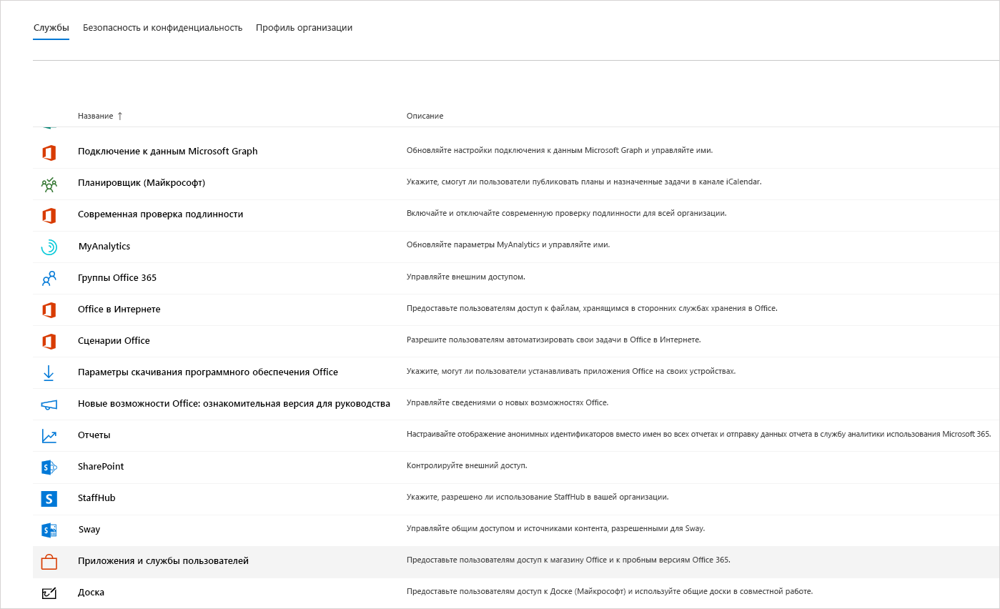
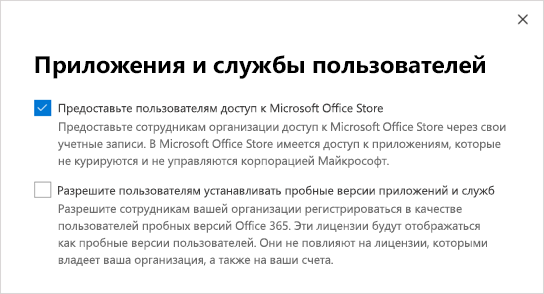
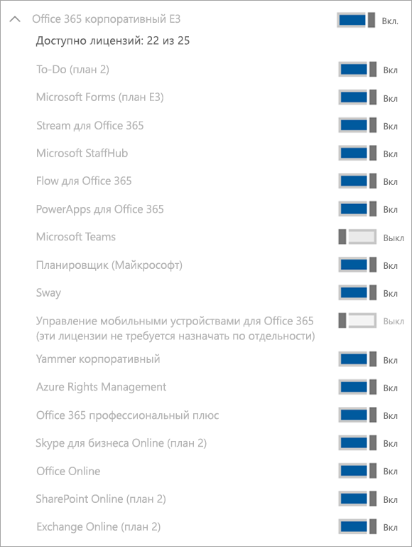

# Управление лицензией на Microsoft Teams Exploratory

Предложение Microsoft Teams Exploratory позволяет пользователям в вашей организации, у которых есть лицензия на Azure Active Directory (Azure AD), но нет лицензии на Teams, оформить ознакомительную лицензию на Teams. Администраторы могут включать и отключать эту функцию для пользователей в организации.

## Что включает предложение Teams Exploratory

Администратору будут представлены следующие планы обслуживания, входящие в предложение Teams Exploratory:

- Exchange Online (план 1)
- Flow для Microsoft 365 или Office 365
- MyAnalytics для анализа данных
- Microsoft Forms (план E1)
- Планировщик (Майкрософт)
- Поиск (Майкрософт)
- Microsoft StaffHub
- Microsoft Stream для SKU Microsoft 365 и Office 365 E1 1</1>
- Microsoft Teams
- Управление мобильными устройствами для Microsoft 365 или Office 365
- Приложения Office Mobile для Office 365
- Office Online
- Power Apps для Microsoft 365 или Office 365
- SharePoint Online (план 1)
- Sway
- To-Do (план 1)
- Доска (план 1)
- Yammer корпоративный

  1 Переход от использования Microsoft Stream к [OneDrive для бизнеса и SharePoint для записи собраний](tmr-meeting-recording-change.md) будет поэтапным. При запуске вы сможете согласиться на использование этого интерфейса. В ноябре потребуется отказаться от использования, если вы хотите продолжить использование Stream. В начале 2021 года мы сделаем использование OneDrive для бизнеса и SharePoint для новых записей собраний обязательным для всех пользователей.

## Кто имеет право на использование

Пользователи соответствуют критериям Teams Exploratory, если они:

- Имеют адрес электронной почты с управляемым доменом Azure AD.
- Входят в состав клиента с платной подпиской.
- У вас нет действующей лицензии на Microsoft Teams.
- Не в клиенте, где была создана политика назначения лицензии.

У пользователей есть возможность зарегистрироваться для получения приложений и пробных версий (в Центре администрирования Microsoft 365). Дополнительные сведения см. в разделе [Управление предложением Teams Exploratory](#manage-the-teams-exploratory-experience) далее в этой статье.

## Кто не имеет права на использование

Пользователи не соответствуют критериям, если они:

- Пользователи, у которых в настоящее время есть платная или пробная лицензия Teams, либо у которых ранее была пробная лицензия
- Входят в состав клиента, который использовал/получил по крайней мере одно специальное предложение, связанное с COVID.

Ваша организация не может использовать это предложение, если вы являетесь клиентом партнера по синдикации или клиентом GCC, GCC High, DoD либо EDU.

## Регистрация для получения Teams Exploratory

Подходящие пользователи могут зарегистрироваться для получения предложения Teams Exploratory, выполнив вход в Teams в классической или веб-версии ([teams.microsoft.com](https://teams.microsoft.com)). В настоящее время включение предложения Exploratory в мобильной версии не поддерживается. При регистрации им будет автоматически назначена лицензия, и администратор клиента получит соответствующее уведомление по электронной почте, когда пользователь организации в первый раз запустит Teams Exploratory.

## Управление предложением Teams Exploratory

Предложение Teams Exploratory предназначено для активации отдельными пользователями, и вы не можете активировать его от имени сотрудников, являющихся конечными пользователями.

Предложение Teams Exploratory включает лицензию на Exchange Online, но она должна быть назначена пользователю администратором. Если у пользователя нет лицензии на Exchange, а администратор еще не назначил лицензию на Exchange Online, пользователь не сможет планировать собрания в Teams и использовать другие функции Teams.

Администраторы могут отключить возможность использования Teams Exploratory для пользователей в своей организации с помощью переключателя **Пробные версии приложений и служб**.

### Запрет на установку пользователями пробных версий приложений и служб

Вы можете отключить возможность установки пробных версий приложений и служб, чтобы пользователи не могли использовать Teams Exploratory.

1. В Центре администрирования Microsoft 365 выберите **Параметры** > **Параметры организации**, щелкните **Службы** и нажмите **Приложения и службы, лицензированные для отдельных пользователей**.

    

2. Снимите флажок **Разрешить пользователям устанавливать пробные версии приложений и служб**.

    

    > [!NOTE]
    > Если ваша организация не имеет права на использование Teams Exploratory, параметр **Разрешить пользователям устанавливать пробные версии приложений и служб** будет отсутствовать.

### Управление доступностью для пользователя с лицензией, включающей Teams

Пользователь, которому назначена лицензия, включающая Teams, не имеет права на использование Teams Exploratory. Если план обслуживания Teams включен, пользователь может выполнить вход в систему и использовать Teams. Если план обслуживания отключен, пользователь не может выполнить вход в систему и возможности Teams Exploratory ему недоступны. У вас должны быть права администратора.

Отключение доступа к Teams:

1. В Центре администрирования Microsoft 365 выберите **Пользователи** > **Активные пользователи**.

2. Установите флажок рядом с именем пользователя.

3. В правой части строки **Лицензии на продукты** щелкните ссылку **Изменить**.

4. В области **Лицензии на продукты** установите переключатель в положение **Выкл**.

    

### Управление доступностью Teams для пользователей, уже использующих Teams Exploratory

Если пользователь использует предложение Teams Exploratory, вы можете отключить его, удалив лицензию или план обслуживания. У вас должны быть права администратора.

Чтобы отключить лицензию на Teams Exploratory, выполните указанные ниже действия.

1. В Центре администрирования Microsoft 365 выберите **Пользователи** > **Активные пользователи**.

2. Установите флажок рядом с именем пользователя.

3. В правой части строки **Лицензии на продукты** щелкните ссылку **Изменить**.

4. В области **Лицензии на продукты** установите переключатель для лицензии на это предложение в положение **Выкл**.

    > [!NOTE]
    > Переключатель для Teams Exploratory отобразится после того, как первый пользователь в организации запустит это предложение.

### Управление Teams для пользователей с лицензией на Teams Exploratory

Управление пользователями, у которых есть лицензия Teams Exploratory, аналогично управлению пользователями с обычной платной лицензией. Дополнительные сведения см. в разделе [Управление параметрами Teams в организации](enable-features-office-365.md).

### Перевод пользователей с Teams Exploratory

Чтобы перевести пользователей с Teams Exploratory, у вас должны быть права администратора. Дополнительные сведения см. в разделе [Перевод пользователей с пробной версии Teams Exploratory](upgrade-from-teams-exploratory.md).

> [!NOTE]
> Если срок действия лицензии на Teams Exploratory закончится и пользователь сразу не перейдет на подписку, включающую Teams, он потеряет доступ к Teams после 30 дней льготного периода. Еще через 30 дней данные удаляются. Пользователь по-прежнему будет существовать в Azure Active Directory. После назначения новой лицензии пользователю, чтобы повторно включить функции Teams, содержимое продолжит существовать, если пользователь будет добавлен в течение льготного периода.

### Удаление лицензии на Teams Exploratory

- Если вы хотите удалить эту лицензию с помощью PowerShell, см. статью [Использование PowerShell в Office 365 для удаления лицензий из учетных записей пользователей](/office365/enterprise/powershell/remove-licenses-from-user-accounts-with-office-365-powershell)

- Если вы хотите удалить эту лицензию на портале администрирования, см. статью [Удаление пользователя из организации](/microsoft-365/admin/add-users/delete-a-user)

## Что такое политика хранения данных

См. [Сведения о подписке на Microsoft 365](/microsoft-365/commerce/subscriptions/what-if-my-subscription-expires?view=o365-worldwide).

## Срок действия предложения Teams Exploratory

Версия Teams Exploratory доступна в качестве подписки на 12 месяцев (с первоначальной регистрации пользователя) для всех новых клиентов. Новая подписка на версию Teams Exploratory начинается, когда первый пользователь в организации регистрируется в Teams Exploratory, и истекает через 12 месяцев. Ко всем пользователям в одном клиенте применяется одинаковая дата окончания 12-месячного периода, который начинается с даты регистрации первого пользователя.

> [!NOTE]
> Дата окончания взаимодействия настраивается на уровне организации, то есть она будет применена ко всем пользователям в этой организации. Например, Пользователь 1 регистрирует подписку 1 января 2021 года. Это устанавливает дату окончания подписки — 31 декабря 2021 года. Другой пользователь, Пользователь 2, регистрирует подписку 1 октября 2021 года. Пользователь 2 может использовать версию Teams Exploratory в течение двух месяцев, так как дата окончания установлена на 31 декабря 2021 года, поскольку это подписка той же организации, что у Пользователя 1.

### Что следует сделать администраторами по окончании 12 месяцев использования версии Teams Exploratory

По окончании подписки на 12 месяцев администраторам следует перевести всех пользователей версии Teams Exploratory на платную лицензию, в которую входит Microsoft Teams. Это необходимо сделать до окончания действия подписки на версию Teams Exploratory, чтобы не прерывать работу пользователей.

> [!NOTE]
> Возможность запуска клиентами новых лицензий на пробную версию Exploratory будет отключена и заблокирована в течение 3 месяцев после истечения срока действия предыдущей лицензии на пробную версию Exploratory.

Дополнительные сведения см. в разделе [Перевод пользователей с Teams Exploratory](#upgrade-users-from-teams-exploratory) выше в этой статье.
