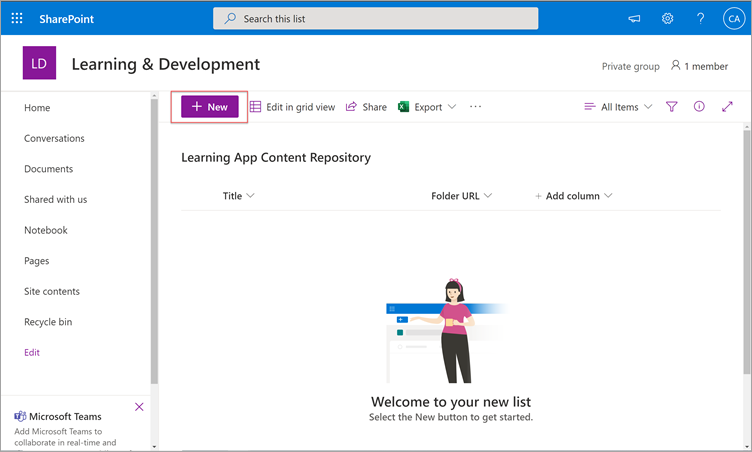
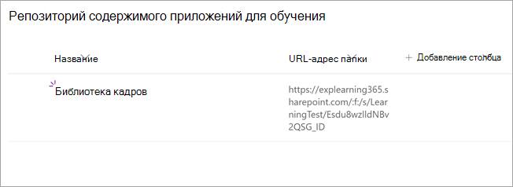
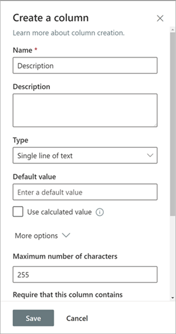
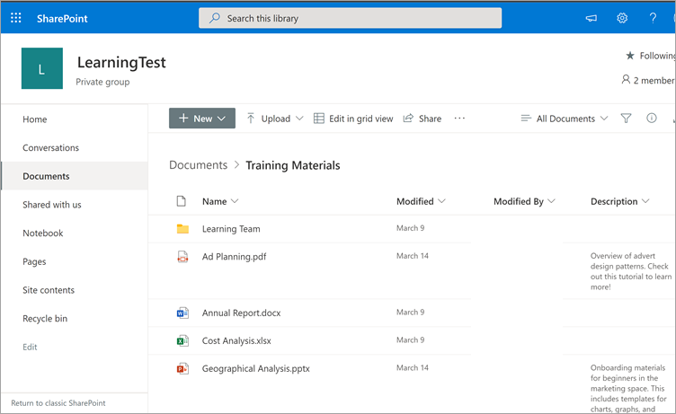

# Установка, управление и назначение разрешений для Microsoft Viva Learning (частная предварительная версия)

*В этой статье содержится предварительная версия программы Microsoft Viva Learning, которая находится в закрытой предварительной версии.*

Microsoft Viva Learning (частная предварительная версия) позволяет командам и отдельным людям в организации сделать обучение естественным в их дни. Приложение создает центр в Teams, где сотрудники могут делиться, назначать и изучать материалы из библиотек контента в организации.

Администраторы устанавливают разрешения и позволяют изучать источники контента для Viva Learning (частная предварительная версия). Контент для обучения может включать LinkedIn Learning, Microsoft Learn, обучение по Microsoft 365, контент организации, хранящаяся в SharePoint Online, и сторонние поставщики, поддерживаемые Viva Learning (частная предварительная версия).

## Роли администраторов

Чтобы настроить Viva Learning (приватную предварительную версию), вам потребуется:

- Администратор Microsoft Teams
- Глобальный администратор Microsoft 365 или администратор SharePoint
- Администратор знаний — новая роль в Центре администрирования Microsoft 365, которую можно навести на любого человека в организации. Эта роль управляет источниками учебного контента организации через Центр администрирования Microsoft 365. 

> [!TIP]
> Администратор знаний должен быть технически технически в меру и иметь существующие учетные данные администратора SharePoint, предпочтительно тот, кто хорошо знакомы с образованием, обучением, обучением или опытом работы сотрудников в организации.
 
## Управление Viva Learning (частная предварительная версия) в Центре администрирования Teams

Администратор Teams устанавливает Viva Learning (приватную предварительную версию) из магазина приложений, а затем применяет политики настройки, управления и разрешений через Центр администрирования Teams.

### Управление настройками Viva Learning (приватная предварительная версия)

Для выполнения этих задач необходимо быть администратором в Центре администрирования Teams.

Чтобы управлять настройками Viva Learning, выполните следующие действия:

1. В левой области навигации Центра администрирования Teams перейдите в **приложения Teams Управление**  >  **приложениями.**

   

2. На странице **Управление приложениями** в поле поиска введите *обучение,* чтобы найти приложение Teams Learning (приватная предварительная версия).

   

3. На странице **Обучения:**
   1. В **области Состояние** выберите **Разрешено,** чтобы включить приложение.
   2. На **вкладке Параметры** в разделе **Параметры** приложения перейдите в Центр администрирования Microsoft 365 для настройки источников обучающего контента.

   

4. После **настройки параметров** приложения  перейдите в статью Разрешения и политики настройки, чтобы предоставить разрешения сотрудникам, которые должны иметь доступ к приложению в рамках участия вашей организации в закрытой предварительной версии.

> [!NOTE]
>  Если ваша организация входит в программу "Звонок 4.0" в рамках программы Tap100 Teams, вам может потребоваться сделать следующее, чтобы утвержденные пользователи в Ring 3.0 могли получать доступ к Viva Learning (частная предварительная версия).

В рамках закрытой предварительной версии Viva Learning (частная предварительная версия) выпущена в ring 3.0. Если ваша организация использует Ring 4.0, вы не увидите приложение в магазине приложений. Чтобы проверить приложение, необходимо создать настраиваемую политику разрешений для приложений, установить для нее разрешение "Разрешить все приложения" и назначить ее пользователям, утвержденным в 3.0. 

   

## Настройка источников обучающего контента в Центре администрирования Microsoft 365

Администраторы Центра администрирования Microsoft 365 (сами по себе или путем назначения роли администратора знаний выбранным лицам в организации) могут управлять настройками, связанными с Viva Learning (частная предварительная версия), и настраивать источники содержимого для обучения.

Администратор выбирает, какие дополнительные источники обучающего контента (например, SharePoint или поддерживаемые сторонние источники поставщиков контента) будут доступны пользователям Viva Learning (частная предварительная версия). Затем администратор настраивает эти источники, чтобы убедиться, что содержимое доступно для поиска и обнаружения и может быть доступно сотрудникам, которые используют Viva Learning (личную предварительную версию).

> [!NOTE]
>  Пользователи могут в браузере или внедренном просмотреть учебные программы, не связанные с Microsoft и LinkedIn Learning Pro. На это настроенное обучение лагаются отдельные условия лицензии, конфиденциальности и обслуживания между вашей организацией и третьей стороной, а не условия Viva Learning (частная предварительная версия). Прежде чем выбирать этот тип обучения, убедитесь, что у вас есть соглашение для вашей организации и пользователей.

### Назначение роли администратора знаний [Необязательно]

Для выполнения этих задач вы должны быть глобальным администратором Microsoft 365.

Чтобы назначить администратора знаний для Viva Learning, выполните следующие действия:

1.  В левой области навигации Центра администрирования Microsoft 365 перейдите в меню **Роли**.

2.  На странице **Роли** на вкладке **Azure AD** выберите **Администратор знаний**.
 
3.  На странице **"Администратор знаний"** в разделе "Назначенные администраторы" выберите Добавить **,** а затем добавьте нужного человека. 

### Настройка параметров источников обучающего контента для Viva Learning (частная предварительная версия)

Для выполнения этих задач вы должны быть глобальным администратором Microsoft 365 или администратором знаний.

Чтобы настроить параметры для учебных источников контента в Viva Learning, выполните следующие действия:

1.  В левой области навигации Центра администрирования Microsoft 365 перейдите в **настройки**  >  **параметров организации**.

2.  На странице **параметров организации** на вкладке **Службы** выберите **Приложение обучения (предварительная версия).**

     

3.  На панели **Приложения обучения (предварительная версия)** выберите источники учебного контента, которые вы хотите настроить для организации, а затем выберите **Сохранить**.

     

Некоторые из них будут включены по умолчанию. В их числе:

- LinkedIn Learning (бесплатное содержимое)
- Microsoft Learn
- Обучение microsoft 365

> [!NOTE]
> Если у вашей организации есть подписка на LinkedIn Learning Standard или Pro, репозиторий содержимого будет разблокирован для сотрудников организации. Использовать весь репозиторий контента смогут только те сотрудники, у которых есть разрешение.  Другие источники может потребоваться включить или настроить вручную. Учебные источники, не от корпорации Майкрософт, лицензируются отдельно между вашей организацией и третьей стороной. Вам потребуется подтвердить, что вы подписались на обучение для вас и ваших пользователей.

Чтобы включить или отключить учебный источник контента, выберите его рядом с источником. Если источник включен, будет виден контрольный знак.

## Настройка SharePoint в качестве источника содержимого для обучения

Вы можете настроить SharePoint в качестве источника обучающего контента, чтобы сделать контент своей организации доступным в Viva Learning (частная предварительная версия).

### Обзор

Администратор знаний (или глобальный администратор) предоставляет URL-адрес сайта, на котором служба обучения может создать пустое централизованное расположение (репозиторий контента для приложений для обучения) в виде структурированного списка SharePoint. С помощью этого списка ваша организация может содержать ссылки на папки SharePoint разных компаний, содержащие учебный контент. Администраторы отвечают за сбор и администрирование списка URL-адресов папок. Эти папки должны включать только содержимое, которое можно сделать доступным в Viva Learning (при личной предварительной версии).

Viva Learning (частная предварительная версия) поддерживает следующие типы документов:

- Word, PowerPoint, Excel, PDF
- Аудио (M4a)
- Видео (MOV, MP4, AVI)

Дополнительные сведения см. в [документации SharePoint Online.](https://docs.microsoft.com/sharepoint/introductionlink) 

### Разрешения

URL-адреса папок библиотеки документов можно собирать с любого сайта SharePoint в организации. Viva Learning (частная предварительная версия) следует за всеми существующими разрешениями на содержимое. Таким образом, в Viva Learning (частная предварительная версия) можно искать только содержимое, к которому у пользователя есть разрешение на доступ. Поиск будет содержимого в этих папках, но можно использовать только содержимое, к которому у отдельного сотрудника есть разрешения.

Удаление контента из репозитория организации в настоящее время не поддерживается.

Чтобы удалить непреднамеренно выгрузленное содержимое, выполните следующие действия:

1.  Чтобы ограничить доступ к библиотеке документов, выберите параметр **Показать действия,** а затем — **Управление доступом**.
     
     

2.  Удалите исходный документ в библиотеке документов.

Дополнительные сведения см. в разделе Общий доступ [и разрешения в современном использовании SharePoint.](https://docs.microsoft.com/sharepoint/modern-experience-sharing-permissions) 

### Служба обучения

Служба обучения использует предоставленные URL-адреса папок для получения метаданных из всего содержимого, храняного в этих папках. В течение 24 часов после того, как URL-адрес папки будет указан в централизованном репозитории, сотрудники смогут искать и использовать содержимое вашей организации в Viva Learning (частная предварительная версия). Все изменения контента, включая обновленные метаданные и разрешения, также будут применены в службе обучения в течение 24 часов.

### Настройка SharePoint в качестве источника

Для выполнения этих задач вы должны быть глобальным администратором Microsoft 365, администратором SharePoint или администратором знаний.

Чтобы настроить SharePoint как учебный источник контента в Viva Learning (предварительная версия), выполните следующие действия:

1.  В левой области навигации Центра администрирования Microsoft 365 перейдите в **настройки**  >  **параметров организации**.
 
2.  На странице **параметров организации** на вкладке **Службы** выберите **Приложение обучения (предварительная версия).**

     

3.  На панели Приложения обучения **(предварительная версия)** в **группе SharePoint** укайте URL-адрес сайта SharePoint, на котором вы хотите создать централизованный репозиторий Viva Learning.

     

4.  Список SharePoint создается автоматически на предоставленного сайте SharePoint.

     

     В левой области навигации на сайте SharePoint выберите Содержимое сайта  >  **Репозиторий содержимого приложений для обучения**. 

      

5. На странице **Репозиторий** содержимого для учебных приложений заполнять список SharePoint URL-адресами папок обучающего контента.

   1. Выберите **"Новые",** чтобы **просмотреть панель "Новый элемент".** 

       
 
   2. На панели **Новый элемент** в поле **Название** добавьте название каталога по вашему выбору. В поле **URL-адрес папки** добавьте URL-адрес в папку обучающего контента. Нажмите **Сохранить**.

       

   3. На **странице Репозиторий** содержимого для учебных приложений обновлен новый учебный контент.

       

> [!NOTE]
> Чтобы обеспечить более широкий доступ к репозиторию содержимого для приложений для обучения, ссылка на список скоро появится в интерфейсе Viva Learning (приватная предварительная версия), где пользователи могут запросить доступ и в конечном итоге помочь заполнить список. Владельцы сайтов и глобальные администраторы должны будут предоставить доступ к списку. Access относится только к списку и не относится к сайту, на котором хранится список.

### Курсор библиотеки URL-адресов папок

Метаданные по умолчанию (например, дата изменения, созданные по имени документа, типу контента и названию организации) автоматически взламыются в Viva Learning (приватная предварительная версия) с помощью API Microsoft Graph.
 
Для улучшения общего обнаружения контента и его релевантности для поиска рекомендуем добавить **столбец Описание.**

Чтобы добавить **столбец Описание** на страницу библиотеки документов, выполните указанные здесь действия.

1.  На странице **Документы выберите** добавить **столбец**.

2. Выберите параметр **Показать действия,** а затем — Одна **строка текста**.

     

3. На панели **Создание столбца** в поле **Имя** в добавьте описательное имя столбца. Нажмите **Сохранить**.

     
 
4. На странице **Документы в** столбце **Описание** добавьте настраиваемые описания для каждого элемента. Если описание не задается, Viva Learning (частная предварительная версия) предоставит сообщение по умолчанию, в которое будет выделено содержимое из вашей библиотеки SharePoint. 

     
 
