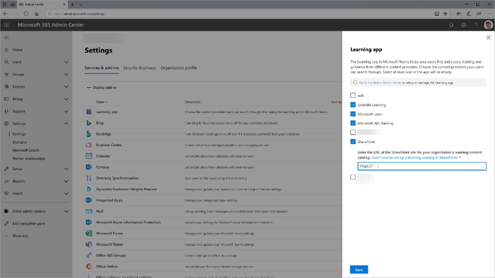
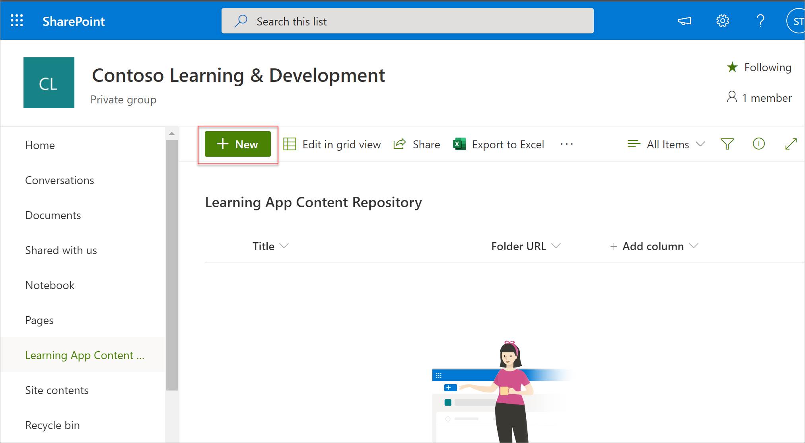

# Установка, управление и назначение разрешений для приложения Teams Learning (частная предварительная версия)

*В этой статье содержатся предварительные сведения о приложении Teams Learning, которое доступно в закрытой предварительной версии.*

Приложение Microsoft Teams Learning (частная предварительная версия) позволяет группам и отдельным людям в вашей организации сделать обучение естественным в их дни. Приложение создает центр в Teams, где сотрудники могут делиться, назначать и изучать материалы из библиотек контента в организации. Администраторы устанавливают разрешения и разрешая источники содержимого для обучения приложению. Учебный контент может включать в себя учебные материалы LinkedIn Learning, Microsoft Learn, обучение по Microsoft 365, контент вашей организации, хранящаяся в SharePoint Online, и сторонние поставщики, поддерживаемые приложением.

Чтобы настроить приложение Teams Learning (личную предварительную версию), необходимо включить:

-   Администратор Центра администрирования Teams
-   Администратор Центра администрирования Microsoft 365 (глобальный администратор)
-   Администратор знаний (новая роль в Центре администрирования Microsoft 365, которую глобальный администратор (или администратор Microsoft 365) может назначить любому администратору в организации. Эта роль управляет источниками контента для обучения организации через Центр администрирования Microsoft 365.) 

## Управление приложением "Обучение Teams" (частная предварительная версия) в Центре администрирования Teams

Администратор Teams устанавливает приложение Teams Learning (личную предварительную версию) из магазина приложений и применяет политики настройки, управления и разрешений через Центр администрирования Teams.

### Управление приложением для обучения Teams (частная предварительная версия)

Для управления настройками приложения выполните следующие действия:

1. В левой области навигации Центра администрирования Microsoft Teams перейдите в приложение **Teams**  >  **"Управление приложениями".**

   

2. На странице **"Управление приложениями"** в поле поиска введите *"Обучение",* чтобы найти приложение Teams Learning (предварительная версия).

   

3. На странице **обучения:**
   1. В **области "Состояние"** **выберите "Разрешено",** чтобы включить приложение.
   2. На **вкладке "Параметры"** в разделе "Параметры приложения" перейдите в Центр администрирования Microsoft 365, чтобы настроить источники содержимого для обучения. 

   

4. После **настройки** параметров приложения  перейдите к настройкам "Разрешения" и "Политики настройки", чтобы предоставить сотрудникам доступ к приложению в рамках участия вашей организации в закрытой предварительной версии.

> [!NOTE]
>  Если ваша организация входит в круг 4.0 в рамках программы Teams TAP100, вам может потребоваться сделать следующее, чтобы включить утвержденных пользователей в Ring 3.0 для доступа к приложению Teams Learning (частная предварительная версия).

В рамках личной предварительной версии приложение Teams Learning (частная предварительная версия) выпущено в ring 3.0. Если ваша организация находится в ring 4.0, вы не увидите приложение в магазине приложений. Чтобы проверить приложение, необходимо создать настраиваемую политику разрешений для приложений, установить в ней разрешение для всех приложений и назначить ее пользователям, утвержденным в Ring 3.0. 

   

## Настройка источников обучающего контента в Центре администрирования Microsoft 365

Администраторы Центра администрирования Microsoft 365 (самостоятельно или путем назначения роли администратора знаний выбранным лицам в организации) могут управлять настройками, связанными с приложением Teams Learning (личной предварительной версией), и настраивать источники содержимого для обучения.

> [!TIP]
> Администратору знаний следует быть техническими и иметь существующие учетные данные администратора SharePoint, желательно, чтобы тот, кто хорошо разбирался в образовании, обучении, обучении или опыте работы сотрудников в организации.
 
Администратор выбирает, какие из источников обучающего контента (например, LinkedIn Learning или SharePoint) будут доступны в приложении. Затем администратор настраивает эти источники, чтобы контент был доступен для поиска и обнаружения и был доступен сотрудникам, которые используют приложение.

### Назначение роли администратора знаний [Необязательно]

Эти действия должен выполнить администратор Центра администрирования Microsoft 365.

1.  В левой области навигации Центра администрирования Microsoft 365 перейдите к области **"Роли".**

2.  На странице **"Роли"** на вкладке **Azure AD** выберите **"Администратор знаний".**
 
3.  На странице **"Администратор знаний"** в разделе **"Назначенные** администраторы" выберите "Добавить", а затем добавьте нужного человека.

### Настройка параметров источников обучающего контента для приложения

Эти действия должны выполняться администратором Microsoft 365 или администратором знаний.

1.  В левой области навигации Центра администрирования Microsoft 365 перейдите в настройки  >  организации.

2.  На странице **"Параметры"** на вкладке "& **Службы"** выберите приложение **"Обучение".**

   

3.  На панели **приложения "Обучение"** выберите источники учебных материалов, которые вы хотите настроить для организации, и выберите **"Сохранить".**

   

Некоторые из всех источников обучения будут включены по умолчанию. В их числе:

- LinkedIn Learning (бесплатное содержимое)
- Microsoft Learn
- Обучение по Microsoft 365

> [!NOTE]
> Если у вашей организации есть подписка на LinkedIn Learning Стандартный или Pro, репозиторий контента будет разблокирован для сотрудников организации. Использовать весь репозиторий контента смогут только те сотрудники, у которых есть разрешение.

Другие источники может потребоваться включить или настроить вручную. Источники обучения, не от корпорации Майкрософт, лицензируются отдельно между вашей организацией и третьими сторонами. Вам потребуется подтвердить, что вы подписались на их обучение для вас и ваших пользователей.

Чтобы включить или отключить источник содержимого для обучения, выберите его, чтобы включить или отключить его. Если источник включен, будет виден знак проверки.

## Настройка SharePoint в качестве источника содержимого для обучения

SharePoint можно настроить в качестве источника содержимого для обучения в приложении Teams Learning (предварительная версия) в Центре администрирования Microsoft 365.

### Обзор

Администратор знаний предоставляет URL-адрес сайта, на котором служба обучения может создать пустой централизованный репозиторий контента для обучения в виде структурированного списка SharePoint. Организация может использовать этот список для разных ссылок на папки SharePoint разных компаний, содержащие учебный контент. Администраторы отвечают за сбор и просмотр списка URL-адресов папок. Эти папки должны включать только содержимое, которое можно сделать доступным в приложении Teams Learning (частная предварительная версия).

### Разрешения

URL-адреса папок можно собрать на любом сайте SharePoint в организации. Поиск будет использоваться в любом содержимом в этих папках, но будет использоваться только тот контент, к которому у конкретного сотрудника есть разрешения.
 
### Служба обучения

Служба обучения использует предоставленные URL-адреса папок для получения метаданных из всего содержимого, храняного в этих папках. В течение 24 часов после того, как url-адрес папки будет указан в централизованном репозитории, сотрудники смогут искать и использовать содержимое компании в приложении. Удаление контента из репозитория на этом этапе не поддерживается. Непреднамеренно выставляемый контент можно удалить только путем ссылки нового URL-адреса сайта SharePoint в Центре администрирования Microsoft 365.

### Настройка SharePoint в качестве источника

Эти действия должны выполняться администратором Microsoft 365 или администратором знаний.

1.  В левой области навигации Центра администрирования Microsoft 365 перейдите в меню **"Параметры".**
 
2.  На странице **"Параметры"** на вкладке "& **Службы"** выберите приложение **"Обучение".**

   

3.  На панели **приложения "Обучение"** в url-адрес сайта SharePoint, где вы хотите создать централизованный репозиторий.

   

4.  Список SharePoint создается автоматически на сайте SharePoint предоставленной организации. В левой области навигации сайта SharePoint выберите репозиторий контента **для обучения.** 

   

 
5. На странице **"Репозиторий контента** для обучения" заполнять список SharePoint URL-адресами папок учебных материалов.

   1.   Выберите **"Новое",** чтобы **просмотреть панель "Новый элемент".** 

   
 
   2.   На панели **"Новый элемент"** в поле **"Название"** добавьте название каталога по вашему выбору. В поле **"URL-адрес папки"** добавьте URL-адрес в папку содержимого для обучения. Выберите **"Сохранить".**

   

   3. На странице "Репозиторий контента для учебных приложений" будет обновлено новое содержимое для обучения.

   

 

