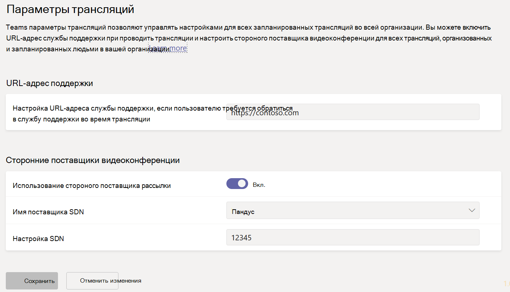
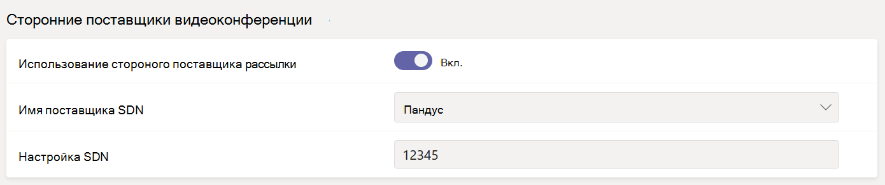

# <a name="configure-live-event-settings-in-microsoft-teams"></a>Настройка параметров трансляции в Microsoft Teams

Используйте параметры трансляций Teams, чтобы настроить параметры для трансляций, проводимых в вашей организации. Вы можете настроить URL-адрес поддержки и стороннего поставщика услуг распространения видео. Эти параметры применяются ко всем трансляциям, созданным в вашей организации.

Вы можете легко управлять этими параметрами в Центре администрирования Microsoft Teams. В области навигации слева перейдите в **раздел Параметры трансляции** >  **собраний**.



## <a name="set-up-event-support-url"></a>Настройка URL-адреса поддержки событий

Этот URL-адрес отображается участникам трансляции. Добавьте URL-адрес поддержки для своей организации, чтобы предоставить участникам возможность обратиться в службу поддержки во время трансляции.

### <a name="using-the-microsoft-teams-admin-center"></a>С помощью Центра администрирования Microsoft Teams

1. В области навигации слева перейдите в **раздел Параметры трансляции** >  **собраний**.
2. В разделе **URL-адрес службы поддержки** введите URL-адрес службы поддержки вашей организации.

    

### <a name="using-windows-powershell"></a>Использование Windows PowerShell

Выполните следующее:

```PowerShell
Set-CsTeamsMeetingBroadcastConfiguration -SupportURL “{your URL}”
```

Дополнительные сведения см. в разделе [Set-CsTeamsMeetingBroadcastConfiguration](/powershell/module/skype/set-csteamsmeetingbroadcastconfiguration?view=skype-ps&preserve-view=true).

## <a name="configure-a-third-party-video-distribution-provider"></a>Настройка стороннего поставщика услуг распространения видео

Если вы приобрели и настроили решение программно-определяемой сети (SDN) или решение корпоративной сети доставки содержимого (eCDN) через партнера майкрософт по доставке видео, настройте поставщика для трансляций в Teams.

### <a name="using-the-microsoft-teams-admin-center"></a>С помощью Центра администрирования Microsoft Teams

1. В области навигации слева перейдите в **раздел Параметры трансляции** >  **собраний**.
2. В разделе **Сторонние поставщики видеораспространителя** выполните следующие действия.

    

    - **Сторонний поставщик рассылки** Включите этот параметр, чтобы включить стороннего поставщика видеораспространителя.
    - **Имя поставщика SDN** Выберите поставщика, который вы используете.
    - **Конфигурация SDN** Введите сведения о конфигурации SDN.

### <a name="using-windows-powershell"></a>Использование Windows PowerShell

Получите идентификатор лицензии или маркер API и шаблон API от вашего контакта поставщика, а затем выполните одно из следующих действий в зависимости от используемого поставщика:

**ECDN Майкрософт**
```PowerShell
Set-CsTeamsMeetingBroadcastConfiguration -AllowSdnProviderForBroadcastMeeting $True -SdnProviderName microsoft
```
**Hive** 
```PowerShell
Set-CsTeamsMeetingBroadcastConfiguration -AllowSdnProviderForBroadcastMeeting $True -SdnProviderName hive -SdnLicenseId {license ID GUID provided by Hive} -SdnApiTemplateUrl “{API template URL provided by Hive}”
```
**Kollective** 
```PowerShell
Set-CsTeamsMeetingBroadcastConfiguration -AllowSdnProviderForBroadcastMeeting $True -SdnProviderName kollective -SdnApiTemplateUrl "{API template URL provided by Kollective}" -SdnApiToken {API token GUID provided by Kollective}
```
**Riverbed** 
```PowerShell
Set-CsTeamsMeetingBroadcastConfiguration -AllowSdnProviderForBroadcastMeeting $True -SdnProviderName riverbed -SdnApiTemplateUrl "{API template URL provided by Riverbed}" -SdnApiToken {API token GUID provided by Riverbed}
```
**Ramp** 
```PowerShell
Set-CsTeamsMeetingBroadcastConfiguration -AllowSdnProviderForBroadcastMeeting $True -SdnProviderName ramp -SdnRuntimeConfiguration "{Configuration provided by RAMP}"
```

Дополнительные сведения см. в разделе [Set-CsTeamsMeetingBroadcastConfiguration](/powershell/module/skype/set-csteamsmeetingbroadcastconfiguration?view=skype-ps&preserve-view=true).

> [!NOTE]
> Если вы планируете создавать трансляции с помощью внешнего приложения или устройства, вам также потребуется [настроить поставщик eCDN](../teams-stream-ecdn.md).

>[!Note]
> Выбранное решение eCDN регулируется условиями обслуживания и политикой конфиденциальности выбранного стороннего поставщика, которые будут регулировать использование решения поставщика eCDN. На использование решения поставщика eCDN не распространяются условия корпоративного лицензирования Майкрософт или условия веб-служб. Если вы не согласны с условиями стороннего поставщика, не включайте решение eCDN в Microsoft Teams.

### <a name="related-topics"></a>См. также

- [Что такое прямые трансляции Teams?](what-are-teams-live-events.md)
- [Планирование трансляций Teams](plan-for-teams-live-events.md)
- [Настройка прямых трансляций Teams](set-up-for-teams-live-events.md)
