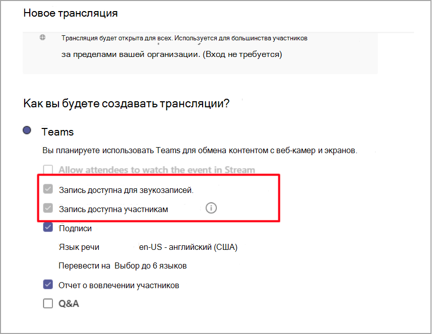

# Политики записи трансляций в Microsoft TeamsLive event recording policies in Microsoft Teams

У вас есть несколько вариантов записи трансляции Microsoft Teams.You have several options for recording a Microsoft Teams live event. Параметры записи за устанавливаются с помощью политик записи.The recording options are set using recording policies. В этой статье описаны различные параметры.This article describes the various settings.

Параметры записи задаются с помощью команды PowerShell [Set-CsTeamsMeetingBroadcastPolicy](/powershell/module/skype/set-csteamsmeetingbroadcastpolicy?view=skype-ps)The recording options are set using the PowerShell command [Set-CsTeamsMeetingBroadcastPolicy](/powershell/module/skype/set-csteamsmeetingbroadcastpolicy?view=skype-ps)

## Планирование и поведение вариантовScheduling and option behaviors

При планировании записи трансляции доступны два параметра организатора:There are two organizer options while scheduling a live event recording:

- Запись доступна для звукозаписей и звукозаписей.Recording available for producers and presenters

  - Файл записи: предоставляет файл записи, который организаторы и организаторы могут скачать после окончания события.Recording file: Provides a recording file that producers and presenters can download after the event is over.

- Запись доступна участникамRecording available for attendees

  - DVR: цифровое видеореференцию позволяет участникам перемотать событие назад и приостановить егоDVR: A digital video recorder (DVR) allows attendees to rewind and pause during the event

  - VOD: видео по запросу (VOD) позволяет участникам следить за событием после его окончания.VOD: A video on demand (VOD) allows attendees to watch after the event is over

## Параметр политики трансляции записиBroadcast recording policy setting

В рамках политики трансляции можно включить или отключить запись трансляции.As part of the broadcast policy, there's a setting that you can toggle to turn recording on or off for a live event.

|                                 | Запись доступна для звукозаписей и звукозаписей.Recording available for producers and presenters | Запись доступна для участниковRecording available for attendees |
| ------------------------------- | ---------------------------------------------------- | ------------------------------------- |
| Всегда записыватьAlways record               | Отключено и выбраноDisabled and selected                                | Отключено и выбраноDisabled and selected         |
| Организатор может записывать или нетOrganizer can record or not | Включена и не выбрана по умолчаниюEnabled and not selected by default                  | Включена и не выбрана по умолчаниюEnabled and not selected by default   |
| Никогда не записыватьNever record               | Отключена и не выбранаDisabled and not selected                            | Отключена и не выбранаDisabled and not selected      |

Если для политики установлено параметр **"Всегда записывать",** на странице политики есть следующие параметры:When the policy is set to **Always record**, the policy page has the following selected options:

## Сохранение и сохранениеStorage and persistence behavior

| ДействиеOption                                       | StateState   | DVRDVR                                                   | VODVOD                                                     | ЗаписьRecording                |
| ------------------------------------------------ | ------------ | --------------------------------------------------------- | ----------------------------------------------------------- | ---------------------------- |
| Запись доступна для звукозаписей.Recording available to producers and presenters | выбраноSelected     | Доступен DVR, и актив служб мультимедиа Azure (AMS) хранится в течение 180 днейDVR is available and the Azure Media Services (AMS) asset is stored for 180 days | Участники могут получить доступ к событию и посмотреть егоAttendee can access and watch the event                     |                              |
|                                                  | Не выбраноNot Selected | Доступен DVR, актив AMS хранится 180 днейDVR is available and the AMS asset is stored for 180 days | Участник не получит доступ к событию после его окончанияAttendee won't get access into the event after it's over |                              |
||Отключено (не выбрано)Disabled (Not selected)|Доступен DVR, а актив AMS удаляется после событияDVR is available and the AMS asset is deleted after the event|Участник не получит доступ к событию после его окончанияAttendee won't get access into the event after it's over||
| Запись доступна для звукозаписей.Recording available to producers and presenters | выбраноSelected     |                                                           |                                                             | Создается и сохраняется MP4-An MP4 is created and stored |
|                                                  | Не выбраноNot Selected |                                                           |                                                             | Файл не созданNo file is created           |

### Статьи по темеRelated topics

- [Что такое трансляции Teams?What is Teams live events?](what-are-teams-live-events.md)
- [Планирование трансляций TeamsPlan for Teams live events](plan-for-teams-live-events.md)
- [Настройка параметров трансляций в TeamsConfigure live events settings in Teams](configure-teams-live-events.md)
- [Запись собраний в облаке TeamsTeams clouds meeting recording](../cloud-recording.md)