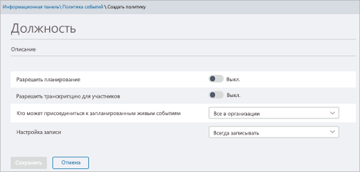

# Подготовка к трансляциям в Microsoft Teams

При подготовке трансляций требуется выполнить несколько действий.

## Шаг 1. Настройка сети для трансляций в Teams

Трансляции, проводимые в Teams, требуют [подготовки сети организации для Teams](../prepare-network.md).  

## Шаг 2. Покупка и назначение лицензий

Убедитесь, что у вас есть подходящие назначенные лицензии для тех, [кто может создавать и планировать трансляции](plan-for-teams-live-events.md#who-can-attend-create-and-schedule-live-events), а также для тех, [кто может просматривать их](plan-for-teams-live-events.md#who-can-watch-live-events).

## Шаг 3. Настройка политик трансляций

Политики трансляций используются для выбора пользователей организации, которые могут проводить трансляции, и функций, доступных в создаваемых трансляциях. Вы можете использовать политику по умолчанию или создать одну или несколько настраиваемых политик трансляций. Создав настраиваемую политику, назначьте ее пользователю или группам пользователей в организации.

> [!NOTE]
> Пользователи в вашей организации будут получать глобальную политику (по умолчанию в организации), если вы не создайте и не назначите ее. По умолчанию в глобальной политике включено планирование трансляций для пользователей Teams, отключены автоматические субтитры (транскрибирование), все пользователи организации могут присоединяться к трансляциям, а режим записи имеет значение "Всегда записывать".

### Создание и изменение политики трансляций

1. В левой области навигации центра администрирования Microsoft Teams политики  >  **трансляций собраний.**
2. Сделайте одно из следующих действий:

    - Если вы хотите изменить существующую политику по умолчанию, выберите **Глобальная (по умолчанию для организации)**.
    - Если вы хотите создать новую настраиваемую политику, выберите **добавить**.
    - Если вы хотите изменить настраиваемую политику, выберите ее и нажмите **Изменить**.

    Ниже перечислены параметры, которые можно изменить для соблюдения требований организации.

    

|Параметр  |Описание  |
|---------|---------|
|**Название**     |Это название политики, отображаемое на странице политик трансляций. Его длина не может превышать 64 символа, и оно не может содержать специальные символы.          |
|**Описание**    |Используйте эту область для добавления понятного описания политики.         |
|**Разрешить планирование**     |Включение этого параметра позволяет пользователям в организации создавать и планировать трансляции в Teams. Важно знать, что при необходимости планирования пользователями трансляций, организуемых с помощью внешнего приложения или устройства, вам потребуется выполнить дополнительные действия. Дополнительные сведения см. в разделе [Разрешение пользователям планировать трансляции, организованные с помощью внешнего приложения или устройства](#enable-users-to-schedule-events-that-were-produced-with-an-external-app-or-device).     |
|**Разрешить для участников транскрибирование** |Этот параметр можно использовать только для трансляций, организованных в Teams. Включение этого параметра позволяет участникам трансляции просматривать автоматические субтитры во время трансляции.         |
|**Кто может присоединиться к запланированным трансляциям**    |Выберите один из следующих вариантов:  **Все**. Пользователи могут создавать трансляции, в которых могут участвовать все, в том числе люди из-за пределов вашей организации. Этот параметр включает тип разрешения **Общедоступная** в Teams, когда пользователь планирует трансляцию.  **Все пользователи в организации**. Пользователи могут создавать трансляции, в которых могут участвовать сотрудники организации, а также [гостевые пользователи](../add-guests.md), добавленные в организацию. Пользователи не могут создавать трансляции, поддерживающие участие анонимных пользователей. Этот параметр включает тип разрешения **Вся организация** в Teams, когда пользователь планирует трансляцию.  **Определенные пользователи или группы**. Пользователи могут создавать трансляции, в которых могут участвовать только определенные пользователи или группы вашей организации. Пользователи не могут создавать трансляции, поддерживающие участие всех пользователей организации или анонимных пользователей. Этот параметр включает тип разрешения **Участники и группы** в Teams, когда пользователь планирует трансляцию.       |
|**Режим записи**        | Этот параметр можно использовать только для трансляций, организованных в Teams. Выберите один из следующих вариантов:    **Всегда записывать**. Трансляции, созданные пользователями, всегда записываются. После завершения трансляции участники команды трансляции могут скачать запись, а обычные участники — просмотреть трансляцию.   **Никогда не записывать**. Трансляции, созданные пользователями, никогда не записываются.  **Организатор может записывать**. Пользователи могут решать, записывать ли трансляцию. Если трансляция записана, после ее завершения участники команды трансляции могут скачать запись, а обычные участники — просмотреть трансляцию.

Эти действия также доступны с помощью Windows PowerShell. Дополнительные сведения см. в статье [Настройка политик трансляций Teams с помощью PowerShell](set-teams-live-events-policies-using-powershell.md).

### Назначение политики трансляций пользователям

Если вы создали настраиваемую политику трансляций, назначьте ее пользователям для ее применения.   [!INCLUDE [assign-policy](../includes/assign-policy.md)]

### Разрешение пользователям планировать трансляции, организованные с помощью внешнего приложения или устройства

Чтобы пользователи могли планировать события, произведенные с помощью внешнего приложения или устройства, необходимо также сделать следующее:

1. Включить Microsoft Stream для пользователей в организации. Служба Stream доступна в рамках Microsoft 365 подписки Office 365 подписки или в качестве автономных служб. Stream не входит в планы бизнес базовый и бизнес премиум. Дополнительные сведения см. в статье [Общие сведения о лицензировании Stream](/stream/license-overview).

   >[!Note]
   > Переход с использования Microsoft Stream на [OneDrive для бизнеса и SharePoint для записей собраний](../tmr-meeting-recording-change.md) будет поэтапным процессом. При запуске вы сможете согласиться на использование этого интерфейса. В ноябре вам потребуется отказаться от использования, если вы хотите продолжить применение Stream. В начале 2021 г. мы потребуем, чтобы все пользователи использовали OneDrive для бизнеса и SharePoint для новых записей собраний. Узнайте больше о том, как [**назначать лицензии**](https://support.office.com/article/Assign-licenses-to-users-in-Office-365-for-business-997596B5-4173-4627-B915-36ABAC6786DC) пользователям, чтобы пользователи могли получать доступ к Stream. Убедитесь, что поток не заблокирован для пользователей, как определено [**в этой статье.**](/stream/disable-user-organization)

2. Убедитесь, что у пользователей есть разрешение на создание трансляций в Stream. По умолчанию администраторы могут создавать трансляции с помощью внешнего приложения или устройства. Администратор Stream может [разрешить дополнительным пользователям создавать трансляции](/stream/live-event-administration#restrict-who-can-create-events) в Stream.

3. Убедитесь, что организаторы трансляций согласились с политикой компании, установленной администратором Stream. Если администратор Stream [установил политику правил компании](/stream/company-policy-and-consent) и требует, чтобы сотрудники приняли эту политику перед сохранением контента, пользователям потребуется это сделать перед созданием трансляции (с помощью внешнего приложения или устройства) в Teams. Перед развертыванием функции трансляций в организации убедитесь, что пользователи, которые будут создавать трансляции, согласились с этой политикой.

## Шаг 4. Настройка решения по распространению видео для трансляций в Teams

При воспроизведении видео трансляций используется потоковая передача с переменной скоростью (ABR). Но это однонаправленная передача, то есть каждый зритель получает собственный видеопоток из Интернета. В случае трансляций или видео, отправляемых в большое количество подразделений организации, зрителями может использоваться значительная часть пропускной способности подключения к Интернету. Для организаций, которые хотят сократить интернет-трафик при трансляциях, решения трансляций интегрированы с надежными партнерами Майкрософт по доставке видео, предлагающими программно-определяемые сети (SDN) или корпоративные сети доставки содержимого (eCDN). Эти платформы SDN/eCDN позволяют организациям оптимизировать пропускную способность сети, не жертвуя возможностями пользователей для просмотра. Наши партнеры помогают обеспечить более масштабируемую и эффективную рассылку видео в корпоративной сети.

**Приобретите и настройте решение за пределами Teams**. Получите экспертную помощь по масштабированию доставки видео, используя надежных партнеров Майкрософт по доставке видео. Прежде чем вы сможете включить поставщика видеосвязи для Teams, необходимо приобрести и настроить решение SDN/eCDN за пределами системы Teams.

Следующие решения SDN/eCDN предварительно интегрированы и могут быть настроены для использования со Stream.

- **Hive Streaming** предоставляет простое и эффективное решение для распространения корпоративных видеотрансляций и видео по запросу. Hive — это программное решение, не требующее дополнительного оборудования или пропускной способности, предоставляющее безопасный способ поддержки тысяч зрителей одновременно, не влияя на вашу сеть. Для клиентов, желающих ознакомиться с воздействием видео на их сеть перед приобретением решения SDN/eCDN, Hive Streaming также предоставляет браузерное решение аналитики для пользователей Майкрософт. [Подробнее](https://www.hivestreaming.com/partners/integration-partners/microsoft/).

- **Kollective** — это облачная платформа интеллектуального пирингового распространения, использующая существующую инфраструктуру сети для доставки контента в разных формах (потоковые видеотрансляции, видео по запросу, программные обновления, исправления для системы безопасности и т. д.) быстрее, надежнее и с меньшим использованием пропускной способности. Нашей безопасной платформе доверяют крупнейшие финансовые учреждения в мире. Благодаря отсутствию дополнительного оборудования обеспечивается простота настройки и обслуживания. [Подробнее](https://kollective.com/microsoft-pilot/).

- **Ramp OmniCache** обеспечивает сетевое распространение следующего поколения и удобную доставку видеоконтента в глобальных сетях, помогая организаторам трансляций оптимизировать пропускную способность сети и успешно осуществлять трансляции и потоковую передачу по запросу. Поддержка Ramp OmniCache для трансляций, организуемых Teams, ожидается в ближайшее время. [Подробнее](https://rampecdn.com).

- **Riverbed**— отраслевый стандарт оптимизации сети, который расширяет решения для ускорения Microsoft Teams и Stream.  Теперь Microsoft 365 пользователи могут с уверенностью ускорить 365-трафик, включая Teams и Stream, а также множество других ведущими корпоративными SaaS-службами для повышения производительности труда, где бы вы ни были. Teams и ускорение потока можно включить с помощью легкой настройки, которая дает все необходимое для обеспечения поддержки и постоянных инвестиций компании Riverbed.

> [!NOTE]
> Выбранное решение SDN или eCDN регулируется **условиями обслуживания и политикой конфиденциальности выбранного стороннего поставщика**, которые управляют использованием решения поставщика. На использование решения поставщика не распространяются условия программы корпоративного лицензирования Майкрософт и условия служб Microsoft Online Services. Если вы не согласны с **условиями стороннего поставщика**, не включайте решение в Teams.

После настройки решения SDN или eCDN вы можете настроить поставщика для трансляций в Teams.

## Дальнейшие действия

Перейдите к статье [Настройка параметров трансляций в Teams](configure-teams-live-events.md).

### Статьи по теме

- [Что такое трансляции Teams?](what-are-teams-live-events.md)
- [Планирование трансляций Teams](plan-for-teams-live-events.md)
- [Настройка параметров трансляций в Teams](configure-teams-live-events.md)