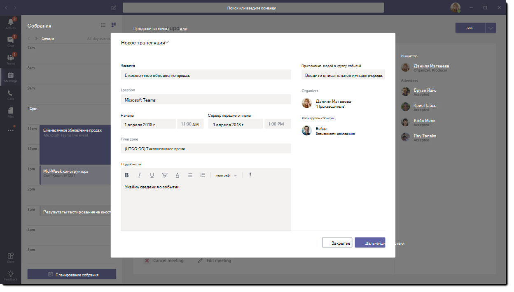
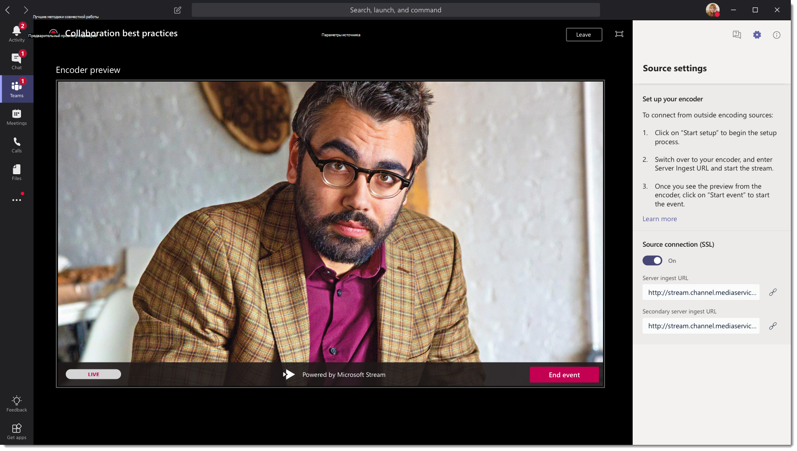
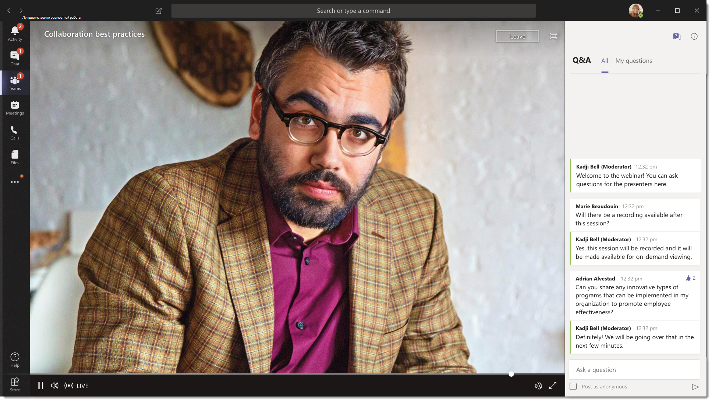

# Что такое трансляции Microsoft Teams

## Обзор

С помощью трансляций Teams пользователи в организации могут транслировать видео и содержимое собрания для большой аудитории в Интернете.

Трансляции Microsoft 365 выводят потоковое видео на новый уровень. Трансляции поощряют связь с участниками на протяжении всего взаимодействия с участниками до, во время и после трансляций. Вы можете создать трансляцию, где бы ни находились ваша аудитория, команда или сообщество, с помощью Teams или Yammer.  

Teams обеспечивает совместную работу в чате, звонки, собрания и трансляции, поэтому вы можете расширить аудиторию ваших собраний. Трансляции Teams — это расширение собраний Teams, которые позволяют пользователям транслировать видео и содержимое собрания для большой аудитории в Интернете. Трансляции предназначены для общения "один-ко-многим", когда организатор трансляции обеспечивает взаимодействие, а участие аудитории в первую очередь заключается в просмотре содержимого, которым делится организатор. Участники могут смотреть трансляцию или запись события в Yammer или Teams, а также взаимодействовать с выступающими с помощью модерации Q & A или беседы Yammer.

So, let's get started. First, take a look at the following diagram that shows high level components involved in Microsoft 365 live events and how they're connected.

> [!NOTE]
> Мы хотим подчеркнуть, что трансляции Teams, учитывая характер этой технологии, часто превышают количество обычных (внутренних) собраний.
>
> Как и в случае с другими более крупными службами мультимедийных трансляций, мы полагаемся на сети доставки контента, чтобы предоставлять контент вашей прямой трансляции получателям. Этот контент защищен методами шифрования и подлежит авторизации с помощью токенов доступа, которые выдаются только получателям в зависимости от настройки вашей трансляции.
>
> Особое внимание следует уделить тому, чтобы контент собрания подходил для такой большой аудитории, либо чтобы аудитория была соответствующим образом уменьшена для конфиденциального контента.  
>
> Как это часто бывает в отрасли, компромисс с другими элементами вашей безопасности, такими как персонал или инфраструктура, может повлиять на безопасность ваших трансляций. Организациям следует рассмотреть возможность включения трансляций и других служб широковещания в планирование и обеспечение безопасности.

### Роли группы событий

Трансляции в Teams позволяют пользователям с некоторыми ролям (организатору, продюсеру, выступающему и участнику) успешно транслировать событие и участвовать в нем. Дополнительные сведения см. в разделе [Роли группы событий](https://support.office.com/article/get-started-with-microsoft-teams-live-events-d077fec2-a058-483e-9ab5-1494afda578a?ui=en-US&rs=en-US&ad=US#bkmk_roles).

## Ключевые компоненты

На изображении выше показаны пять ключевых компонентов, которые используются трансляциях в Teams.

> [!NOTE]
> Для получения сведений о настройке трансляций и возможностях участников, просмотрите эти короткие [видео](https://support.office.com/article/video-plan-and-schedule-a-live-event-f92363a0-6d98-46d2-bdd9-f2248075e502).

### Планирование

С помощью Teams организаторы могут создать событие с соответствующими разрешениями участников, назначить участников команды события, выбрать метод работы и пригласить участников. Если трансляция создана в группе Yammer, участники могут использовать беседу Yammer для взаимодействия в рамках события.

> [!IMPORTANT]
> Teams не позволяет пользователям планировать собрания или прямые трансляции, когда они работают в автономном режиме или в режиме ограниченной пропускной способности.

### Производство

Видеовход — это основа трансляции, и он может варьироваться от одной веб-камеры до многокамерного профессионального видеопроизводства. Трансляции в Microsoft 365 поддерживают спектр производственных сценариев, включая событие, которое проводится в Teams с помощью веб-камеры, или событие, которое проводится во внешнем приложении или устройстве. Вы можете выбрать любой вариант в зависимости от требований проекта и бюджета. Провести событие можно двумя способами.

- **Teams**: этот метод производства позволяет пользователям проводить свои трансляции в Teams с помощью веб-камеры или аудио- и видеовхода из систем комнаты Teams. Этот вариант — лучший и самый быстрый, если вы хотите использовать аудио- и видеоустройства, подключенные к компьютеру, или пригласить удаленных выступающих для участия в событии. Этот вариант позволяет пользователям легко использовать свои веб-камеры и демонстрировать экран в качестве входных данных в событии.

- **Кодировщик Teams**. Позволяет пользователям создавать свои трансляции непосредственно из внешнего аппаратного или программного кодировщика с [помощью Teams](../teams-stream-overview.md). Этот вариант лучше всего подходит при наличии оборудования студийного качества (например, медиа-микшеры), которое поддерживает потоковую передачу в службу потокового протокола реального времени (RTMP). Этот тип производства обычно используется на крупномасштабных событиях, таких как общие собрания, где аудитории транслируется единый поток с медиа-микшера.

    

### Платформа потоковой передачи

Платформа потоковой передачи трансляций состоит из следующих частей:

- **Службы мультимедиа Azure**:  [Службы мультимедиа Azure](/azure/media-services/previous/) предоставляют службы потокового видео вещательного качества для охвата более широкой аудитории на самых популярных современных мобильных устройствах. Службы мультимедиа повышают доступность, распространение и масштабируемость, а также делают потоковую передачу содержимого на местную или мировую аудиторию легкой и экономически эффективной, при этом защищая ваше содержимое.
- **Сеть доставки содержимого Azure (CDN)**:  После запуска потоковой передачи, она будет осуществляться через [Сеть доставки содержимого Azure (CDN)](/azure/cdn/). Службы мультимедиа Azure предоставляют интегрированную сеть CDN для конечных точек потоковой передачи. Это позволяет просматривать трансляции по всему миру без буферизации.

### Корпоративная сеть доставки содержимого (eCDN)

Целью eCDN является получение видеосодержимого из интернета и распространение содержимого по всей компании без воздействия на производительность сети. Для оптимизации сети для трансляций, проводимых в вашей организации, вы можете использовать либо [стороннее решение eCDN корпорации Майкрософт](/ecdn) , либо одного из следующих сертифицированных партнеров eCDN:

- [Hive](https://www.hivestreaming.com/partners/integration-partners/microsoft/)
- [Kollective](https://kollective.com/ecdn-solutions/microsoft-live-events/)
- [Ramp](https://rampecdn.com)
- [Riverbed](https://www.riverbed.com/solutions/office-365.html)

### Взаимодействие с участниками

Взаимодействие с участниками — самый важный аспект трансляций, и очень важно, чтобы посетители могли участвовать в трансляциях без каких-либо проблем. Интерфейс участника использует Teams (для событий, созданных в Teams) и Проигрыватель мультимедиа Azure (для событий, созданных во внешнем приложении или устройстве) и работает на настольных компьютерах, в браузере и на мобильных устройствах (iOS, Android). Microsoft 365 и Office 365 предоставляют Yammer и Teams в качестве двух центров совместной работы, а интерактивное взаимодействие с участниками интегрировано в эти инструменты совместной работы.

### Отчет об использовании трансляций

Администраторы клиентов могут просматривать аналитику использования в реальном времени для трансляций в Центре администрирования Microsoft Teams.  [Отчет об использовании трансляций](../teams-analytics-and-reports/teams-live-event-usage-report.md) показывает обзор действий во время трансляций, проводимых в организации.  Администраторы могут просматривать сведения об использовании событий, включая состояние события, время начала, просмотры и тип производства.  

## Дальнейшие действия

Перейдите в раздел [Настройка для командных турниров](plan-for-teams-live-events.md).

### Статьи по теме

- [Начало работы с трансляциями Microsoft Teams](https://support.office.com/article/d077fec2-a058-483e-9ab5-1494afda578a)
- [Прямые трансляции в Yammer](https://support.office.com/article/live-events-in-yammer-4ece0ee2-c268-4636-bf2a-16e454befe57)
- [Трансляции потоковой передачи в Microsoft Teams](../teams-stream-overview.md)
