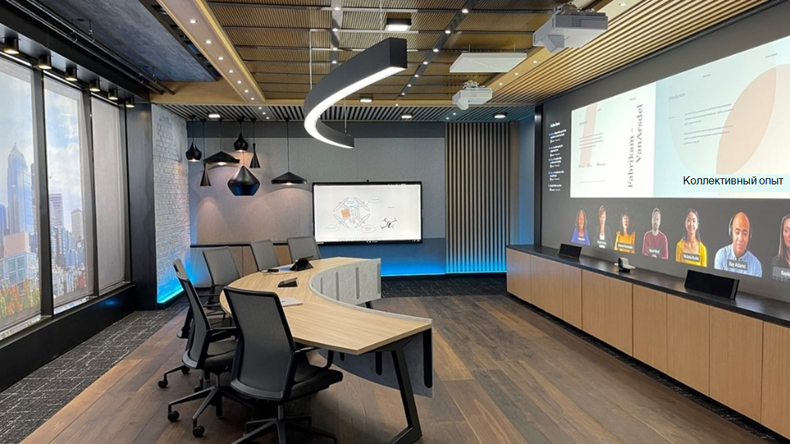

# Руководство по помещению для Teams

Эта статья поможет пользователям оптимизировать пространство для собраний с помощью Комнаты Microsoft Teams решений и устройств. В нем содержатся сведения Комнаты Teams использования устройств и решений, макетах и спецификациях.

Раздел [Примеры пробелов](#example-spaces) в этой статье содержит спецификации и макеты помещений, а также позволяет визуализировать и планировать Teams устройства или Комнаты Teams развертывания решения.

## Использование и макеты комнаты для собраний

Комнаты Microsoft Teams решения обеспечивают гибкость целей и даже возможности перемещения по помещению, которое не обеспечивается традиционными помещениями для проведения собраний. Например, с помощью Комнаты Teams устройств пользователи могут улучшить совместную работу с цифровой доской и интеллектуальными камерами отслеживания людей, чтобы каждый локальный участник был виден, где бы он ни был. Любой тип места и любой тип собрания можно оптимизировать с помощью Комнаты Teams устройств или Комнаты Teams решений.

### Собрания, ориентированные на презентацию 

Собрания и собрания — это первый сегмент, и эта встреча обычно более формальная. Аудио-визуальный контент является приоритетом, и фокус находится на содержимого. Устройство обычно исправлено, так что пользователи могут оставаться на месте при взаимодействии с устройством из центральной консоли таблицы.

Использование презентаций и обсуждений в рамках презентаций и презентаций с использованием пробелов на должно быть должно быть оптимизировано. Это означает, что макет и технология должны быть оптимизированы для общего доступа к контенту и удаленного совместного создания. Все должны участвовать в обсуждении и иметь возможность видеть общий контент и работать с ним.

**Макеты помещений** для встречи и **показа.** Таблицы должны быть фиксированными и располагаться на дисплеях комнаты. В небольших помещениях таблицы могут быть прикреплены к стене, но в больших пространствах они должны быть разделены для учета соображений камеры.

### Собрания, ориентированные на совместное создание

Собрания и совместное создание собраний обычно менее формальные и имеют приоритет при совместном создании, создании отредакторов и создании доски. В этом сегменте также находится доступ к личным файлам. Устройство может быть мобильным, что позволяет пользователям встать на связь, собрать их и работать с ним.

Правильное пространство позволяет без проблем соперемить пользователей и технологию, устраняя конфликты даже с самыми начинающими пользователями. Teams устройства предназначены для того, чтобы юные учащиеся и новые пользователи были достаточно удобными для навигации, а преподаватели и администраторы — для управления и настройки с первого использования.

**Встречи и совместное создание макетов помещений:** Таблицы и оборудование для совместной работы могут иметь гибкие позиции и должны вместить группы людей, работающих за таблицами или оборудованием.

### Презентации и собрания, на которые уделяется совместное создание

Помните, что комнаты обоих типов могут обрабатывать оба типа при необходимости. Помещения также можно легко разместить в обоих помещениях с помощью технологий для каждого использования. Важно помнить, что независимо от места, которое вы оборудованы, от частного офиса до лекции, его необходимо Teams включить.

**Комбинированная презентация и макеты пространства для совместной работы:** Сочетание вариантов использования из других сценариев собраний можно объединить в многоэтапные комнаты, где собрания, ориентированные на презентацию, а также совместные работы, можно добиться одинаковой эффективности , зачастую одновременно.

## Оптимизация работы с собранием
Отличный способ проведения собраний — это результат использования наилучшей технологии для проведения собраний таким образом, чтобы упростить обмен идеями без назойки.

### Native Комнаты Teams experiences versus other devices

Комнаты Teams о том, что можно делать с Teams на личных устройствах, предоставляя уникальные возможности в комнате, такие как однонажатие содержимого, камеры содержимого для интеллектуального доступа к физическим доскам в собрании, а также функции близости, такие как беспрепятственное перенос Teams-собрания с личного устройства в комнату.

Нестандартные и самозаверяющие системы, которые используют внешние службы или подключение с использованием собственного устройства, никогда не будут по-настоящему соответствовать простоте использования или иммерсивным качествам встроенного Teams Room.

Как известно, в ходе развертывания могут потребоваться промежуточные шаги (например, быстрое развертывание комнат для проведения собраний с собственным устройством) на пути к полностью собственному Teams собраниям.

### Использование Teams для максимального использования собраний

Если вы Teams на всех личных устройствах и правильно развернете Комнаты Microsoft Teams на всех своих пространствах, вы сможете сделать собрания максимально возможными для всех пользователей. Чтобы добиться максимального результата, вам потребуется решить проблему с точки зрения развертывания как в развернутых, так и для конечных пользователей, а также для обучения.

Обычно при планировании масштабного развертывания в масштабах всей компании это происходит поэтапно, когда некоторые комнаты с технологией, добавляемой в различное время, или даже некоторые компоненты устанавливаются раньше других (например, развертывание панелей Teams для планирования в каждом помещении в конкретном здании при установке Комнаты Teams решения по одному или даже помещению).

Подготовьте пользователей к поэтапному использованию, чтобы расширить Teams собрания в любой момент.

#### Хороший опыт— Личные устройства в отдельном месте для собраний

Вы можете начать с этого плана, обратившись ко всем местам собраний, не оборудованным для совместной работы или не для совместной работы. Вы по-прежнему можете воспользоваться преимуществами Teams в своих комнатах для собраний, даже если в этих комнатах еще не Teams устройств.

*Аудио:* Отличный мост к полному помещению Teams — спланировать технологию собраний, предоставив отдельным пользователям звуковые устройства, сертифицированные для Teams, для небольших помещений и групп, или разместив их в комнатах перед полным решением Комнаты Teams для больших мест, предназначенных для больших групп, где устройство не будет вырезать его.

*Видео:* Когда эти комнаты используются, отдельные пользователи могут использовать свои устройства для Teams собрания и фиксировать свои выражения с помощью своих камер. После этого пользователи могут назначить пользователя единственным источником звука для локальной группы, подключив его к сертифицированным звуковым устройствам, чтобы все (как локальные, так и удаленные) могли работать со звуком собрания положительно.

*Взаимодействие:* Включение комнаты для проведения собраний Teams более емким образом, даже если требуется использование личных устройств и периферийных устройств, позволит пользователям расширить возможности, которые они могут делать с Teams. Когда ваши пользователи находятся в частных офисах и на отдельных рабочих станциях, Teams позволяет участвовать в личных обсуждениях, а не только с удаленными участниками.

#### Улучшение работы — Комнаты Teams решения без личных устройств

Если вы устанавливаете Комнаты Teams или у вас уже есть помещения, уже развернутые с подходящими устройствами Комнаты Teams для соответствующих пробелов, то вы сможете отлично работать с собраниями.

*Аудио:* Звук для этих мест собраний будет обрабатываться решением Комнаты Teams и его звуковым устройством, сертифицированным Майкрософт.

*Видео:* Видео в этих пространствах будет обрабатываться решением Комнаты Teams и его камерами, сертифицированными Майкрософт.

*Взаимодействие:* Конечные пользователи смогут использовать все возможности Комнаты Teams собрания, обеспечив их легкое участие в собраниях, а также отличные аудио- и видеосвязи.

#### Лучший опыт — Комнаты Teams решения, используемые в сочетании с личными устройствами

Обучение пользователей использованию технологий в координации ведет к наиболее эффективному и упрощению результатов. Оптимальный сценарий — сочетание установленных технологий и личных устройств.

*Аудио:* Большинство подключений к комнатам собраний и аудио- и видеосвязи будут обрабатываться решением Комнаты Teams, в то время как отдельные пользователи могут присоединяться к одному собранию с помощью камер и выключения звука для полностью иммерсивного взаимодействия.

*Видео:* Удаленные пользователи смогут видеть всех участников собрания, не только говорить и обмениваться содержимым. Удаленный пользователь может включить личное видео, чтобы получить представление в любом месте комнаты с возможностью сосредоточиться на любом участнике.

*Взаимодействие:* Чат может оставаться динамическим для всех участников, локальных и удаленных, вовлеченных и вовлеченных. Общий доступ к видео как Комнаты Teams, так и с помощью отдельных камер позволяет удаленным участникам взаимодействовать со всеми.

Использование Teams на всех устройствах обеспечивает равное вовлечение локальных и удаленных пользователей в собрания.

## Технические аспекты

Правильные варианты аудио- и видеотехнопарков помогут пользователям наиболее хорошо работать с Microsoft Teams собраниями.

### Звук

Важно учитывать звук, чтобы обеспечить четкое и понятное понимание удаленных и участников в помещении. Микрофон и громкость динамика должны включать все места в комнате, не покидая прозоры.

*Правильные звуковые устройства для каждого места*

Чтобы в комнате собрания не было проблем со звуком, необходим один источник звука.

Сопряжение нужного микрофона и динамиков для каждого места позволит без отвлекающих факторов четко проговорить звук.

-   В общих пространствах параметры расширяются, но остаются те же принципы: участники собрания должны быть хорошо слышать и слышать других участников.

    -   Все-в-одном звуковых устройствах — это простые в  развертывании высококачественные параметры для небольших пробелов с ограниченным количеством участников, которые находятся относительно близко к звуковому устройству.

    -   В **больших пространствах** микрофоны и динамики отделяются друг от друга, чтобы обеспечить максимальное покрытие для всех участников в пространстве. Многие решения для комнат среднего и крупного размера доступны в комплекте, который не требует конфигурации, а только для физической установки микрофонов и динамиков.

    -   В самых больших и самых сложных пространствах доступны решения, позволяющие использовать различные типы микрофона и динамиков, например захватив заумную аудиторию и голос аудитории из большого зала, одновременно доведя звонок до всех. Эти решения лучше всего добиться при развертывании с партнером Майкрософт, который имеет опыт разработки и развертывания более технически оформленных решений.

### Видео

Видео не менее важно, чем звук. Запись физической, невербальной связи, например выражений лица или жестов, так же важна, как содержимое аудитории или собрания, чтобы обеспечить максимальную вовлеченность и понимание. Комнаты должны быть оснащены соответствующими размерами отображения, чтобы все могли правильно продемонстрировать собрание как в помещении, так и в удаленном помещении. Именно поэтому комнаты также должны иметь правильное покрытие камеры и поле зрения (FOV), чтобы эффективно захватить всех участников собрания в зале для тех, кто присоединяется удаленно.

*Правильные камеры для каждого пространства*

Как и для качественного аудио, высококачественное видео необходимо для современной Teams совместной работы. Технология камер значительно усовершенствована: высококачественные камеры теперь доступны для всех пробелов.

-   Во всех собраниях следует использовать камеры на таких устройствах, как ноутбуки и планшеты, чтобы обеспечить их просмотр и просмотр. Для пользователей, которые ищут более  высокое качество видео в личном **пространстве,** внешние камеры представляют собой шаг вперед от внедренных устройств и могут использоваться в большем количестве сценариев и конфигураций, гарантируя, что участники звонка будут иметь доступ к наилучшему качеству. Эти устройства легко устанавливаются с помощью простого USB-подключения, найденного на каждом компьютере.

-   В общих пространствах возможности и параметры расширяются. **Для небольших помещений** могут быть установлены камеры, которые входят в состав всех звуковых устройств, таких как звуковые панели. Обычно эти камеры имеют широкое поле зрения, что позволяет зафиксировать всех участников в пространстве одним кадром. Многие из этих камер также имеют такие функции, как интеллектуальное обрамление изображения, чтобы камера отображала только людей на собрании, а не пустые стулья или людей, которые подсчитывали, для отслеживания и понимания использования места.

-   В **больших помещениях** камеры имеют технологию, необходимую для захвата участников в разных местах на разных расстояниях. Эти камеры могут захватывать группы или сосредоточиться на определенных пользователей, сохраняя большую наглядность. Устройства, которые могут отслеживать и использовать только активных выступающих, регулярно используются в больших пространствах, чтобы многие участники могли быть представлены по отдельности во время собрания по мере того, как они внося свои мысли.

## Примеры пробелов

В этом разделе мы рассмотрим некоторые примеры того, как решать проблемы с различными пробелами в большинстве организаций. Существует множество способов добиться отличного проведения собраний, и эти примеры пробелов могут действовать в качестве отличных руководств при построении для вашей организации.

## Меньшее пространство для собраний

### Частный офис с местом для собраний

| Режим | Макет | Звук | Видео |
|------------------|----------------------------------------------------|------------------------------------------------------------|------------------------------------------------------------------|
| Встреча и презент | Типичная емкость: 3–4 человека                       | Рекомендуемый звук: одно устройство переднего или настольного стола | Рекомендуемая камера: короткое расстояние с очень широким полем просмотра |
|                  | Стандартные размеры: 10 ft x 10 ft                  |                                                            | Минимальный размер дисплея: 46in                                       |
|                  | Рекомендуется использовать один или два основных дисплея: Один |                                                            |                                                                  |

Частные офисы часто имеют отдельные места для собраний, чтобы небольших собраний можно было проводить вместе с локальными и удаленными участниками.

 

*Показано решение:*

Подмайка или область фокуса внутри частного рабочего пространства.

*Почему этот макет и тип устройства?*

Макет пространства предназначен для упрощения собраний с локальными и удаленными участниками.

Таблица собраний физически отделена от частного рабочего пространства и технологии комнаты для упрощения собраний с локальными и удаленными участниками.

В комнате есть один размер экрана, чтобы все участники могли четко видеть все представляемые материалы и удаленные видео участников. Кроме того, в нем есть звуковое решение Room со встроенной интеллектуальной камерой. Это решение легко устанавливать и работать, а также обеспечивает отличное покрытие аудио- и видеофайла для собраний в таком пространстве.

*На рисунке:*

-   Единый дисплей

-   Решение для Комнаты Teams на основе Комнаты Teams "Все в Комнаты Teams".

### Открытие пробелов

| Режим | Макет | Звук | Видео |
|--------------------|------------------------------------------|-----------------------------------------|--------------------------------------------|
| Встреча и совместное создание | Типичная емкость: 3–13 человек            | Рекомендуемый звук: зависит от места | Рекомендуемая камера: зависит от места   |
|                    | Стандартные размеры: зависит от пробела. |                                         | Минимальный размер дисплея: зависит от места |
|                    |                                          |                                         |                                            |

Для нестандартных собраний часто используются открытые пробелы, такие как застолия и общие области.

 

*Показано решение:*

Две области с Surface Hub устройствами, которые доступны для интерактивной совместной работы и создания в большом открытом пространстве.

*Почему этот макет и тип устройства?*

Таблица с высотой в счетчике находится с большим Surface Hub устройством для использования дисплея для создания контента, а также Комнаты Teams для небольших собраний. Другое Surface Hub настроено в корзине для перемещений в неформальные места для создания контента. Мебель по-разнородно используется как для неформальных рабочих бесед, так и для импровизированный совместной работы, предоставляя параметры для всех типов помещений.

*На рисунке:*

-   Большие настенные Surface Hub

-   Мобильные устройства, установленные в корзине Surface Hub

### Комната "Фокус/объеха"

| Режим | Макет | Звук | Видео |
|------------------|----------------------------------------------------|------------------------------------------------------------|------------------------------------------------------------------|
| Встреча и презент | Типичная емкость: 3–5 человек                       | Рекомендуемый звук: одно устройство переднего или настольного стола | Рекомендуемая камера: короткое расстояние с очень широким полем просмотра |
|                  | Стандартные размеры: 10 ft x 10 ft                  |                                                            | Минимальный размер дисплея: 46in                                       |
|                  | Рекомендуется использовать один или два основных дисплея: Один |                                                            |                                                                  |

Эти пробелы идеально подходят для совместной работы и обсуждения в небольших группах.

 

*Показано решение:*

Комната для работы в группе с Комнаты Microsoft Teams для совместной работы в небольших группах.

*Почему этот макет и тип устройства?*

Таблица прикреплена к стене, что обеспечивает максимальную гибкость для различных макетов. Это гарантирует, Комнаты Teams фокусом места будет решение. Вместимый экран комнаты гарантирует, что все физические участники собрания смогут видеть удаленных участников собрания или документ для совместной работы. Камера комнаты фиксирует комнату для удаленных участников. Так как комната является выделенным местом для собраний, звуковое устройство на настольном столе позволяет убедиться, что все участники слышны.

*На рисунке:*

-   Простое Комнаты Teams для небольших помещений

-   Отображение отдельного переднего экрана для удаленных участников и содержимого, к которое нужно делиться

### Небольшие традиционные комнаты для собраний

| Режим | Макет | Звук | Видео |
|------------------|----------------------------------------------------|------------------------------------------------------------|------------------------------------------------------------------|
| Встреча и презент | Типичная емкость: 5–7 человек                       | Рекомендуемый звук: одно устройство переднего или настольного стола | Рекомендуемая камера: короткое расстояние с очень широким полем просмотра |
|                  | Стандартные размеры: 10 ft x 15 ft                  |                                                            | Минимальный размер дисплея: 50 в                                       |
|                  | Рекомендуется использовать один или два основных дисплея: Один |                                                            |                                                                  |

Эти пробелы идеально подходят для совместной работы и обсуждения в небольших группах.

 

*Показано решение:*

Небольшая, традиционно разместимая комната для собраний с Комнаты Microsoft Teams решением.

*Почему этот макет и тип устройства?*

Более традиционный макет комнаты для собраний можно использовать так же, как и собрания с удаленными участниками и контентом. Таблица отделена от отображаемой стены и Комнаты Teams решением. Вместимый экран комнаты гарантирует, что все физические участники собрания смогут видеть удаленных участников собрания или документ для совместной работы. Камера комнаты фиксирует комнату для удаленных участников. Так как комната является выделенным местом для собраний, звуковое устройство на настольном столе позволяет убедиться, что все участники слышны.

*На рисунке:*

-   Простое Комнаты Teams для небольших помещений

-   Отображение отдельного переднего экрана для удаленных участников и содержимого, к которое нужно делиться

## Большие пространства для собраний

### Средние традиционные комнаты для собраний

| Режим | Макет | Звук | Видео |
|------------------------------|------------------------------------------------------------|-------------------------------------------------------------------------------------------------------------------------------|-----------------------------------------------------------------------------------------------------------------------------|
| Встреча и презент + совместное создание | Типичная емкость: 10–12 человек                             | Рекомендуемый звук: установленный звук с дискретной настольной таблицей или повергами микрофонов, а также динамиков настенного или окверхверха | Рекомендуемая камера: камера среднего расстояния с функцией наклона панорамирования и интеллектуальными возможностями отслеживания людей |
|                              | Стандартные размеры: 15 ft x 20 ft                          |                                                                                                                               | Минимальный размер дисплея: 55in для двойного, больше для одного                                                                      |
|                              | Рекомендуется использовать один или два основных дисплея: один или два |                                                                                                                               |                                                                                                                             |

Этот средний конференц-зал идеально подходит для конференций и групповой совместной работы, особенно в существующих пространствах, где уже есть классический макет конференц-зала.

 

*Показано решение:*

Комната для собраний среднего размера с двойным отображением переднего плана для разных макетов людей и содержимого с примечаниями и совместной работой для Surface Hub 2.

*Почему этот макет и тип устройства?*

Более традиционный макет комнаты для собраний можно использовать так же, как и собрания с удаленными участниками и контентом. Таблица отделена от отображаемой стены и Комнаты Teams решения. Отображение нескольких мониторов гарантирует, что удаленные участники будут иметь заметное место в физической комнате и что будут видны все документы для совместной работы. При этом удаленные участники могут озвучить голос "в зале". Установленная камера гарантирует, что все физические участники собрания будут схвачены.

*На рисунке:*

-   Комнаты Microsoft Teams с двойным отображением переднего экрана для высокого уровня видимости удаленных участников и общего содержимого

-   Необязательный Surface Hub 2 для примечания и доски

-   Большое решение для работы с звуком и камерой, разделенное друг от друга, для максимального покрытия участников в большем пространстве. Микрофоны таблицы и динамики, подключенные к стене, гарантируют, что все будут Teams звонках

### Большие традиционные комнаты для собраний

| Режим | Макет | Звук | Видео |
|------------------------------|------------------------------------------------------------|-------------------------------------------------------------------------------------------------------------------------------|-----------------------------------------------------------------------------------------------------------------------------|
| Встреча и презент + совместное создание | Типичная емкость: 12–20 человек                             | Рекомендуемый звук: установленный звук с дискретной настольной таблицей или повергами микрофонов, а также динамиков настенного или окверхверха | Рекомендуемая камера: камера среднего расстояния с функцией наклона панорамирования и интеллектуальными возможностями отслеживания людей |
|                              | Стандартные размеры: 15 ft x 30 ft                          |                                                                                                                               | Минимальный размер дисплея: 65in для двойного, больше для одного                                                                      |
|                              | Рекомендуется использовать один или два основных дисплея: один или два |                                                                                                                               |                                                                                                                             |

Крупное помещение идеально подходит для конференций и групповой совместной работы, особенно в существующих пространствах, где уже есть классический макет конференц-зала.

 

*Показано решение:*

Большой размер комнаты для собраний с двойным отображением переднего плана для разных макетов людей и содержимого с примечаниями и совместной работой для Surface Hub 2.

*Почему этот макет и тип устройства?*

Более традиционный макет комнаты для собраний можно использовать так же, как и собрания с удаленными участниками и контентом. Таблица отделена от отображаемой стены и Комнаты Teams решения. Отображение нескольких мониторов гарантирует, что удаленные участники будут иметь заметное место в физической комнате и что будут видны все документы для совместной работы. При этом удаленные участники могут озвучить голос "в зале". Установленная камера гарантирует, что все физические участники собрания будут схвачены.

*На рисунке:*

-   Комнаты Microsoft Teams с двойным отображением переднего экрана для высокого уровня видимости удаленных участников и общего содержимого

-   Необязательный Surface Hub 2 для примечания и доски

-   Установлено крупное решение с раздельным звуком и камерой, чтобы максимальное покрытие участников в большем пространстве. Микрофоны таблицы и динамики, подключенные к стене, гарантируют, что все будут Teams звонках

### Дополнительные традиционные комнаты собраний и комнаты для собраний

| Режим | Макет | Звук | Видео |
|------------------------------|------------------------------------------------------------|--------------------------------------------------------------------------------------------------------------|----------------------------------------------------------------------------------------------------------------------|
| Встреча и презент + совместное создание | Типичная емкость: 25–40 человек                             | Рекомендуемый звук: установленные окне или микрофоны таблицы и динамики с цифровым сигнальным процессором (DSP) | Рекомендуемая камера: long-distance camera with Pan Tilt Zoom and/or intelligent people-tracking capabilities |
|                              | Стандартные размеры: 28 ft x 33 ft                          |                                                                                                              | Минимальный размер дисплея: 75in для двойного, больше для одного                                                               |
|                              | Рекомендуется использовать один или два основных дисплея: один или два |                                                                                                              |                                                                                                                      |

Этот тип пространства обычно включает в себя макет дополнительного размера, в котором есть таблица для собраний, а также место для аудитории с двумя мониторами переднего плана.

 

*Показано решение:*

Комната для собраний другого размера с двойным отображением переднего плана для разных макетов людей и содержимого с примечаниями и совместной работой для Surface Hub 2.

*Почему этот макет и тип устройства?*

В этом помещении есть таблица основного собрания для многих участников собрания, а также область расстояния аудиторий для дополнительного числа локальных участников собрания. При двойном большом дисплее удаленные участники могут физического присутствия в комнате. Устанавливаемая в окнах аудиосистема означает покрытие звука для всех участников в каждой части комнаты, даже для тех, кто не вошел в главную таблицу собрания. Экран совместной работы с доской предназначен для содержимого как в зале, так и в удаленных участниках, чтобы быть частью любой творческой идеи.

*На рисунке:*

-   Комнаты Microsoft Teams с разделенными двумя дисплеями

-   Необязательный Surface Hub 2 для примечания и доски

-   Установленные аудио-визуальные компоненты, в которых установлены звуковые устройства с повергаемой мощностью и установленное решение для камеры, чтобы максимальное покрытие участников в течение всего пространства

### Панорамные комнаты для собраний

| Режим | Макет | Звук | Видео |
|------------------------------|--------------------------------------------------------------------------------------------------------|-----------------------------------------------------------------------------------------------------------|--------------------------------------------------------------------------------------------------------|
| Встреча и презент + совместное создание | Типичная емкость: 6–12 человек                                                                          | Рекомендуемый звук: установленный потолочный или настольный микрофон и динамики, поддерживаювшие направление звука | Рекомендуемая камера: междугородная камера с очень широким полем просмотра и интеллектуальным отслеживанием людей |
|                              | Стандартные размеры: зависит от пробела.                                                               |                                                                                                           | Минимальный размер дисплея: зависит от места                                                             |
|                              | Рекомендуется использовать один или два основных дисплея: двойные традиционные дисплеи или смешанные проекторы с двумя краями |                                                                                                           |                                                                                                        |

Это место посвящено самым иммерсивным Teams собраниям.
 

*Показано решение:*

Комната для собрания, ориентированная на таблицу, видна на панораму смешанных мониторов, гарантируя, что все пользователи будут видеть всех участников и содержимое собрания максимально возможным.

*Почему этот макет и тип устройства?*

Панорамная таблица предназначена для максимального видимости и взаимодействия с удаленными участниками и контентом. Крупные смешанные дисплеи позволяют получить иммерсивное ощущение, при этом все столы отображаются, и они могут следовать за ними. Пространственный звук означает, что удаленные участники находятся в комнате вместе с локальными участниками в зависимости от их положения на экране.

*На рисунке:*

-   Комнаты Microsoft Teams с двумя эффектными проецируемыми краями экрана, создавая иммерсивное пространство для собраний Teams комнаты.

-   Surface Hub 2 для примечания и доски

-   Установленные аудио- и визуальные компоненты с использованием звуковых устройств с повергаемой мощностью и передней части комнаты для максимального покрытия участников на протяжении всего пространства с учетом пространственного звука

-   Уместная, удиви-угол передней камеры комнаты, которая запечатлела всех участников в пространстве

## Нестандартные пространства для собраний

### Многоэтабные пробелы

| Режим | Макет | Звук | Видео |
|------------------------------|----------------------------------------------------|-----------------------------------------------------------------------------------------------------------|--------------------------------------------------------------------------------------------------------|
| Встреча и создание + совместное создание | Типичная емкость: настраиваемая                           | Рекомендуемый звук: установленный потолочный или настольный микрофон и динамики, поддерживаювшие направление звука | Рекомендуемая камера: long-distance camera with ultra-wide field of view and intelligent people tracking |
|                              | Стандартные размеры: Пользовательские                         |                                                                                                           | Минимальный размер дисплея: пользовательский                                                                           |
|                              | Рекомендуется использовать один или два основных дисплея: Пользовательские |                                                                                                           |                                                                                                        |

Teams можно реализовать практически в любом образовательном или многоэтабном пространстве. Библиотеки, смешанные презентации и пространства для совместной работы, пробелы в кафе и открытых местах можно использовать с помощью Teams или Teams устройств.

 

*Пример многоэтабного пространства:*

Решение Комнаты Teams с большим экраном на основе проектора, несколькими сенсорными консолями для работы и несколькими Surface Hub 2 устройствами для широкого круга применения.

*К устройствам относятся:*

-   Комнаты Microsoft Teams с несколькими сенсорными консолями с одним крупным проектором и экраном для широкой видимости удаленных участников и общего содержимого

-   Необязательный Surface Hub 2 для примечания и доски

-   Установленные аудио- и визуальные компоненты, в которых есть звуковые устройства с повергаемой мощностью, и установленное решение для камеры для максимального покрытия участников в течение всего пространства

### Классах

| Режим | Макет | Звук | Видео |
|------------------------------|----------------------------------------------------|-------------------------------------------------------------------------------------------------------------------------------|-----------------------------------------------------------------------------------------------------------------------------|
| Встреча и создание + совместное создание | Типичная емкость: настраиваемая                           | Рекомендуемый звук: установленный звук с дискретной настольной таблицей или повергами микрофонов, а также динамиков настенного или окверхверха | Рекомендуемая камера: камера среднего расстояния с функцией наклона панорамирования и интеллектуальными возможностями отслеживания людей |
|                              | Стандартные размеры: Пользовательские                         |                                                                                                                               | Минимальный размер дисплея: пользовательский                                                                                                |
|                              | Рекомендуется использовать один или два основных дисплея: Пользовательские |                                                                                                                               |                                                                                                                             |

Аудитории, в том числе традиционные и обратные, требуют активного взаимодействия со всеми присутствующими. Эффективные инструкции, обсуждения и совместная работа между многими сторонами являются ключевыми.

 

*Показано решение:*

Аудитории, предназначенные для участников как лично, так и удаленного учащегося с макетом, в который может одновременно обращаться один преподаватель.

*Почему этот макет и тип устройства?*

При большом масштабе удаленные участники могут физического присутствия в комнате, а также динамики комнаты, которые позволяют слышать их голоса всем, даже тем, кто находится за рабочими столами дальше от источника. Микрофоны расположены в передней части комнаты и во всем помещении, поэтому преподаватели и учащиеся могут перемещаться по помещению и по-прежнему быть слышны. Экран презентации предназначен для содержимого как в зале, так и в удаленных участниках.

*На рисунке:*

-   Комнаты Microsoft Teams с отдельными двумя дисплеями, одной корзиной или автономным отображением, на котором удаленные участники преподавателя должны четко видеться, и отдельным экраном презентации для содержимого учебного заведения, доступного как локальным, так и удаленным учащимся для наблюдения

-   Комплект с динамиками и камерой в передней части комнаты, а также микрофоны на переднем и распределенном по аудитории

### Лекции и аудитории

| Режим | Макет | Звук | Видео |
|------------------------------|----------------------------------------------------|-------------------------------------------------------------------------------------------------------------------------------|--------------------------------------------------------------------------------------------------------------------------|
| Встреча и создание + совместное создание | Типичная емкость: настраиваемая                           | Рекомендуемый звук: установленный звук с дискретной настольной таблицей или повергами микрофонов, а также динамиков настенного или окверхверха | Рекомендуемая камера: камера среднего расстояния с функцией наклона панорамирования и интеллектуальными возможностями отслеживания людей |
|                              | Стандартные размеры: Пользовательские                         |                                                                                                                               | Минимальный размер дисплея: пользовательский                                                                                             |
|                              | Рекомендуется использовать один или два основных дисплея: Пользовательские |                                                                                                                               |                                                                                                                          |

Как и в классах, лекции содержат множество учащихся, которые должны сосредоточиться на преподавателях и любой информации, которую они представляют. Однако лекции обычно не требуют одинакового взаимодействия между учащимися. Фокус находится на информации, а не на совместной работе.

 

*Показано решение:*

Лекционный зал, предназначенный для содержимого как содержимого, так и удаленного учащегося с макетом, в который может одновременно обращаться один преподаватель, а также создавать и коммещать содержимое с сенсорной поверхности.

*Почему этот макет и тип устройства?*

Удаленные участники могут видеть то же поле зрения, что и участники личной встречи, с помощью камеры. Удаленные учащиеся будут видеться на экране с помощью камер. На специальном экране презентации и сенсорном экране для доской отображаются учебные материалы для всех. Микрофон с плиткой по окту и мощный динамик должны быть четко заслушаны докладчиком и ответами учащихся.

*На рисунке:*

-   Комнаты Microsoft Teams с разделенными двойными дисплеями, одной корзиной или автономным отображением, на котором удаленные участники преподавателя должны четко видеть свое представление, и отдельный экран презентации для содержимого учебного заведения, доступного в вызове для наблюдения за локальными и удаленными учащимися

-   Необязательный Surface Hub 2 для примечания и доски

-   Установленные аудио- и визуальные компоненты, в которых есть звуковые устройства с повергаемой мощностью, и установленное решение для камеры для максимального покрытия участников в течение всего пространства
