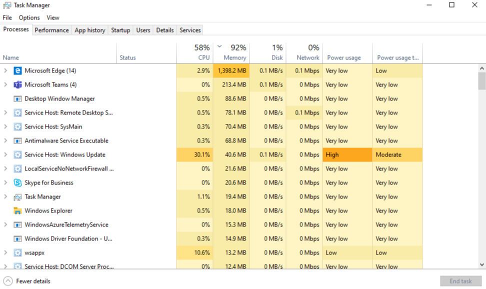

# Использование памяти в Microsoft Teams

У некоторых пользователей Microsoft Teams есть вопросы о том, как Teams использует память. В этой статье описывается, как teams использует память и почему классические приложения Teams и веб-приложение Teams не препятствуют оптимальному выполнению других приложений и рабочих нагрузок на том же компьютере. Teams предназначена для использования современных веб-технологий. Для этого настольный клиент Teams был разработан на платформе Electron, которая использует Chromium для отрисовки. Это тот же механизм отрисовки, что и многие из самых популярных браузеров, включая Edge и Chrome.

## Принципы работы Teams

Teams, разработанные на платформе Electron, позволяют ускорить разработку, а также поддерживать четность версий Teams в разных операционных системах (Windows, Mac и Linux). Такая четность возможна, так как Electron и Chromium поддерживают аналогичную базу кода во всех версиях. Еще одним преимуществом этой архитектуры является наличие аналогичного профиля использования памяти между веб-приложением Teams и версией рабочего стола. Как веб-приложение, так и классические версии используют память так же, как и браузер. Дополнительные сведения о Electron доступны на [их веб-сайте](https://electronjs.org/).

[Дополнительные сведения см. Chromium](https://www.chromium.org/developers/memory-usage-backgrounder) использования памяти и ключевых [понятий в памяти Chrome](https://chromium.googlesource.com/chromium/src.git/+/master/docs/memory/key_concepts.md).

На следующем рисунке показано параллельное использование памяти классическим приложением Teams для Windows и веб-приложением Teams (в этом примере используется Google Chrome).

## Использование памяти в Teams

Важно понимать ожидаемое поведение Teams, когда речь идет о системной памяти, и знать симптомы действительно проблем с системной памятью.

### Ожидаемое использование памяти Teams

Независимо от того, используете ли вы настольное приложение Teams или веб-приложение Teams, Chromium определяет, какой объем системной памяти доступен и использует достаточно памяти для оптимизации интерфейса отрисовки. Если другим приложениям или службам требуется системная память, Chromium памяти для этих процессов. Chromium постоянно настраивает использование памяти Teams, чтобы оптимизировать производительность Teams, не затрагивая все остальные выполняемые в настоящее время операции.

Таким образом, аналогичные Chromium могут использовать различные объемы памяти в зависимости от объема доступной системной памяти.

На следующем графике показано использование памяти Teams в четырех отдельных системах, каждая из которых содержит различные объемы доступной памяти. Каждая из систем обрабатывает аналогичные рабочие нагрузки (те же приложения открываются и выполняются).

Если на компьютерах больше памяти, Teams будет использовать эту память. В системах с нехваткой памяти Teams будет использовать меньше ресурсов.

### Симптомы проблем с системной памятью

Если на компьютере отображается один или несколько из следующих симптомов, возможно, у вас есть серьезные проблемы с памятью системы:

- Использование большого объема памяти при одновременном выполнении нескольких крупных приложений.
- Низкая производительность системы или зависания приложений.
- Устойчивое общее использование системной памяти в 90 % или более во всех приложениях. Благодаря такому объему использования памяти Teams следует вернуть память другим приложениям и рабочим нагрузкам. Устойчивое использование памяти на уровне 90 % может означать, что Teams не возвращает память системе, что указывает на проблему.

На следующих изображениях показаны примеры представлений в диспетчере задач, когда использование системной памяти аномально высоко.

