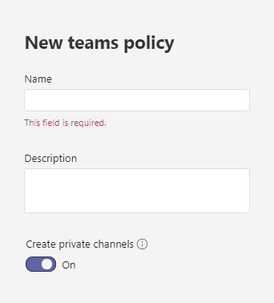

# Управление политиками каналов в Microsoft Teams

Как администратор вы можете использовать политики в Microsoft Teams для управления тем, что пользователи в организации могут делать в командах и каналах. Например, можно у установить, разрешено ли пользователям создавать частные или общие каналы.

Вы управляете политиками команд, **Teams** >  **Teams политики** в Microsoft Teams администрирования. Вы можете использовать глобальную (по умолчанию в пределах организации) политику или создавать и присваивать настраиваемые политики. Пользователи вашей организации автоматически получают глобальную политику, если вы не создали и не назначили настраиваемую политику.

Вы можете изменить глобальную политику или создать и назначить настраиваемую политику. После изменения глобальной политики или назначения политики может потребоваться 24 часа, чтобы изменения вступили в силу.

## Политики каналов

Для каналов teams доступны следующие политики:

|Политика|Описание|
|:-----|:----------|
|**Создание частных каналов**|В **этом случае** владельцы и участники команды могут создавать частные каналы. (Владельцы команд могут управлять тем, могут ли участники создавать частные каналы в каждой команде.)|
|**Создание общих каналов**|В **этом случае** владельцы команд могут создавать общие каналы. Teams приложения, доступные в вашей организации, также доступны в общих каналах.|
|**Приглашение внешних пользователей в общие каналы**|В **этом случае** владельцы и участники общих каналов могут приглашать внешних участников из организаций, в которых настроено доверие между организациями. Teams политики организации применяются к этим каналам.|
|**Присоединяйтесь к внешним общим каналам**|В **этом случае** пользователи могут участвовать в общих каналах, созданных другими организациями, в которых настроено доверие между организациями. Teams политики для другой организации применяются к этим каналам.|

## Создание настраиваемой политики teams

1. В левой области навигации центра администрирования Microsoft Teams перейдите **к Teams** >  **Teams политики**.
2. Нажмите **Добавить**.
3. Введите имя и описание для политики.

    
4. Включите или отключите нужные параметры, а затем нажмите кнопку **Сохранить**.

5. Нажмите кнопку **Сохранить**.

## Изменение политики teams

Вы можете изменить глобальную политику или любые настраиваемые политики, которые вы создаете.

1. В левой области навигации центра администрирования Microsoft Teams перейдите **к Teams** >  **Teams политики**.
2. Выберите политику, щелкнув слева от ее имени, а затем нажмите **Изменить**.
3. Включите или отключите нужные параметры, а затем нажмите кнопку **Сохранить**.

## Назначение настраиваемой политики teams пользователям

[!INCLUDE [assign-policy](includes/assign-policy.md)]

## См. также

[Управление Teams подключенными сайтами и сайтами каналов](/SharePoint/teams-connected-sites)

[Частные каналы в Teams](private-channels.md)

[Назначение политик пользователям в Teams](policy-assignment-overview.md)

[New-CsTeamsChannelsPolicy](/powershell/module/skype/new-csteamschannelspolicy)
