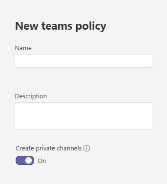

# Управление политиками каналов в Microsoft Teams

Как администратор вы можете использовать политики команд в Microsoft Teams управлять тем, что пользователи в вашей организации могут делать в командах и каналах. Например, вы можете разрешить пользователям создавать частные каналы.

Вы управляете политиками команд, **Teams** Teams политики в  >   Microsoft Teams администрирования. Вы можете использовать глобальную (по умолчанию в пределах организации) политику или создавать и присваивать настраиваемые политики. Пользователи вашей организации автоматически получают глобальную политику, если вы не создали и не назначили настраиваемую политику.

Вы можете изменить глобальную политику или создать и назначить настраиваемую политику. После изменения глобальной политики или назначения политики может занять несколько часов, чтобы изменения вступили в силу.

## Создание настраиваемой политики teams

1. В левой области навигации Центра администрирования Microsoft Teams перейдите к **Teams**  >  **Teams политики**.
2. Нажмите **Добавить**.
3. Введите имя и описание для политики.

    
4. Включите или отключите  **создание** частных каналов в зависимости от того, хотите ли вы разрешить пользователям создавать частные каналы.

5. Нажмите кнопку **Сохранить**.

## Изменение политики teams

Вы можете редактировать глобальную политику или любые настраиваемые политики, которые вы создаете.

1. В левой области навигации Центра администрирования Microsoft Teams перейдите к **Teams**  >  **Teams политики**.
2. Выберите политику, щелкнув слева от ее имени, а затем нажмите **Изменить**.
3. Включите или отключите нужные параметры, а затем нажмите кнопку **Сохранить**.

## Назначение настраиваемой политики teams пользователям

[!INCLUDE [assign-policy](includes/assign-policy.md)]

## Статьи по теме

[Управление Teams подключенными сайтами и сайтами каналов](/SharePoint/teams-connected-sites)

[Закрытые каналы в Teams](private-channels.md)

[Назначение политик пользователям в Teams](policy-assignment-overview.md)

[New-CsTeamsChannelsPolicy](/powershell/module/skype/new-csteamschannelspolicy)
