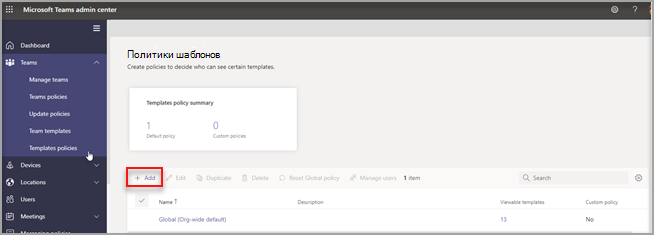
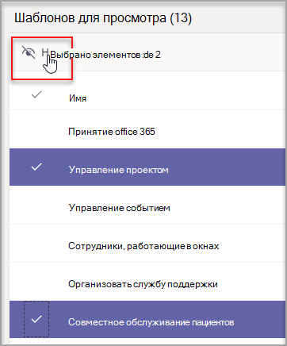
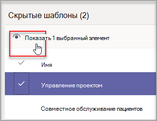
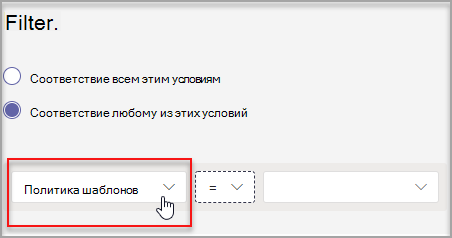

# <a name="manage-team-templates-in-the-admin-center"></a>Управление шаблонами команд в Центре администрирования

Управляйте шаблонами команд, которые видят пользователи, создав политики шаблонов в Центре администрирования. В каждой политике шаблонов можно указать, какие шаблоны отображаются или скрыты.
Назначьте разным пользователям различные политики шаблонов, чтобы пользователи могли просматривать только указанное подмножество шаблонов команды.

Просмотрите это короткое видео, чтобы узнать, как управлять политиками шаблонов.

> [!VIDEO https://www.microsoft.com/videoplayer/embed/RWyXL9]

## <a name="create-templates-policies-and-assign-available-templates"></a>Создание политик шаблонов и назначение доступных шаблонов

1. Войдите в Центр администрирования Teams.

2. Перейдите **к Teams** >  **Templates**.

3. Choose **Add**.

    

1. Присвойте политике имя и добавьте краткое описание.

2. В **списке просматриваемых шаблонов** выберите шаблоны, которые нужно скрыть, а затем выберите **"Скрыть"**.

    

    Шаблоны, выбранные для скрытия, можно просмотреть в списке **скрытых шаблонов** .

1. Чтобы отобразить определенные шаблоны, перейдите к списку **скрытых шаблонов** .

2. Выберите шаблоны, которые нужно отобразить, а затем нажмите кнопку **"Показать"**.

   

   Выбранные шаблоны будут отображаться в списке **просматриваемых шаблонов** .
3. Нажмите кнопку **Сохранить**.

   Новая политика шаблонов отображается в списке **политик шаблонов** .

## <a name="assign-templates-policies-to-users"></a>Назначение политик шаблонов пользователям

Вы можете назначить политику шаблонов непосредственно пользователям по отдельности или в большом масштабе с помощью пакетного назначения. Помните, что для того, чтобы новая политика вступает в силу для пользователей, может потребоваться до 24 часов.

> [!Note]
> В настоящее время назначение политик шаблонов пользователям на основе членства в группе, например для всех пользователей в группе безопасности, не поддерживается. Эта возможность будет доступна в будущем.

Общие сведения о способах назначения политик в Teams см. в [Teams.](policy-assignment-overview.md)

### <a name="assign-a-templates-policy-to-individual-users"></a>Назначение политики шаблонов отдельным пользователям

Вы можете использовать центр администрирования Teams или PowerShell для назначения политики шаблонов отдельному пользователю или небольшому количеству пользователей одновременно. Дополнительные сведения см. в [статье "Назначение политики отдельным пользователям"](assign-policies-users-and-groups.md#assign-a-policy-to-individual-users).

### <a name="assign-a-templates-policy-to-a-batch-of-users"></a>Назначение политики шаблонов пакету пользователей

С помощью PowerShell можно назначать политику шаблонов большим наборам пользователей одновременно. Для этого используйте командлет [New-CsBatchPolicyAssignmentOperation](/powershell/module/teams/new-csbatchpolicyassignmentoperation) вместе с TeamsTemplatePermissionPolicy ```PolicyType``` для отправки пакета пользователей и политики шаблонов, которую необходимо назначить. Например:

```powershell
New-CsBatchPolicyAssignmentOperation -OperationName <Any operation name> -PolicyType TeamsTemplatePermissionPolicy -PolicyName <policy name> -Identity <users identity | list of user identities>
```

Задания будут обрабатываться в фоновом режиме, а для каждого пакета будет создан идентификатор операции. Затем можно использовать командлет [Get-CsBatchPolicyAssignmentOperation](/powershell/module/teams/get-csbatchpolicyassignmentoperation) для отслеживания хода выполнения и состояния назначений в пакете.

Дополнительные сведения см. в статье ["Назначение политики для пакета пользователей с помощью PowerShell"](assign-policies-users-and-groups.md#use-powershell-method).

## <a name="size-limits-for-templates-policies"></a>Ограничения размера для политик шаблонов

Для каждой политики можно скрыть не более 100 шаблонов. **Кнопка "** Скрыть" отключена, если данной политике уже скрыто 100 шаблонов.

## <a name="frequently-asked-questions"></a>Вопросы и ответы

**Вопрос. Если будет создан новый шаблон, будет ли он включен в мои политики?**

О. Все новые шаблоны будут отображаться по умолчанию. Вы можете скрыть шаблон в Центре администрирования в разделе "Политики шаблонов".

**Вопрос. Что происходит при удалении шаблона?**

О. Все удаленные шаблоны больше не будут присутствовать в политиках шаблонов.

**Вопрос. Можно ли назначить несколько пользователей политике шаблонов в Teams администрирования?**

Ответ. Да.

1. В центре Teams перейдите в раздел **"Управление пользователями** > **"**.
1. В списке пользователей выберите пользователей, которых вы хотите назначить политике шаблонов.
1. Выберите **"Изменить параметры**", а затем в разделе **"Политика шаблонов**" выберите политику, которую нужно назначить.
1. Нажмите **кнопку "Применить"**.

Дополнительные сведения см. в [статье "Назначение политики отдельным пользователям"](assign-policies-users-and-groups.md#assign-a-policy-to-individual-users).

**Вопрос. Разделы справки просмотреть всех пользователей, назначенных определенной политике?**

О. В Teams администрирования:

1. Перейдите к **разделу "Управление** > **пользователями"**.
2. Выберите **фильтр**, задайте фильтр для политики шаблонов и нажмите кнопку "Применить **"**.

    

**Вопрос. Можно ли управлять политиками шаблонов с помощью PowerShell?**

О. Нет, управление политиками шаблонов в PowerShell не поддерживается. Однако для назначения пользователям политик шаблонов можно использовать [](#assign-templates-policies-to-users) PowerShell.

**Вопрос. Применимы ли политики шаблонов к EDU?**

О. Нет, политики шаблонов для EDU не поддерживаются.

## <a name="related-articles"></a>Статьи по теме

- [начало работы с шаблонами команд в Центре администрирования](./get-started-with-teams-templates-in-the-admin-console.md)

- [Создание настраиваемого шаблона команды](./create-a-team-template.md)

- [Создание шаблона из существующей команды](./create-template-from-existing-team.md)

- [Создание шаблона команды на основе существующего шаблона команды](./create-template-from-existing-template.md)

- [Назначение политик пользователям в Microsoft Teams — Microsoft Teams \| Документация Майкрософт](./policy-assignment-overview.md)

- [New-CsBatchPolicyAssignmentOperation](/powershell/module/teams/new-csbatchpolicyassignmentoperation)
