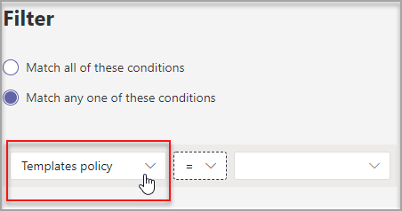

# Управление шаблонами групп в Центре администрирования

Управляйте шаблонами групп, которые видят пользователи, создавая политики шаблонов в Центре администрирования. В каждой политике шаблонов можно узначить, какие шаблоны должны быть показаны или скрыты.
Назначьте разным пользователям различные политики шаблонов, чтобы пользователи просматривали только указанные подмножество шаблонов группы.

Просмотрите это короткое видео, чтобы узнать, как управлять политиками шаблонов.

> [!VIDEO https://www.microsoft.com/videoplayer/embed/RWyXL9]

## Создание политик шаблонов и назначение доступных шаблонов

1. Войдите в Центр администрирования Teams.

2. Раз **Teams**  >  **шаблонов**.

3. Нажмите **Добавить**.

    

1. В разделе **Политики шаблонов Параметры** заполнять следующие поля:

    - Имя политики шаблонов

    - Краткое описание политики шаблонов

2. В таблице **Шаблоны для** просмотра выберите шаблоны, которые нужно скрыть, и выберите **скрыть**.

    

    Выбранные шаблоны можно увидеть в таблице **Скрытые шаблоны.**

1. Чтобы открыть определенные шаблоны, перейдите к таблице **Скрытые шаблоны.**

2. Выберите шаблоны, которые нужно отобрать, а затем выберите **Показать**.

   

   Выбранные шаблоны появятся в таблице **Шаблоны для** просмотра.
3. Нажмите **Сохранить**.

   Новая политика шаблонов отображается в списке Политики **шаблонов.**

## Назначение пользователей политикам шаблонов

Пользователи, которые назначены политике, смогут только просматривать ее шаблоны.

1. В **меню Политики шаблонов** выберите политику, а затем выберите **Управление пользователями.**

2. Введите пользователей, которые должны назначить эту политику.

   

3. Выберите **Применить**.

> [!Note]
> Для того чтобы новая политика вступила в силу для конечных пользователей, может потребоваться до 24 часов.

## Ограничения размера для политик шаблонов

Для одной политики можно скрыть не более 100 шаблонов. Кнопка **Скрыть** отключена, если в заданной политике уже скрыто 100 шаблонов.

## Вопросы и ответы

**Вопрос. Можно ли пакетно назначить пользователей политикам шаблонов команд?**
  
Ответ. Да, мы поддерживаем пакетные назначения для политики шаблонов в PowerShell. Для этого действия тип политики — TeamsTemplatePermissionPolicy. [Подробнее](/powershell/module/teams/new-csbatchpolicyassignmentoperation)

**Вопрос. Могут ли группы быть назначены политикам шаблонов групп?**

А. В настоящее время нет. Эта функция будет доступна в будущем.

**Вопрос. Если будет создан новый шаблон, будет ли он включен в мои политики?**

А. Новые шаблоны будут по умолчанию видны. Вы можете скрыть шаблон в Центре администрирования в разделе Политики шаблонов.

**Вопрос. Что происходит при удалении шаблона?**

А. Удаленные шаблоны больше не будут присутствовать в политиках шаблонов.

**Вопрос. Можно ли назначить нескольким пользователям политику шаблонов в Центре Teams администрирования?**

Ответ. Да.

1. В Центре администрирования перейдите в группу **Пользователи**.
1. В таблице списка Пользователи выберите пользователей, которые хотите назначить определенной политике шаблонов.
1. Выберите Изменить параметры и измените поле Политики шаблонов.
1. Выберите применить. [Подробнее](./assign-policies-users-and-groups.md#assign-a-policy-to-a-batch-of-users).

**Вопрос. Как просмотреть всех пользователей, которые назначены определенной политике?**

А. В Центре администрирования:

1. Перейдите в **раздел Пользователи.**
2. Выберите фильтр в таблице списка Пользователи и отфильтровать политику шаблона группы.
3. Выберите **Применить**.

**Вопрос. Можно ли управлять политиками шаблонов с помощью PowerShell?**

А. Нет, управление шаблонами в PowerShell не поддерживается.

**Вопрос. Применяются ли политики шаблонов к EDU?**

А. Нет, политики шаблонов для EDU не поддерживаются.

## Статьи по теме

- [Начало работы с шаблонами групп в Центре администрирования](./get-started-with-teams-templates-in-the-admin-console.md)

- [Создание пользовательского шаблона команды](./create-a-team-template.md)

- [Создание шаблона из существующей команды](./create-template-from-existing-team.md)

- [Создание шаблона команды из существующего шаблона группы](./create-template-from-existing-template.md)

- [Назначение политик пользователям в Microsoft Teams - Microsoft Teams Microsoft \| Docs](./policy-assignment-overview.md)

- [Пакетное назначение пользователей политике](/powershell/module/teams/new-csbatchpolicyassignmentoperation)
