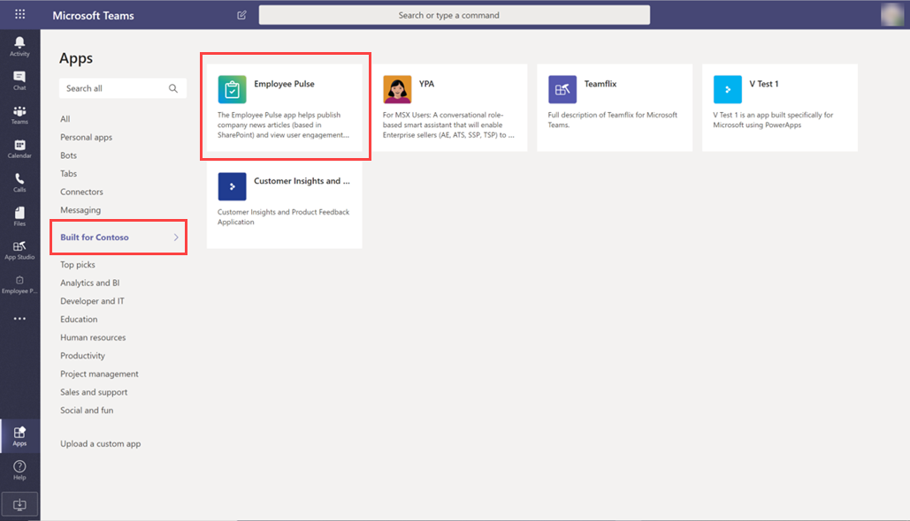

# Публикация пользовательского приложения путем отправки пакета приложения

> [!NOTE]
> При публикации пользовательского Teams приложения оно доступно пользователям в магазине приложений вашей организации. Существует два способа публикации пользовательского приложения и способ его использования зависит от способа его получения. **Эта статья посвящена** публикации пользовательского приложения путем отправки пакета приложения (.zip формата), который вам отправляет разработчик. Другой способ утверждения настраиваемого приложения используется, когда разработчик сообщает о приложении непосредственно на странице Управление приложениями с  помощью API отправки Teams приложения. Дополнительные информацию об этом методе см. в документе Публикация настраиваемого приложения, отправленного с помощью <a href="/microsoftteams/submit-approve-custom-apps" target="_blank">API Teams отправки приложений</a>.

В этой статье приводится по-разное руководство по Teams от разработки до развертывания до обнаружения. В этом руководстве основное внимание уделяется Teams и предназначено для администраторов и ИТ-специалистов. Дополнительные сведения о разработке Teams приложений см. в Teams <a href="/microsoftteams/platform" target="_blank">документации для разработчиков</a>.

## Разработка

### Создание приложения

Платформа Microsoft Teams позволяет разработчикам легко интегрировать собственные приложения и службы, чтобы повысить производительность, быстрее принимать решения и создавать совместную работу по существующему контенту и рабочим процессам. Приложения, встроенные на платформе Teams, перемыкаются между клиентом Teams и вашими службами и процессами, что напрямую влияет на контекст вашей платформы совместной работы. Дополнительные сведения можно найти в документации <a href="/microsoftteams/platform" target="_blank">Teams разработчиков</a>.

## Проверить

### Получить пакет приложения

Когда приложение будет готово к использованию в производственной области, разработчик должен создать пакет приложения. Для этого <a href="/microsoftteams/platform/get-started/get-started-app-studio" target="_blank">они могут использовать App Studio</a> . Они отправят вам файл в .zip формате.

Корпорация Майкрософт <a href="/microsoftteams/platform/publishing/office-store-approval" target="_blank">использует эти рекомендации</a>, чтобы обеспечить соответствие приложений стандартам качества и безопасности глобального Teams приложений.

### Разрешить надежным пользователям загружать пользовательские приложения

Чтобы проверить правильность работы приложения в рабочем клиенте, необходимо разрешить себе и (или) доверенным пользователям загружать пользовательские приложения в клиенте. Для этого <a href="/microsoftteams/teams-app-setup-policies" target="_blank">используются</a> политики настройки приложений.

> [!NOTE]
> Если вы не можете отправить приложение в свой клиент для проверки (даже для себя или надежных пользователей), пропустите этот шаг и следуйте шагам из раздела Upload и Настройка приложения и  управление им для публикации  неоцененного приложения в магазине приложений вашей организации. Затем ограничив доступ к этому приложению только себе и пользователям, которые вам доверяете. Затем эти пользователи могут получить приложение из магазина приложений вашей организации для выполнения проверки. После проверки приложения используйте те же политики разрешений, чтобы открыть и разо свернуть приложение для использования в производственной сфере.

Чтобы разрешить надежным пользователям загружать пользовательские приложения, выполните указанные здесь действия.

1. Включите **параметр Разрешить взаимодействие с пользовательскими приложениями** во всей организации. Для этого выполните следующие действия:
    1. В левой области навигации Центра Microsoft Teams выберите Teams **приложенияУправляемые** >  приложениями **и** щелкните Параметры приложений **для всей организации**.
    2. В **области Пользовательские** приложения **включите разрешить взаимодействие с пользовательскими** приложениями и нажмите кнопку **Сохранить**.
2. Отключите параметр **Upload настраиваемые приложения** в политике настройки глобального приложения. Для этого выполните следующие действия:
    1. В левой области навигации Центра администрирования Microsoft Teams перейдите к Teams **appsSetup** >  **policies** и выберите глобальную **политику (** по умолчанию для всей организации).
    2. Отключите **Upload и** нажмите кнопку **Сохранить**.
3. Создайте политику настройки приложений, которая позволяет загружать пользовательские приложения и назначать их наборам доверенных пользователей. Для этого выполните следующие действия:
    1. В левой области навигации центра Microsoft Teams выберите Teams Настройкинастройки  > **политики и нажмите** кнопку **Добавить**. Придай новой политике имя и описание, включите Upload **настраиваемые** приложения и нажмите кнопку **Сохранить**.
    2. Выберите созданную политику и нажмите кнопку **Управление пользователями**. Найдите пользователя, нажмите кнопку **Добавить** и нажмите кнопку **Применить**. Повторите это шаг, чтобы назначить политику всем доверенным пользователям.

        

    Эти пользователи теперь могут отправить манифест приложения, чтобы проверить, правильно ли приложение работает в рабочем клиенте.

## Upload

Чтобы сделать приложение доступным для пользователей в магазине приложений организации, загрузите его. Это можно сделать на странице <a href="/microsoftteams/manage-apps" target="_blank">"Управление приложениями</a>" Microsoft Teams администрирования.

1. В левой панели навигации Центра администрирования Microsoft Teams выберите **Приложения Teams** > **Управление приложениями**.
2. Выберите **Upload****, щелкните** Upload, выберите пакет приложения, полученный от разработчика, и нажмите кнопку **Открыть**.

    

## Настройка и управление

### Управление доступом к приложению

По умолчанию все пользователи в организации имеют доступ к приложению в магазине приложений организации. Чтобы ограничить и контролировать, у кого есть разрешение на использование приложения, можно создать и назначить политику разрешений для приложения. Дополнительные сведения см. в статье <a href="/microsoftteams/teams-app-permission-policies" target="_blank">Управление политиками и параметрами пользовательских приложений в Teams</a>.

### Закрепление и установка приложения для обнаружения

По умолчанию пользователям нужно перейти в магазин приложений вашей организации и найти его. Чтобы у пользователей было удобно получать доступ к приложению, вы можете закрепить его на панели приложения в Teams. Для этого создайте политику настройки приложения и назначьте ее пользователям. Дополнительные сведения см. в статье <a href="/microsoftteams/teams-app-setup-policies" target="_blank">Управление политиками и параметрами пользовательских приложений в Teams</a>.

### Поиск событий в приложении Teams в журнале аудита

В журнале аудита можно просмотреть действия Teams приложений в организации. Чтобы узнать больше о поиске в журнале аудита и увидеть список Teams, которые вошли в журнал аудита, см. в журнале аудита найдите события в <a href="/microsoftteams/audit-log-events" target="_blank">Teams.</a>

Прежде чем выполнять поиск в журнале аудита, необходимо сначала включить функцию аудита в <a href="https://protection.office.com" target="_blank">Центре безопасности и соответствия требованиям</a>. Дополнительные сведения см. в статье <a href="https://support.office.com/article/Turn-Office-365-audit-log-search-on-or-off-e893b19a-660c-41f2-9074-d3631c95a014" target="_blank">Включение и отключение поиска в журнале аудита</a>. Обратите внимание, что данные аудита доступны только с момента его включения.

## Обнаружение и принятие

Пользователи, у которых есть разрешения на доступ к приложению, могут найти его в магазине приложений вашей организации. Чтобы найти **пользовательские приложения *вашей*** организации, перейдите в страницу "Встроенные для вашей организации" на странице "Приложения".

Если вы создали и настроили политику настройки приложений, приложение будет закреплено на панели приложения в Teams для удобного доступа для пользователей, которым назначена политика.

## Обновление

Чтобы обновить приложение, разработчики должны продолжать выполнять действия, которые следуют за разделами [Разработка](#develop) [и проверка](#validate) .

Вы можете обновить приложение на странице Управление приложениями в Microsoft Teams администрирования. Для этого в левой области навигации центра администрирования Microsoft Teams перейдите в Teams **AppsУправляемые** >  приложениями. Щелкните имя приложения и нажмите кнопку **Обновить**. Это заменяет существующее приложение, и все политики разрешений приложений и политики настройки приложений остаются принудительно примененными для обновленного приложения.

### Интерфейс обновления для конечных пользователей

В большинстве случаев после завершения обновления для конечных пользователей автоматически появляется новая версия. Однако существуют некоторые обновления манифеста <a href="/microsoftteams/platform/resources/schema/manifest-schema" target="_blank">Microsoft Teams, которые</a> требуют принятия пользователем:

* Бот был добавлен или удален
* Изменено свойство botId существующего бота
* Изменено свойство isNotificationOnly существующего бота
* Добавлены возможности "Поддержка", "ПоддержкаВидео" и "ПоддержкаFiles" в ботах
* Добавлено расширение для сообщений
* Добавлен новый соединител
* Были добавлены или изменены разрешения в области "Авторизация"

## Статьи по теме

- [Публикация пользовательского приложения, отправленного с Teams API отправки приложений](submit-approve-custom-apps.md)
- [Управление приложениями в Центре Microsoft Teams администрирования](manage-apps.md)
- [Управление пользовательскими политиками и параметрами приложений в Teams](teams-custom-app-policies-and-settings.md)
- [Управление политиками разрешений для приложений в Teams](teams-app-permission-policies.md)
- [Управление политиками настройки приложений в Teams](teams-app-setup-policies.md)
