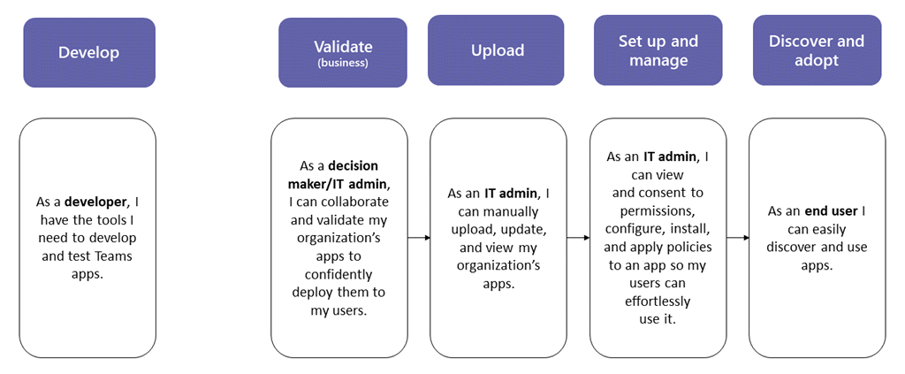

# Публикация настраиваемого приложения путем отправки пакета приложенияPublish a custom app by uploading an app package

> [!NOTE]
> При публикации настраиваемого приложения Teams оно доступно для пользователей в магазине приложений вашей организации.When you publish a custom Teams app, it's available to users in your organization's app store. Существует два способа публикации настраиваемого приложения и способ его использования в зависимости от того, как вы получаете приложение.There are two ways to publish a custom app and the way that you use depends on how you get the app. **В этой статье рассказывается о том, как опубликовать пользовательское приложение, отправив пакет приложения (в формате ZIP), который разработчик отправляет вам**.**This article focuses on how to publish a custom app by uploading an app package (in .zip format) that a developer sends you**. Другой метод, утверждающий настраиваемое приложение, используется, если разработчик отправляет приложение непосредственно на страницу <a href="https://docs.microsoft.com/microsoftteams/manage-apps" target="_blank">Управление приложениями</a> с помощью API отправки приложений Teams.The other method, approving a custom app, is used when a developer submits an app directly to the <a href="https://docs.microsoft.com/microsoftteams/manage-apps" target="_blank">Manage apps</a> page through the Teams App Submission API. Чтобы узнать больше об этом методе, ознакомьтесь со статьей <a href="https://docs.microsoft.com/microsoftteams/submit-approve-custom-apps" target="_blank">Публикация настраиваемого приложения, отправленного с помощью API отправки приложений Teams</a>.To learn more about that method, see <a href="https://docs.microsoft.com/microsoftteams/submit-approve-custom-apps" target="_blank">Publish a custom app submitted through the Teams App Submission API</a>.

В этой статье приведены исчерпывающие инструкции по развертыванию приложения Teams в среде разработки до обнаружения.This article provides end-to-end guidance for how to take your Teams app from development to deployment to discovery. Это руководство сосредоточено на аспектах приложения Teams и предназначено для администраторов и ИТ-специалистов.This guidance focuses on the Teams aspects of the app and is intended for admins and IT pros. Дополнительные сведения о разработке приложений Teams можно найти в <a href="https://docs.microsoft.com/microsoftteams/platform" target="_blank">документации разработчиков Teams</a>.For more information about developing Teams apps, see the <a href="https://docs.microsoft.com/microsoftteams/platform" target="_blank">Teams developer documentation</a>.

## РазработкаDevelop

### Создание приложенияCreate your app

Платформа разработчиков Microsoft Teams позволяет разработчикам интегрировать собственные приложения и службы для повышения производительности, принятия решений быстрее и создания совместной работы над существующим контентом и рабочими процессами.The Microsoft Teams developer platform makes it easy for developers to integrate your own apps and services to improve productivity, make decisions faster, and create collaboration around existing content and workflows. Приложения, созданные на платформе Teams, — это мосты между клиентом Teams и Вашими службами и рабочими процессами, которые переносятся непосредственно в контекст вашей платформы совместной работы.Apps built on the Teams platform are bridges between the Teams client and your services and workflows, bringing them directly into the context of your collaboration platform. Дополнительные сведения можно найти в <a href="https://docs.microsoft.com/microsoftteams/platform" target="_blank">документации разработчиков Teams</a>.For more information, go to the <a href="https://docs.microsoft.com/microsoftteams/platform" target="_blank">Teams developer documentation</a>.

## ДействительValidate

### Получение пакета приложенияGet the app package

Когда приложение будет готово к использованию в производстве, разработчик должен создать пакет приложения.When the app is ready for use in production, the developer should produce an app package. Для этого они могут использовать <a href="https://docs.microsoft.com/microsoftteams/platform/get-started/get-started-app-studio" target="_blank">Приложение App Studio</a> .They can use <a href="https://docs.microsoft.com/microsoftteams/platform/get-started/get-started-app-studio" target="_blank">App Studio</a> for that. Файлы будут отправлены в формате ZIP.They'll send you the file in .zip format.

Корпорация Майкрософт использует <a href="https://docs.microsoft.com/microsoftteams/platform/publishing/office-store-approval" target="_blank">эти рекомендации</a> для обеспечения соответствия приложений стандартам качества и безопасности в магазине глобальных приложений Teams.Microsoft uses <a href="https://docs.microsoft.com/microsoftteams/platform/publishing/office-store-approval" target="_blank">these guidelines</a> to ensure apps comply with the quality and security standards of the global Teams apps store.

### Разрешение доверенных пользователей отправлять пользовательские приложенияAllow trusted users to upload custom apps

Чтобы проверить, правильно ли приложение работает в вашем производственном клиенте, необходимо разрешить себе и/или надежным пользователям отправлять пользовательские приложения в производственный клиент.To validate that the app is working correctly in your production tenant, you need to allow yourself and/or trusted users to upload custom apps in the production tenant. Для этого используются <a href="https://docs.microsoft.com/microsoftteams/teams-app-setup-policies" target="_blank">политики настройки приложений</a> .You use <a href="https://docs.microsoft.com/microsoftteams/teams-app-setup-policies" target="_blank">app setup policies</a> to do this.

> [!NOTE]
> Если вы не уверены в том, что вы можете загрузить приложение в производственный клиент для проверки, даже для себя или для доверенных пользователей, можно пропустить этот шаг и выполнить действия, описанные в разделах [Отправка](#upload) и [Настройка и управление](#set-up-and-manage) , чтобы опубликовать непроверенное приложение в магазине приложений вашей организации.If you're uncomfortable with uploading the app to your production tenant for validation, even for yourself or trusted users, you can skip this step and follow the steps in the [Upload](#upload) and [Set up and manage](#set-up-and-manage) sections to publish the unvalidated app to your organization's app store. Затем Ограничьте доступ к этому приложению только себе и надежным пользователям.Then, restrict access to that app to only yourself and users you trust. Эти пользователи могут затем получить приложение из магазина приложений вашей организации для выполнения проверки.These users can then get the app from your organization's app store to perform validation. После проверки приложения используйте те же политики разрешений, чтобы открыть Access и извлечь приложение для использования на рабочем месте.After the app is validated, use the same permission policies to open access and roll the app out for production use.

Чтобы разрешить надежным пользователям загружать пользовательские приложения, выполните указанные ниже действия.To allow trusted users to upload custom apps, follow these steps:

1. Включите параметр **Разрешить взаимодействие с пользовательскими приложениями** в масштабе приложения.Turn on the **Allow interaction with custom apps** org-wide app setting. Для этого выполните следующие действия:To do this:
    1. В левой области навигации центра администрирования Microsoft Teams перейдите в раздел **приложения Teams**  >  **Управление приложениями**, а затем выберите **Параметры приложения для всей Организации**.In the left navigation of the Microsoft Teams admin center, go to **Teams apps** > **Manage apps**, and then click **Org-wide app settings**.
    2. В разделе **пользовательские приложения**включите **параметр Разрешить взаимодействие с пользовательскими приложениями**и нажмите кнопку **сохранить**.Under **Custom apps**, turn on **Allow interaction with custom apps**, and then click **Save**.
2. Отключите параметр " **отправлять пользовательские приложения** " в политике настройки глобального приложения.Turn off the **Upload custom apps** setting in the global app setup policy. Для этого выполните следующие действия:To do this:
    1. В левой области навигации центра администрирования Microsoft Teams перейдите в раздел **Teams apps**  >  **политики настройки**приложений группы, а затем выберите **глобальную политику (по умолчанию на уровне Организации)** .In the left navigation of the Microsoft Teams admin center, go to **Teams apps** > **Setup policies**, and then click the **Global (Org-wide default)** policy.
    2. Отключите функцию " **отправить пользовательские приложения**" и нажмите кнопку " **сохранить**".Turn off **Upload custom apps**, and then click **Save**.
3. Создайте новую политику настройки приложения, которая позволяет отправлять пользовательские приложения и назначать их набору доверенных пользователей.Create a new app setup policy that allows uploading custom apps and assign it to your set of trusted users. Для этого выполните следующие действия:To do this:
    1. В левой области навигации центра администрирования Microsoft Teams перейдите в раздел **Teams apps**  >  **политики настройки**приложений группы, а затем нажмите кнопку **Добавить**.In the left navigation of the Microsoft Teams admin center, go to **Teams apps** > **Setup policies**, and then click the **Add**. Присвойте новой политике имя и описание, включите команду **отправить пользовательские приложения**, а затем нажмите кнопку **сохранить**.Give the new policy a name and description, turn on **Upload custom apps**, and then click **Save**.
    2. Выберите созданную политику и нажмите кнопку **Управление пользователями**.Select the new policy you created, and then click **Manage users**. Найдите пользователя, нажмите кнопку **Добавить**, а затем — **Применить**.Search for a user, click **Add**, and then click **Apply**. Повторите этот шаг, чтобы назначить политику всем доверенным пользователям.Repeat this step to assign the policy to all your trusted users.

        

    Теперь пользователи могут добавить манифест приложения, чтобы проверить, правильно ли приложение работает в производственном клиенте.These users can now upload the app manifest to validate that the app is working correctly in the production tenant.

## ДаноUpload

Чтобы сделать приложение доступным для пользователей в магазине приложений вашей организации, загрузите приложение.To make the app available to users in your organization's app store, upload the app. Это можно сделать на странице <a href="https://docs.microsoft.com/microsoftteams/manage-apps" target="_blank">Управление приложениями</a> в центре администрирования Microsoft Teams.You can do this on the <a href="https://docs.microsoft.com/microsoftteams/manage-apps" target="_blank">Manage apps</a> page of the Microsoft Teams admin center.

1. В левой области навигации центра администрирования Microsoft Teams перейдите в раздел **приложения Teams**  >  **Управление приложениями**.In the left navigation of the Microsoft Teams admin center, go to **Teams apps** > **Manage apps**.
2. Нажмите кнопку **Добавить**, щелкните **выбрать файл**, а затем выберите пакет приложения, полученный от разработчика.Click **Upload**, click **Select a file**, and then select the app package that you received from the developer.

    

## Настройка и управлениеSet up and manage

### Управление доступом к приложениюControl access to the app

По умолчанию все пользователи в организации могут получить доступ к приложению в магазине приложений вашей организации.By default, all users in your organization can access the app in your organization's app store. Чтобы ограничить круг лиц, имеющих разрешение на использование приложения, и управлять им, вы можете создать и назначить политику разрешений для приложения.To restrict and control who has permission to use the app, you can create and assign an app permission policy. Дополнительные сведения можно найти <a href="https://docs.microsoft.com/microsoftteams/teams-app-permission-policies" target="_blank">в разделе Управление политиками разрешений приложений в Teams</a>.To learn more, see <a href="https://docs.microsoft.com/microsoftteams/teams-app-permission-policies" target="_blank">Manage app permission policies in Teams</a>.

### Закрепление и установка приложения для пользователей для выясненияPin and install the app for users to discover

По умолчанию, чтобы пользователи могли найти приложение, нужно перейти в магазин приложений вашей организации и просмотреть или найти его.By default, for users to find the app they have to go to your organization's app store and browse or search for it. Чтобы пользователи могли легко получить доступ к приложению, вы можете закрепить приложение на панели приложения в Teams.To make it easy for users to get to the app, you can pin the app to the app bar in Teams. Для этого создайте политику настройки приложения и назначьте ее пользователям.To do this, create an app setup policy and assign it to users. Дополнительные сведения можно найти <a href="https://docs.microsoft.com/microsoftteams/teams-app-setup-policies" target="_blank">в разделе Управление политиками настройки приложений в Teams</a>.To learn more, see <a href="https://docs.microsoft.com/microsoftteams/teams-app-setup-policies" target="_blank">Manage app setup policies in Teams</a>.

## Обнаружение и принятиеDiscover and adopt

Пользователи, у которых есть разрешения на доступ к приложению, могут найти его в магазине приложений вашей организации.Users who have permissions to the app can find it in your organization's app store. Чтобы найти пользовательские приложения своей организации, перейдите на страницу приложения, созданную в соответствии с \*\* *названием своей организации* \*\* .Go to **Built for *Your Organization Name*** on the Apps page to find your organization's custom apps.

Если вы создали и назначили политику настройки приложения, приложение закрепляется на панели приложения в Teams для упрощения доступа пользователей, которым назначена эта политика.If you created and assigned an app setup policy, the app is pinned to the app bar in Teams for easy access for those users who were assigned the policy.

## ОбновлениеUpdate

Чтобы обновить приложение, разработчики должны выполнить инструкции, описанные в разделах " [Разработка](#develop) " и " [Проверка](#validate) ".To update an app, developers should continue to follow the steps in the [Develop](#develop) and [Validate](#validate) sections.

Вы можете обновить приложение на странице "Управление приложениями" в центре администрирования Microsoft Teams.You can update the app on the Manage apps page in the Microsoft Teams admin center. Для этого на левой панели навигации в центре администрирования Microsoft Teams перейдите в раздел **приложения Teams**  >  **Управление приложениями**.To do this, in the left navigation of the Microsoft Teams admin center, go to **Teams apps** > **Manage apps**. Щелкните имя приложения и нажмите кнопку **Обновить**.Click the app name, and then click **Update**. При этом существующее приложение заменяется, а все политики разрешений приложений и политики настройки приложений остаются принудительно примененными для обновленного приложения.Doing this replaces the existing app, and all app permission policies and app setup policies remain enforced for the updated app.

### Процесс обновления конечных пользователейEnd user update experience

В большинстве случаев после завершения обновления приложения автоматически появляется новая версия для конечных пользователей.In most cases, after you complete an app update the new version automatically appears for end users. Тем не менее, в <a href="https://docs.microsoft.com/microsoftteams/platform/resources/schema/manifest-schema" target="_blank">Манифест Microsoft Teams</a> , для которого требуется принять пользователя, существуют некоторые обновления.However, there are some updates to the <a href="https://docs.microsoft.com/microsoftteams/platform/resources/schema/manifest-schema" target="_blank">Microsoft Teams manifest</a> that require user acceptance to complete:

* Добавление или удаление BotA bot was added or removed
* Изменилось свойство "botId" существующей ленты.An existing bot's "botId" property changed
* Изменилось свойство "isNotificationOnly" существующей ленты.An existing bot's "isNotificationOnly" property changed
* Изменилось свойство "supportsFiles" на BotThe bot's "supportsFiles" property changed
* Добавлено или удалено расширение сообщенияA Messaging extension was added or removed
* Добавлена Новая соединительная линияA new connector was added
* Добавлена новая статическая вкладкаA new static tab was added
* Добавлена новая настраиваемая вкладкаA new configurable tab was added
* Изменились свойства в "webApplicationInfo"Properties inside "webApplicationInfo" changed

## См. такжеRelated topics

- [Публикация настраиваемого приложения, отправленного с помощью API отправки приложений TeamsPublish a custom app submitted through the Teams App Submission API](submit-approve-custom-apps.md)
- [Управление приложениями в центре администрирования Microsoft TeamsManage your apps in the Microsoft Teams admin center](manage-apps.md)
- [Управление пользовательскими политиками и параметрами приложений в TeamsManage custom app policies and settings in Teams](teams-custom-app-policies-and-settings.md)
- [Управление политиками разрешений для приложений в TeamsManage app permission policies in Teams](teams-app-permission-policies.md)
- [Управление политиками настройки приложений в TeamsManage app setup policies in Teams](teams-app-setup-policies.md)
