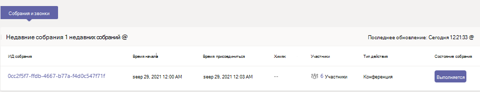
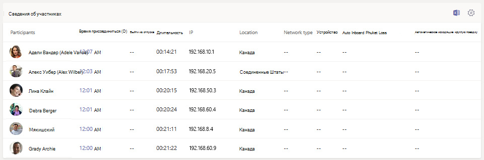
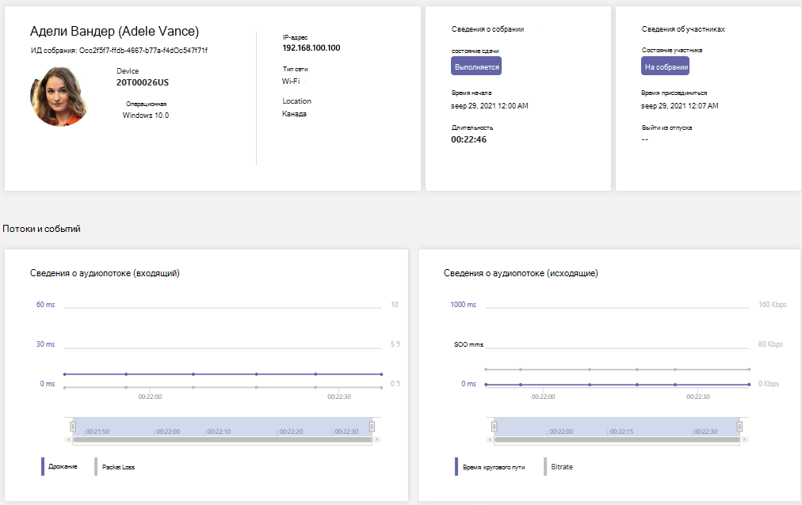

# Использование телеметрии в режиме реального времени для устранения неполадок с качеством собрания

> [!NOTE]
> В настоящее время эта функция находится в режиме предварительной версии.

В этой статье объясняется, как использовать телеметрию в режиме реального времени для устранения неполадок Microsoft Teams качества собраний для отдельных пользователей. Если у вас есть одна из следующих ролей, вы можете увидеть телеметрию в режиме реального времени:

- Администратор Teams
- Teams Специалист службы поддержки связи
- Инженер поддержки по коммуникациям Teams

Дополнительные сведения о ролях Teams администраторов см. в Microsoft Teams роли администратора [для Teams.](/MicrosoftTeams/using-admin-roles)

Телеметрия в режиме реального времени позволяет ИТ-администраторам видеть запланированные собрания важных пользователей и видеть проблемы со звуком, видео, совместным доступом к контенту и сетью. Администраторы могут использовать телеметрию для изучения этих проблем во время собраний и устранения неполадок в режиме реального времени.

## Что такое телеметрия в режиме реального времени?

В настоящее время отдельные средства устранения неполадок собраний доступны Teams администраторам с помощью средств аналитики  вызовов после окончания собрания. Телеметрия в режиме реального времени позволяет администраторам устранять неполадки с запланированными собраниями во время их выполнения.

Телеметрия в режиме реального времени отображает подробные сведения о собраниях Teams для каждого пользователя в вашей учетной записи Office 365, обновленных в режиме реального времени. Она содержит сведения об устройствах, сети, подключениях, проблемах с аудио, видео и совместным доступом к содержимому, что поможет администратору более эффективно устранять неполадки с качеством содержимого.

Как администратор Teams вы получаете полный доступ ко всем данным телеметрии в режиме реального времени для каждого пользователя. Кроме того, вы можете назначать роли Azure Active Directory сотрудникам службы поддержки. Дополнительные информацию об этих ролях см. [в](set-up-call-analytics.md#give-permission-to-support-and-helpdesk-staff)справке.

## Поиск каждого пользователя в режиме реального времени для устранения неполадок телеметрии

Чтобы увидеть все сведения о собрании и данные для пользователя, перейдите в центр [Teams администрирования](https://admin.teams.microsoft.com). В **области** Управление пользователями выберите пользователя и откройте вкладку Собрания  >  & **вызовов** на странице профиля пользователя. В **списке** Недавние собрания вы увидите список собраний, которые пользователь посещал в течение последних 24 часов, для которых доступна телеметрия в режиме реального *времени,* включая все собрания, которые уже ведутся. Если собрание не находится в процессе или не имеет данных телеметрии в режиме реального времени, оно отображается в области **Прошлые собрания.**

Чтобы получить дополнительные сведения об участниках собрания, включая данные об их устройстве, сети  и статистике звука, найдите собрание в области Последние собрания и выберите ссылку под столбцом **Участники.**

Чтобы посмотреть телеметрию в режиме реального времени для данного пользователя, в том числе сведения об устройстве, сети, звуке, видео и сведениях о доступе к содержимому, выберите ИД **собрания.**

## Платформы, поддерживаемые телеметрией в режиме реального времени

- Windows
- Macos
- Linux
- Android
- iOS

## Teams устройства поддерживают телеметрию в режиме реального времени

- MTR — Surface Hub
- MTR — Teams дисплей
- MTR — панели совместной работы
- IP-Телефон устройств

## Ограничения

- Телеметрия в режиме реального времени доступна только для запланированных собраний. Для таких нестрогих собраний, как "Собрание", "ТСТС", "1:1" и групповые звонки, телеметрия в режиме реального времени не работает.
- Телеметрия в режиме реального времени доступна только для тех, кто проводит запланированные трансляции. В настоящее время она недоступна для участников трансляции.
- Данные телеметрии в режиме реального времени доступны для собраний в области Последние собрания в течение 24 часов после его окончания.  Через 24 часа вы не сможете получить доступ к данным, и собрание будет проходить в **прошлых собраниях.** Если собрание длится более 3 часов, телеметрия в режиме реального времени будет доступна только за *последние 3 часа.*
- Телеметрия не работает с более старыми версиями Teams. Если телеметрия недоступна, попробуйте обновить клиент.
- Если к собранию присоединяются внешние участники или  анонимные пользователи, их отображаемые имена будут отображаться как недоступные для сохранения конфиденциальности в разных клиентах.

## См. также

[Настройка аналитики вызовов для каждого пользователя](set-up-call-analytics.md)

[Используйте Microsoft Teams администраторов для управления Teams](/MicrosoftTeams/using-admin-roles).
