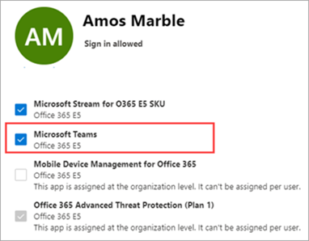

# <a name="manage-user-access-to-teams"></a>Управление доступом пользователей к Teams

Вы управляете доступом к Teams на уровне пользователя, назначая или удаляя лицензию на продукт Microsoft Teams. За исключением анонимного присоединения к собраниям Teams, у каждого пользователя в организации должна быть лицензия Teams, прежде чем он сможет использовать Teams. Вы можете назначить лицензию Teams новым пользователям при создании новых учетных записей пользователей или пользователям с существующими учетными записями.

По умолчанию, когда пользователю назначается план лицензирования (например, Microsoft 365 корпоративный E3 или Microsoft 365 бизнес премиум), автоматически назначается лицензия Teams и пользователь включается в Teams. Вы можете отключить или включить Teams для пользователя, удалив или назначив лицензию в любое время.

Используйте политики обмена сообщениями, управляемые из <a href="https://go.microsoft.com/fwlink/p/?linkid=2024339" target="_blank">Центра Администратор Teams</a>, для управления функциями чата и обмена сообщениями каналов, доступными пользователям в Teams. Вы можете использовать политику по умолчанию или создать одну или несколько пользовательских политик обмена сообщениями для сотрудников вашей организации. Дополнительные сведения см. в разделе ["Управление политиками обмена сообщениями в Teams"](messaging-policies-in-teams.md).
Вы управляете лицензиями Teams в Центр администрирования Microsoft 365 или с помощью PowerShell. Для управления лицензиями необходимо быть глобальным администратором или администратором управления пользователями.

> [!NOTE]
> Мы рекомендуем включить Teams для всех пользователей, чтобы команды могли быть органично сформированы для проектов и других динамических инициатив. Даже если вы выполняете пилотный проект, может оказаться полезным поддерживать Teams для всех пользователей, но только для целевого взаимодействия с пилотной группой пользователей.

## <a name="using-the-microsoft-365-admin-center"></a>Использование Центр администрирования Microsoft 365

Управление лицензиями на уровне пользователей Teams осуществляется непосредственно через Центр администрирования Microsoft 365 интерфейсов управления пользователями. Администратор может назначать лицензии для новых пользователей при создании их учетных записей, а также для пользователей с существующими учетными записями.

> [!IMPORTANT]
> Администратор должен иметь права глобального администратора или администратора управления пользователями для управления лицензиями Microsoft Teams.
Используйте Центр администрирования Microsoft 365 для управления лицензиями Teams для отдельных пользователей или небольших наборов пользователей одновременно. Вы можете управлять лицензиями Teams на странице **"Лицензии** " (одновременно до 20 пользователей) или на странице **"Активные пользователи** ". Выбор метода зависит от того, хотите ли вы управлять лицензиями на продукты для определенных пользователей или управлять пользовательскими лицензиями для определенных продуктов.

Если вам нужно управлять лицензиями Teams для большого количества пользователей, например сотен или тысяч пользователей, используйте [PowerShell](#using-powershell) или групповое лицензирование в [Azure Active Directory (Azure AD)](/azure/active-directory/users-groups-roles/licensing-groups-assign). 

### <a name="assign-a-teams-license"></a>Назначение лицензии Teams

Действия отличаются в зависимости от того, используете ли вы страницу **"Лицензии** " или **"Активные пользователи** ".  Пошаговые инструкции см. в разделе ["Назначение лицензий пользователям"](/microsoft-365/admin/manage/assign-licenses-to-users).

|&nbsp;|&nbsp;|
|---------|---------|
|    |         |

### <a name="remove-a-teams-license"></a>Удаление лицензии Teams

> [!IMPORTANT]
> Отключение номера SKU Teams занимает около 24 часов.

При удалении лицензии Teams у пользователя Teams отключится для этого пользователя, и он больше не будет видеть Teams в средстве запуска приложений или на домашней странице. Подробные инструкции см. в разделе " [Отмена назначения лицензий от пользователей"](/microsoft-365/admin/manage/remove-licenses-from-users).

|&nbsp;|&nbsp;|
|---------|---------|
|    |         |

## <a name="using-powershell"></a>С помощью PowerShell

Используйте PowerShell для массового управления лицензиями Teams для пользователей. Вы включаете и отключаете Teams с помощью PowerShell так же, как и для любой другой лицензии плана обслуживания. Вам потребуются идентификаторы планов обслуживания для Teams, которые будут выглядеть следующим образом:

- Microsoft Teams: TEAMS1
- Microsoft Teams для GCC: TEAMS_GOV
- Microsoft Teams для DoD: TEAMS_DOD

### <a name="assign-teams-licenses-in-bulk"></a>Массовое назначение лицензий Teams

Подробные инструкции см. [в статье "Назначение лицензий учетным записям пользователей с помощью PowerShell"](/office365/enterprise/powershell/assign-licenses-to-user-accounts-with-office-365-powershell).

### <a name="remove-teams-licenses-in-bulk"></a>Массовое удаление лицензий Teams

Подробные инструкции см. в статье "Отключение доступа к службам с помощью [PowerShell](/office365/enterprise/powershell/disable-access-to-services-with-office-365-powershell) " и "Отключение доступа к службам при назначении [пользовательских лицензий"](/office365/enterprise/powershell/disable-access-to-services-while-assigning-user-licenses).

#### <a name="example"></a>Пример 

Ниже приведен пример использования командлетов [New-MsolLicenseOptions](/powershell/module/msonline/new-msollicenseoptions) и [Set-MsolUserLicense](/powershell/module/msonline/set-msoluserlicense) для отключения Teams для пользователей с определенным планом лицензирования. Например, выполните следующие действия, чтобы сначала отключить Teams для всех пользователей с определенным планом лицензирования. Затем включите Teams для каждого отдельного пользователя, который должен иметь доступ к Teams.

> [!IMPORTANT]
> [Командлет New-MsolLicenseOptions](/powershell/module/msonline/new-msollicenseoptions) включает все службы, которые ранее были отключены, если явно не указан в пользовательском скрипте. Например, если вы хотите оставить Exchange и Sway отключенными, а также отключить Teams, необходимо включить его в сценарий, или exchange и Sway будут включены для указанных вами пользователей.

Выполните следующую команду, чтобы отобразить все доступные планы лицензирования в организации. Дополнительные сведения см. в разделе ["Просмотр лицензий и служб с помощью PowerShell"](/office365/enterprise/powershell/view-licenses-and-services-with-office-365-powershell).


```powershell
Get-MsolAccountSku
```

Выполните следующие команды, \<CompanyName:License> где указано название вашей организации и идентификатор плана лицензирования, полученного на предыдущем шаге. Например, ContosoSchool:ENTERPRISEPACK_STUDENT.

```powershell
$acctSKU="<CompanyName:License>
$x = New-MsolLicenseOptions -AccountSkuId $acctSKU -DisabledPlans "TEAMS1"
```

Выполните следующую команду, чтобы отключить Teams для всех пользователей, имеющих активную лицензию для плана лицензирования.

```powershell
Get-MsolUser | Where-Object {$_.licenses[0].AccountSku.SkuPartNumber -eq  ($acctSKU).Substring($acctSKU.IndexOf(":")+1,  $acctSKU.Length-$acctSKU.IndexOf(":")-1) -and $_.IsLicensed -eq $True} |  Set-MsolUserLicense -LicenseOptions $x
```

## <a name="related-topics"></a>См. также

- [Лицензии на надстройки Teams](teams-add-on-licensing/microsoft-teams-add-on-licensing.md)
- [Назначение лицензий на надстройки Teams](teams-add-on-licensing/assign-teams-add-on-licenses.md)
- [Просмотр лицензий и служб с помощью PowerShell](/office365/enterprise/powershell/view-licenses-and-services-with-office-365-powershell)
- [Названия продуктов и идентификаторы планов служб для лицензирования](/azure/active-directory/users-groups-roles/licensing-service-plan-reference)
- [Справочник по SKU для образовательных учреждений](sku-reference-edu.md)
