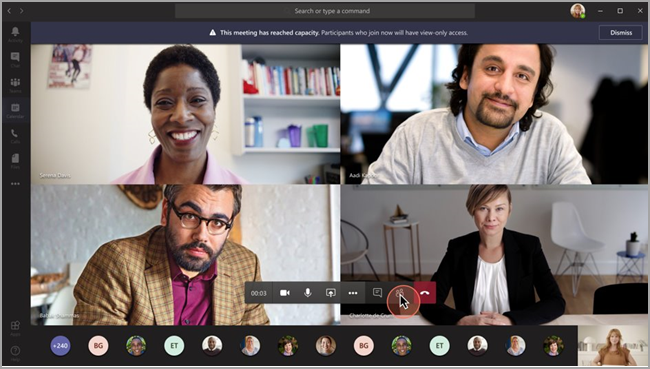
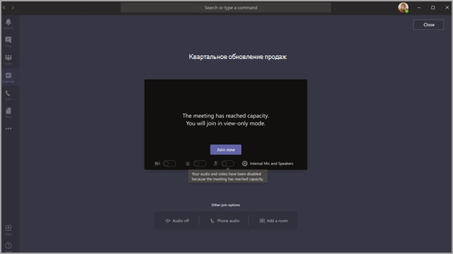

# <a name="teams-view-only-meeting-experience"></a>Режим собраний Teams только для просмотра

> [!Note]
> Трансляции только для просмотра доступны в Microsoft 365 E3/E5 и Microsoft 365 A3/A5. Эта функция станет доступна 1 марта 2021 г. в отключенном по умолчанию состоянии. Развертывание функции в облаке сообщества для государственных организаций Microsoft 365 (GCC) начнется в конце марта 2021 г. Развертывание в облаке сообщества для государственных организаций High (GCCH) и Министерства обороны (DoD) будет осуществлено позже. Если нужно включить эту функцию по умолчанию, после указанной даты измените политику по умолчанию. Используйте PowerShell, чтобы включить политику `Set-CsTeamsMeetingPolicy -Identity Global -StreamingAttendeeMode Enabled`.

> [!Note]
> Если ваше собрание или вебинар достигает ограничения по вместимости, Teams легко масштабируется для поддержки режима трансляции только для просмотра на 10 000 пользователей. Кроме того, сейчас, когда возрос объем удаленной работы, вы можете воспользоваться трансляциями для 20 000 человек до конца этого года. Вебинары в настоящее время не поддерживают трансляцию в режиме только для просмотра.

Microsoft Teams позволяет присоединить к собранию Teams до 10 000 участников. После достижения предельной вместимости основного собрания (то есть когда число участников достигнет 1000) дополнительные участники будут присоединяться в режиме только для просмотра.

Участники, присоединившиеся к собранию первыми (до достижения предельной вместимости собрания), смогут использовать все возможности собраний Teams. Они могут делиться звуком и видео, просматривать демонстрируемые видео и участвовать в чате собрания.

Участникам, присоединившимся после достижения предельной вместимости собрания, будет доступен режим только для просмотра.

Участники смогут присоединиться к представлению в режиме только для просмотра через рабочий стол, интернет и мобильную версию Teams (Android и iOS).

> [!Note]
> Сейчас предельное количество участников "основного собрания", или, другими словами, количество полностью интерактивных пользователей, составляет 1000 и распространяется на GCC и вебинары.

## <a name="teams-view-only-experience-controls"></a>Средства управления режимом Teams только для просмотра

Включить режим только для просмотра можно с помощью командлета [`Set-CsTeamsMeetingPolicy`](/powershell/module/skype/set-csteamsmeetingpolicy?view=skype-ps) из модуля [SkypeForBusiness PowerShell](/powershell/module/skype/?view=skype-ps) или модуля [MicrosoftTeams](https://www.powershellgallery.com/packages/MicrosoftTeams) версии не ниже 2.0.0.

Чтобы использовать рекомендуемый модуль `MicrosoftTeams`:

```PowerShell
Install-Module -Name "MicrosoftTeams" -MinimumVersion 2.0.0
Connect-MicrosoftTeams
```

Чтобы включить возможности только для просмотра, можно использовать следующий фрагмент кода PowerShell:

```PowerShell
Set-CsTeamsMeetingPolicy -Identity Global -StreamingAttendeeMode Enabled
```

Отключить режим только для просмотра можно тоже с помощью PowerShell.

```PowerShell
Set-CsTeamsMeetingPolicy -Identity Global -StreamingAttendeeMode Disabled
```

В будущем администраторы смогут также отключать режим только для просмотра в Центре администрирования Teams.

## <a name="impact-to-users"></a>Влияние на пользователей

Взаимодействие с пользователем зависит от нескольких факторов.

После достижения предельной вместимости собрания участник не сможет присоединиться к собранию, если выполняется любое из следующих условий.

- Администратор отключил возможность работы с Teams в режиме только для просмотра либо для организатора, либо для всего клиента.
- Пользователь, участвующий в режиме только для просмотра, не может присоединиться в обход вестибюля. Например, если организатор собрания разрешает присоединяться в обход вестибюля категории **Сотрудники моей организации**, а участник, не принадлежащий к сотрудникам организации, пытается присоединиться в режиме только для просмотра, он не сможет присоединиться.

После достижения предельной вместимости собрания организатор и выступающие собрания увидят баннер, информирующий о том, что достигнута предельная вместимость собрания и что новые участники будут присоединяться в режиме только для просмотра.

  

После достижения предельной вместимости собрания участники собрания увидят на экране предварительного присоединения уведомление о том, что они присоединяются в режиме только для просмотра.

  

При наличии мест пользователь всегда присоединяется к основному собранию. Если в основном собрании достигнута предельная вместимость и один или несколько участников покидают основное собрание, в основном собрании появляются свободные места. Участники, которые присоединяются (или повторно присоединяются) к собранию, присоединяются к основному собранию, пока не будет достигнута его предельная вместимость. Участники, присоединившиеся в режиме только для просмотра, не повышаются автоматически до полнофункционального режима, и в настоящее время их нельзя повысить до полнофункционального режима вручную.

Если роли участника и выступающего настроены и выступающий пытается присоединиться к собранию после того, как основное собрание достигло максимальной вместимости, он присоединяется в качестве участника только для просмотра и имеет те же ограничения, что и другие участники, присоединившиеся в режиме только для просмотра. Возможность для выступающего присоединяться в полнофункциональном режиме будет добавлена позже. Организатору всегда будет гарантировано место на собрании в полнофункциональном режиме.

## <a name="impact-to-meeting-presenters-and-organizers"></a>Последствия для выступающих и организаторов собрания

Это влечет за собой определенные последствия для выступающих и организаторов собрания:

- У вас не будет сведений об участнике с разрешением только для просмотра. Обнаружение электронных данных не поддерживается для участников с разрешением только для просмотра.
- Пользователи основного собрания не могут видеть участников, присоединившихся в режиме только для просмотра.
- Вы не можете удалить из собрания участника с разрешением только для просмотра.

> [!Note]
> Количество участников отражает только участников собрания, но не учитывает пользователей в режиме только для просмотра. Поэтому выступающие не могут узнать точное количество пользователей в режиме только для просмотра.

## <a name="experience-for-view-only-attendees"></a>Возможности для участников с разрешением только для просмотра

Режим только для просмотра Teams позволяет участникам:

- Слушать участников основного собрания Teams.
- Просматривать канал видео активного докладчика (если активный докладчик демонстрирует видео).
- Просматривать содержимое, предоставляемое с помощью функции общего доступа к рабочему столу или экрану.

Участник с разрешением только для просмотра не сможет воспользоваться следующими возможностями собраний.

- Присоединение к собранию, если у участника нет разрешения на обход "зала ожидания" на основе установленных политик или параметров "зала ожидания".
- Присоединение к комнате только для просмотра с помощью аудиоконференций.
- Присоединение к комнате только для просмотра с помощью системы комнат Microsoft Teams или служб облачного видеовзаимодействия (CVI).
- Демонстрация видео или звука.
- Просмотр чата собрания или участие в нем.
- Просмотр канала видео участников собрания, если участник не является активным докладчиком.
- Просмотр файлов PowerPoint, демонстрируемых с помощью собственных функций PowerPoint Live или общего доступа отдельных приложений (отличного от общего доступа к рабочему столу).
- Поднятие руки на собрании.
- Отправка и просмотр реакций.
- Взаимодействие с любыми приложениями 3P, интегрированными в собрание Teams, включая опросы.
- Доступ к записи собрания.

## <a name="view-only-feature-limitations"></a>Ограничения режима только для просмотра

- Участники, присоединившиеся в режиме только для просмотра, смогут просматривать субтитры только на рабочем столе и в Интернете. В настоящее время поддерживаются только субтитры на английском языке.
- Участники, присоединившиеся в режиме только для просмотра, не могут регистрироваться на вебинары.
- Для участников с разрешением только для просмотра доступна поддержка технологии потоковой передачи.
- Участники с разрешением только для просмотра не включаются в отчет об участниках.
- Участникам с разрешением только для просмотра доступен режим одного видеоокна. Они могут видеть либо активного выступающего, либо демонстрируемое содержимое (но не оба окна одновременно).
- В настоящее время макеты **Галерея**, **Большая галерея** и **Режим "Вместе"** не поддерживаются для участников с разрешением только для просмотра.
- Только просмотр участников поддерживаются следующими политиками "lobby": "Люди в моей организации", "Люди в моей организации и гости", "Люди в моей организации, надежные организации и гости" и "Все". Если вы используете политику вестибюля, которая не поддерживает режим только для просмотра, участники, присоединившиеся в режиме, не будут допускаться на собрание. 
- Задержка сигнала для участников с разрешением только для просмотра будет отличаться от задержки для обычных участников <sup>1</sup>

  <sup>1</sup> Для участников с разрешением только для просмотра будет применяться 30-секундная задержка видео и звука на собрании.  
