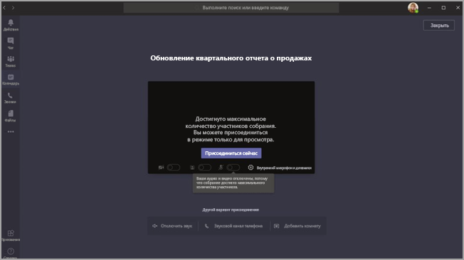

# <a name="teams-view-only-meeting-experience"></a><span data-ttu-id="3c094-103">Представление только для просмотра собраний Teams</span><span class="sxs-lookup"><span data-stu-id="3c094-103">Teams view-only meeting experience</span></span>

> [!Note]
> <span data-ttu-id="3c094-104">Доступ к собраниям только для просмотра будет доступен в начале марта 2021 г.</span><span class="sxs-lookup"><span data-stu-id="3c094-104">View-only meeting experience will be available in early March 2021.</span></span>

> [!Note]
> <span data-ttu-id="3c094-105">Мы временно увеличили возможность просмотра только для 20 000 участников, но 30 июня 2021 г. мы снова соберем поддержку до 10 000 участников.</span><span class="sxs-lookup"><span data-stu-id="3c094-105">We've temporarily increased view-only experience for 20,000 attendees, but we'll revert support to 10,000 attendees on June 30, 2021.</span></span>

<span data-ttu-id="3c094-106">В Microsoft Teams к собранию Teams может присоединиться до 10 000 участников.</span><span class="sxs-lookup"><span data-stu-id="3c094-106">Microsoft Teams allows up to 10,000 attendees to join a Teams meeting.</span></span> <span data-ttu-id="3c094-107">После того как будет достигнуто количество участников основного собрания, другие участники будут присоединяться с представлением только для просмотра.</span><span class="sxs-lookup"><span data-stu-id="3c094-107">After the capacity of the main meeting has been reached, additional attendees will join with a view-only experience.</span></span>

<span data-ttu-id="3c094-108">Участники, которые первыми присоединяются к собранию (до его емкости), получают все возможности собраний Teams.</span><span class="sxs-lookup"><span data-stu-id="3c094-108">Attendees who join the meeting first, up to the capacity of the meeting, will get the full Teams meeting experience.</span></span> <span data-ttu-id="3c094-109">Они могут делиться звуком и видео, видеть общие видео и участвовать в чате собрания.</span><span class="sxs-lookup"><span data-stu-id="3c094-109">They can share audio and video, see shared videos, and participate in meeting chat.</span></span>

<span data-ttu-id="3c094-110">Участники, которые присоединяются к собранию после того, как достигнуто основное количество собраний, смогут работать только для просмотра.</span><span class="sxs-lookup"><span data-stu-id="3c094-110">Attendees who join after the main meeting capacity has been reached will have a view-only experience.</span></span>

<span data-ttu-id="3c094-111">Участники присоединяются к собраниям с полной поддержкой мобильных устройств с Android и iOS.</span><span class="sxs-lookup"><span data-stu-id="3c094-111">We have full Android and iOS mobile support for an attendee to join.</span></span>

> [!Note]
> <span data-ttu-id="3c094-112">В настоящее время ограничение на количество пользователей, которые могут общаться и звонить на собрание, составляет 300 в WW и 250 в GCC, GCC High и DoD.</span><span class="sxs-lookup"><span data-stu-id="3c094-112">The current limit for the number of people who can chat and call in to a meeting is 300 in WW and 250 in GCC, GCC High, and DoD.</span></span>

<span data-ttu-id="3c094-113">По умолчанию все организаторы, у которых есть SKU E3/E5/A3/A5, включены только для просмотра.</span><span class="sxs-lookup"><span data-stu-id="3c094-113">The view-only experience is enabled by default for any organizer who has E3/E5/A3/A5 SKU.</span></span> <span data-ttu-id="3c094-114">Дальнейшая настройка и настройка не требуются.</span><span class="sxs-lookup"><span data-stu-id="3c094-114">No further configuration or setup is required.</span></span>

### <a name="disable-teams-view-only-experience"></a><span data-ttu-id="3c094-115">Отключение только просмотра в Teams</span><span class="sxs-lookup"><span data-stu-id="3c094-115">Disable Teams view-only experience</span></span>

<span data-ttu-id="3c094-116">Администраторы могут отключить только просмотр с помощью PowerShell.</span><span class="sxs-lookup"><span data-stu-id="3c094-116">Administrators can disable the view-only experience using PowerShell.</span></span>

```PowerShell
Set-CsTeamsMeetingPolicy -Identity Global -StreamingAttendeeMode Disabled
```

<span data-ttu-id="3c094-117">В будущем администраторы также смогут отключить возможности просмотра в Центре администрирования Teams.</span><span class="sxs-lookup"><span data-stu-id="3c094-117">In the future, it will also be possible for administrators to disable the view-only experience in the Teams admin center.</span></span>

## <a name="impact-to-users"></a><span data-ttu-id="3c094-118">Влияние на пользователей</span><span class="sxs-lookup"><span data-stu-id="3c094-118">Impact to users</span></span>

<span data-ttu-id="3c094-119">Пользовательский интерфейс зависит от нескольких факторов.</span><span class="sxs-lookup"><span data-stu-id="3c094-119">A user's experience will vary depending on several factors.</span></span>

<span data-ttu-id="3c094-120">После того как будет достигнуто количество участников основного собрания, участник не сможет присоединиться к собранию, если:</span><span class="sxs-lookup"><span data-stu-id="3c094-120">When the capacity of the main meeting has been reached, an attendee will be unable to join the meeting if any of the following are true:</span></span>

- <span data-ttu-id="3c094-121">Администратор отключил для Teams только просмотр.</span><span class="sxs-lookup"><span data-stu-id="3c094-121">An administrator has disabled the Teams view-only experience.</span></span>
- <span data-ttu-id="3c094-122">У участника нет разрешения на обход "вести".</span><span class="sxs-lookup"><span data-stu-id="3c094-122">The attendee doesn't have permission to bypass the lobby.</span></span>

<span data-ttu-id="3c094-123">После того как будет достигнуто количество участников основного собрания, организатор и зрители увидят баннер, информирующий о том, что количество участников достигается и что новые участники присоединятся к только просмотру.</span><span class="sxs-lookup"><span data-stu-id="3c094-123">When the capacity of the main meeting has been reached, the meeting organizer and presenters will see a banner informing them that the meeting capacity has been reached and that new attendees will join a view-only attendee.</span></span>

  

<span data-ttu-id="3c094-125">После того как будет достигнуто количество участников основного собрания, участники собрания будут на экране предварительного присоединения сообщать о том, что они присоединяются в режиме просмотра.</span><span class="sxs-lookup"><span data-stu-id="3c094-125">When the capacity of the main meeting has been reached, meeting attendees will be informed on the pre-join screen that they're joining in view-only mode.</span></span>

  

<span data-ttu-id="3c094-127">Если места достаточно, пользователь всегда будет присоединяться к основному собранию.</span><span class="sxs-lookup"><span data-stu-id="3c094-127">If there's space, a user will always join the main meeting.</span></span> <span data-ttu-id="3c094-128">Если основное собрание достигается и один или несколько участников покидают главное собрание, его можно вместить.</span><span class="sxs-lookup"><span data-stu-id="3c094-128">If the main meeting reaches capacity, and one or more attendees leave the main meeting, the main meeting has available capacity.</span></span> <span data-ttu-id="3c094-129">Участники, которые присоединяются к собранию или повторно присоединяются к нему, пока оно не достигнет нужной мощности.</span><span class="sxs-lookup"><span data-stu-id="3c094-129">Attendees who join (or rejoin) the meeting will join the main meeting until it reaches capacity again.</span></span> <span data-ttu-id="3c094-130">Участники, которые работают только с просмотром, не будут автоматически повышены до главного собрания и в настоящее время не могут быть вручную повышены до основного собрания.</span><span class="sxs-lookup"><span data-stu-id="3c094-130">Attendees who are in the view-only experience won't automatically be promoted to the main meeting and can't currently be manually promoted to the main meeting.</span></span>

<span data-ttu-id="3c094-131">Если роли участника и участника не заданы, пробелы в основном собрании заполняются первым.</span><span class="sxs-lookup"><span data-stu-id="3c094-131">If presenter/attendee roles haven't been set, spaces in the main meeting are filled on a first-come, first-served basis.</span></span> <span data-ttu-id="3c094-132">После этого все остальные пользователи будут присоединяться к собранию только для просмотра.</span><span class="sxs-lookup"><span data-stu-id="3c094-132">Once the meeting capacity has been reached, all other users will join with a view-only experience.</span></span>

## <a name="impact-to-meeting-presenters"></a><span data-ttu-id="3c094-133">Влияние на лицев собраний</span><span class="sxs-lookup"><span data-stu-id="3c094-133">Impact to meeting presenters</span></span>

<span data-ttu-id="3c094-134">Мы оставляем место в обычном собрании для пользователей, явно указанных в качестве участников в параметрах собрания.</span><span class="sxs-lookup"><span data-stu-id="3c094-134">We'll reserve space in the normal meeting for users explicitly indicated as presenters in the meeting options.</span></span> <span data-ttu-id="3c094-135">Если один из них покинет, а позже снова к собранию, он сможет ться на собрание как один из них.</span><span class="sxs-lookup"><span data-stu-id="3c094-135">If a presenter leaves and then later rejoins the meeting, they'll be let into the meeting as a presenter.</span></span>

<span data-ttu-id="3c094-136">В число ограничений, накладывающихся на собрание, входят:</span><span class="sxs-lookup"><span data-stu-id="3c094-136">Limitations for meeting presenters include:</span></span>

- <span data-ttu-id="3c094-137">У вас не будет сведений об этом участнике.</span><span class="sxs-lookup"><span data-stu-id="3c094-137">You'll have no information about the view-only attendee.</span></span> <span data-ttu-id="3c094-138">Мы не поддерживаем обнаружение электронных почты только для просмотров.</span><span class="sxs-lookup"><span data-stu-id="3c094-138">We don't support E-discovery for view-only attendees.</span></span>
- <span data-ttu-id="3c094-139">Пользователи не могут просматривать только просмотр участников.</span><span class="sxs-lookup"><span data-stu-id="3c094-139">Users can't see the view-only attendees.</span></span>
- <span data-ttu-id="3c094-140">Удалить участника из собрания, только для просмотра, нельзя.</span><span class="sxs-lookup"><span data-stu-id="3c094-140">You can't remove a view-only attendee from the meeting.</span></span>

> [!Note]
> <span data-ttu-id="3c094-141">Число участников будет учитываться только для участников собрания, а не для участников в переполненном помещении.</span><span class="sxs-lookup"><span data-stu-id="3c094-141">Attendee count will only reflect the people in the meeting and not the people in the overflow room.</span></span> <span data-ttu-id="3c094-142">Таким образом, вы не сможете получить точное количество пользователей, которые будут использовать только просмотр.</span><span class="sxs-lookup"><span data-stu-id="3c094-142">Therefore, presenters can't get an exact count of who is in the view-only experience.</span></span>

## <a name="experience-for-view-only-attendees"></a><span data-ttu-id="3c094-143">Просмотр только для участников</span><span class="sxs-lookup"><span data-stu-id="3c094-143">Experience for view-only attendees</span></span>

<span data-ttu-id="3c094-144">Возможность просмотра только в Teams позволяет участникам:</span><span class="sxs-lookup"><span data-stu-id="3c094-144">The Teams view-only experience allows attendees to:</span></span>

- <span data-ttu-id="3c094-145">Прослушав участников основного собрания Teams.</span><span class="sxs-lookup"><span data-stu-id="3c094-145">Listen to the participants in the main Teams meeting.</span></span>
- <span data-ttu-id="3c094-146">Посмотрите видеосвязь активного выступающего (если активный докладчик обменивается видео).</span><span class="sxs-lookup"><span data-stu-id="3c094-146">See the video feed for the active speaker (if the active speaker is sharing video).</span></span>
- <span data-ttu-id="3c094-147">Просмотр общего содержимого с помощью функции совместного использования рабочего стола.</span><span class="sxs-lookup"><span data-stu-id="3c094-147">See content being shared using the share desktop functionality.</span></span>

<span data-ttu-id="3c094-148">Участники, доступные только для просмотра, не смогут просматривать на собраниях следующие параметры:</span><span class="sxs-lookup"><span data-stu-id="3c094-148">The view-only attendee won't be able to experience the following options in meetings:</span></span>

- <span data-ttu-id="3c094-149">Присоединитесь к собранию, если у участника нет разрешения на обход "вести", исходя из установленных политик и параметров "вести".</span><span class="sxs-lookup"><span data-stu-id="3c094-149">Join the meeting if the attendee doesn't have permission to bypass the lobby based on set lobby policies or options.</span></span>
- <span data-ttu-id="3c094-150">Присоединитесь к комнате переполнения с помощью аудиоконференции.</span><span class="sxs-lookup"><span data-stu-id="3c094-150">Join the Overflow Room via Audio Conferencing.</span></span>
- <span data-ttu-id="3c094-151">Присоединитесь к окну "Переполнение" с помощью системы комнат Microsoft Teams или службы Cloud Video Interop (CVI).</span><span class="sxs-lookup"><span data-stu-id="3c094-151">Join the Overflow Room via Microsoft Teams Room system or via Cloud Video Interop (CVI) services.</span></span>
- <span data-ttu-id="3c094-152">Присоединитесь к комнате переполнения с помощью мобильного приложения Teams для Android.</span><span class="sxs-lookup"><span data-stu-id="3c094-152">Join the Overflow Room via the Teams Android mobile app.</span></span>
- <span data-ttu-id="3c094-153">Поделитесь звуком или видео.</span><span class="sxs-lookup"><span data-stu-id="3c094-153">Share their audio or video.</span></span>
- <span data-ttu-id="3c094-154">Смотреть или участвовать в чате собрания.</span><span class="sxs-lookup"><span data-stu-id="3c094-154">See or participate in the meeting chat.</span></span>
- <span data-ttu-id="3c094-155">Смотреть видеосвязь участников собрания, если участник не является активным выступающим.</span><span class="sxs-lookup"><span data-stu-id="3c094-155">See the video feed of meeting participants unless the participant is the active speaker.</span></span>
- <span data-ttu-id="3c094-156">См. файлы PowerPoint, которые совместно используют функции общего доступа PowerPoint или отдельные общие папки приложений (кроме общего доступа к рабочему столу).</span><span class="sxs-lookup"><span data-stu-id="3c094-156">See PowerPoint files that are shared using the native share PowerPoint functionality or individual application shares (other than desktop sharing).</span></span>

## <a name="view-only-feature-limitations"></a><span data-ttu-id="3c094-157">Ограничения функций только для просмотра</span><span class="sxs-lookup"><span data-stu-id="3c094-157">View-only feature limitations</span></span>

- <span data-ttu-id="3c094-158">Участники, только для просмотра, всегда будут видеть субтитры в прямом эфире независимо от параметров трансляции для этого собрания.</span><span class="sxs-lookup"><span data-stu-id="3c094-158">View-only attendees will always see live captions, regardless of the live-captions setting for that meeting.</span></span> <span data-ttu-id="3c094-159">В настоящее время поддерживаются только английские субтитры.</span><span class="sxs-lookup"><span data-stu-id="3c094-159">Only English Captions are supported at this time.</span></span>
- <span data-ttu-id="3c094-160">Участники, только просмотр, будут поддерживаться с помощью потоковой передачи.</span><span class="sxs-lookup"><span data-stu-id="3c094-160">View-only attendees will be supported by streaming technology.</span></span>
- <span data-ttu-id="3c094-161">Только для просмотра участники не включаются в отчет об посещение.</span><span class="sxs-lookup"><span data-stu-id="3c094-161">View-only attendees won't be included in the attendance report.</span></span>
- <span data-ttu-id="3c094-162">Только для просмотра участники будут иметь один видеосвязь.</span><span class="sxs-lookup"><span data-stu-id="3c094-162">View-only attendees will have a single video experience.</span></span> <span data-ttu-id="3c094-163">Они могут видеть либо активного выступающего, либо совместное содержимое, но не оба.</span><span class="sxs-lookup"><span data-stu-id="3c094-163">They can see either the active speaker or the content being shared, but not both.</span></span>
- <span data-ttu-id="3c094-164">В настоящее время не поддерживаются  макеты **"Галерея",**"Большая **галерея"** и "Режим «Вместе» для участников, только для просмотра.</span><span class="sxs-lookup"><span data-stu-id="3c094-164">We don't currently support **Gallery**, **Large gallery**, or **Together mode** layouts for view-only attendees.</span></span>  
- <span data-ttu-id="3c094-165">У участников, только для просмотра, не будет такой же задержки, как у обычных участников.</span><span class="sxs-lookup"><span data-stu-id="3c094-165">View-only attendees won't have the same latency as a regular attendee.</span></span> <span data-ttu-id="3c094-166"><sup>1</sup></span><span class="sxs-lookup"><span data-stu-id="3c094-166"><sup>1</sup></span></span>

  <span data-ttu-id="3c094-167"><sup>1</sup> Участники собрания будут проходить с задержкой в 30 секунд по видеосвязи и звуку.</span><span class="sxs-lookup"><span data-stu-id="3c094-167"><sup>1</sup> View-only attendees will be at a 30-second video and audio delay in the meeting.</span></span>  

## <a name="related-topics"></a><span data-ttu-id="3c094-168">Связанные статьи</span><span class="sxs-lookup"><span data-stu-id="3c094-168">Related topics</span></span>

- [<span data-ttu-id="3c094-169">Надстройка "Дополнительные коммуникации" для Teams</span><span class="sxs-lookup"><span data-stu-id="3c094-169">Advanced communications add-on for Teams</span></span>](teams-add-on-licensing/advanced-communications.md)
- [<span data-ttu-id="3c094-170">Ограничения и спецификации для Teams</span><span class="sxs-lookup"><span data-stu-id="3c094-170">Limits and specifications for Teams</span></span>](limits-specifications-teams.md)
