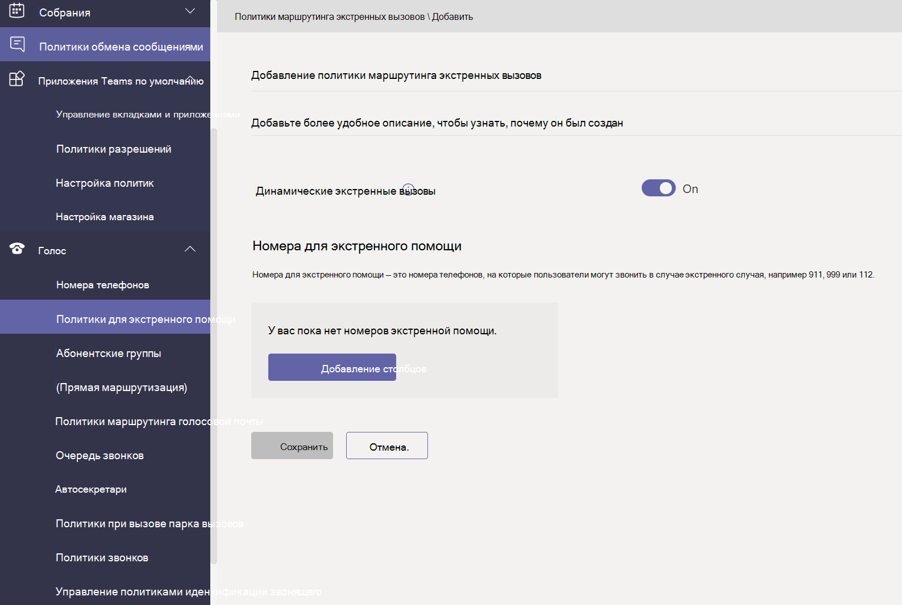
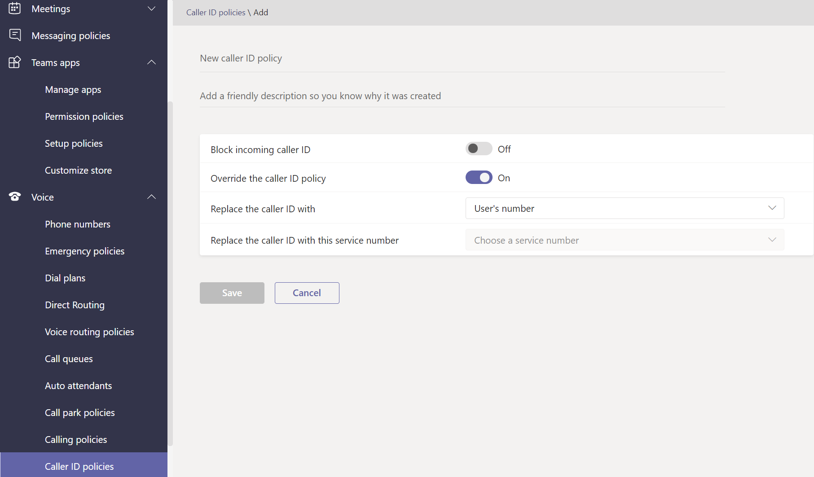
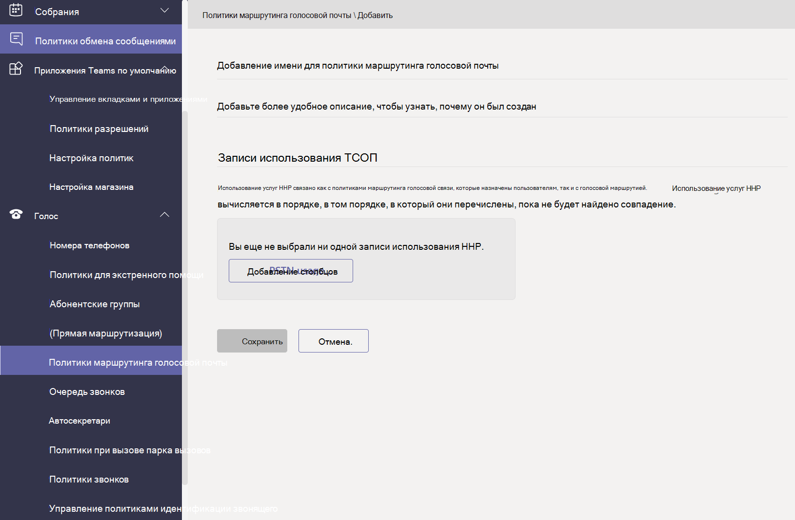

# Управление политиками голосовой связи и звонков в Microsoft Teams

Политики голосовой связи и звонков используются для управления голосовой связью и вызовами в Microsoft Teams.

## Политики экстренных вызовов

Политики [экстренных вызовов используются](manage-emergency-calling-policies.md) для настройки того, что происходит, когда пользователь в вашей организации совершает экстренный вызов. Эти политики управляются в центре администрирования Teams или с помощью Windows PowerShell.

## Политики маршрутизации экстренных вызовов

Если ваша организация развернула прямую маршрутизацию **телефонная система**, можно использовать политики маршрутизации экстренных вызовов, чтобы определить, куда направляются экстренные вызовы, включены ли расширенные экстренные службы и какие номера используются для экстренных служб. Управление этими политиками можно выполнить с помощью PowerShell или Microsoft Teams центра администрирования.

## Политики идентификаторов вызывающих абонентов

[Политики идентификатора вызывающего](caller-id-policies.md) абонента используются для изменения или блокировки идентификатора вызывающего абонента.

## Политики маршрутизации голосовой связи

Политика [маршрутизации голосовой связи](manage-voice-routing-policies.md) — это контейнер для записей об использовании телефонной сети общего пользования (ТСОП). Эти политики можно использовать, если ваша организация развернула телефонная система **прямой маршрутизации**. Управление политиками маршрутизации голосовой связи можно выполнять с помощью PowerShell или Teams центра администрирования.

## Политики звонков

[Политики](teams-calling-policy.md) звонков позволяют контролировать, какие функции переадресации звонков и звонков доступны пользователям, включая возможность личных звонков, отправки звонков в группы звонков и маршрутизации звонков в голосовую почту.

## Парковка вызовов и получение политик

[Приостановка и извлечение](call-park-and-retrieve.md) звонков позволяет пользователям помещать других пользователей на удержание и позволяет одному пользователю или другому пользователю продолжить звонок.

## Создание и использование абонентских групп

[Абонентские группы](create-and-manage-dial-plans.md) преобразовывают номера телефонов с телефонным подключением для авторизации и маршрутизации звонков. Вы можете создавать абонентские группы и управлять ими с помощью PowerShell или Microsoft Teams центра администрирования.

## Статьи по теме

* [Управление политиками экстренных вызовов в Microsoft Teams](manage-emergency-calling-policies.md)
* [Управление политиками маршрутизации экстренных вызовов](manage-emergency-call-routing-policies.md)
* [Управление политиками идентификации вызывающего абонента в Microsoft Teams](caller-id-policies.md)
* [Управление политиками маршрутизации голосовой связи](manage-voice-routing-policies.md)
* [Политики звонков в Microsoft Teams](teams-calling-policy.md)
* [Парковка и восстановление звонков в Microsoft Teams](call-park-and-retrieve.md)
* [Создание и использование абонентских групп](create-and-manage-dial-plans.md)
* [Управление Teams с помощью политик](manage-teams-with-policies.md)
