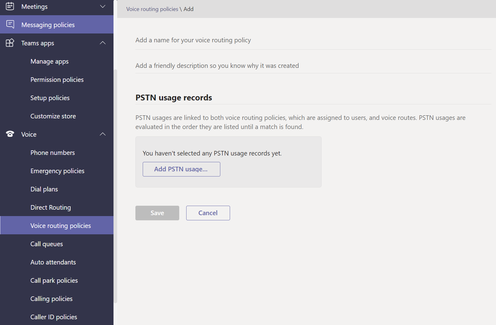

# Управление политиками голосовой и голосовой Microsoft Teams

Политики голосовой и голосовой почты используются для управления голосовой и голосовой Microsoft Teams.

## Политики экстренных вызовов

Политики [экстренных вызовов](manage-emergency-calling-policies.md) используются для настройки того, что происходит при звонке пользователем в организации. Управление этими политиками можно Teams центре администрирования или с помощью Windows PowerShell.

## Политики маршрутизов экстренных вызовов

Если в вашей организации развернута прямая **маршрут телефонная система**,  вы можете использовать политики маршрутизации экстренных вызовов, чтобы определить, куда перенаправят экстренные вызовы, включены ли расширенные экстренные службы и какие номера используются для экстренных служб. Управлять этими политиками можно с помощью PowerShell или Microsoft Teams центре администрирования.

## Политики ИД вызываемой вызовы

[Для изменения или блокировки](caller-id-policies.md) ИД вызываемой вызываемой вызовы применяются политики.

## Политики маршрутов голосовой маршрутии

Политика [голосовой маршрутистики](manage-voice-routing-policies.md) является контейнером для записей использования телефонной сети общего пользования (STN). Эти политики можно использовать, если в вашей организации развернута прямая **телефонная система маршрутизации.** Управление политиками маршрутинга голосовой почты можно управлять с помощью PowerShell или Teams центре администрирования.

## Политики звонков

[Политики звонков](teams-calling-policy.md) контролируют, какие функции переад сообщения и вызовы доступны пользователям, включая возможность личных звонков, отправки звонков в группы звонков и перенаправка звонков на голосовую почту.

## Парк вызовов и извлечение политик

[Парк вызовов и извлечение](call-park-and-retrieve.md) позволяет пользователям помещать других пользователей на удержание и позволяет тому же пользователю или другому пользователю продолжить звонок.

## Создание и использование абонентских групп

[В наборах можно](create-and-manage-dial-plans.md) переводить номера телефонов для авторизации звонков и маршрутизации. Вы можете создавать наборные группы и управлять ими с помощью PowerShell или Microsoft Teams центре администрирования.

## Статьи по теме

* [Управление политиками экстренных вызовов в Microsoft Teams](manage-emergency-calling-policies.md)
* [Управление политиками маршрутизации экстренных вызовов](manage-emergency-call-routing-policies.md)
* [Управление политиками идентификации вызывающего абонента в Microsoft Teams](caller-id-policies.md)
* [Управление политиками маршрутинга голосовой почты](manage-voice-routing-policies.md)
* [Политики звонков в Microsoft Teams](teams-calling-policy.md)
* [Парковка и восстановление звонков в Microsoft Teams](call-park-and-retrieve.md)
* [Создание и использование абонентских групп](create-and-manage-dial-plans.md)
* [Управление Teams политиками](manage-teams-with-policies.md)
