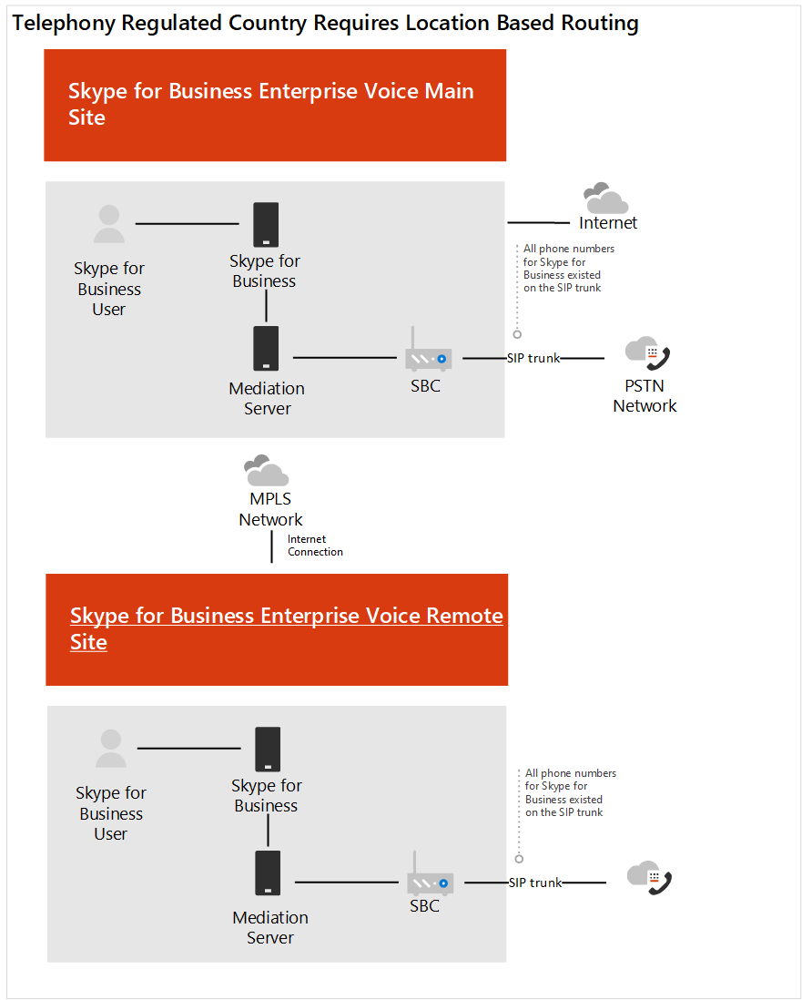

# Пример для Contoso: Location-Based маршрутингаContoso case study: Location-Based Routing

Location-Based Routing (LBR) — это функция, которая ограничивает обход платных платы на основе политики и физического местонахождения пользователя во время звонка.Location-Based Routing (LBR) is a feature that restricts toll bypass based on policy and the user's physical location at the time of placing or receiving a call.  

## ОбзорOverview

В компании Contoso есть два офиса, в которых для уменьшения затрат на междугородние звонки запрещено обходить поставщика услуг телефонной сети общего звонков (STN).Contoso has two offices in a country where it is illegal to bypass the Public Switched Telephone Network (PSTN) provider to decrease long-distance calling costs. В главном офисе есть подключение к Интернету, которое используется как основным, так и вторым офисом.The main office has an Internet connection that is used by the main office and by the second office. В каждом офисе есть собственный пограничный контроллер сеанса (SBC), подключенный к оператору ННП.Each office has their own Session Border Controller (SBC) connected to a PSTN carrier.  
 
В этой стране развертывание Skype для бизнеса было настроено в компании Contoso с помощью LBR.In this country, Contoso had LBR configured for their Skype for Business deployment. Чтобы определить, как настроить LBR для Teams, Contoso прочитает Location-Based маршруты для [прямой маршрутинга.](location-based-routing-plan.md)To determine how to configure LBR for Teams, Contoso read [Plan Location-Based Routing for Direct Routing](location-based-routing-plan.md). Компания Contoso определила, что в Teams и Skype для бизнеса будут выполняться те же сценарии, что и при размещении звонка, при его получении, перенаправлении вызова по STN пользователю Teams и перенаправлении на него другого пользователя Teams.Contoso determined that Teams and Skype for Business follow the same scenarios on when a call can be placed, when it can be received, when a PSTN call can be transferred to a Teams user, and when you can transfer another Teams user to the PSTN call.  

Для Skype для бизнеса для LBR настроена связь SIP-контроллера (SBC) с оператором связи STN.For Skype for Business, LBR was configured with the Session Border Controller (SBC) SIP Trunk connecting to the PSTN carrier. Для этого SBC компания Contoso просмотрела список сертифицированных [SBCs](direct-routing-border-controllers.md) и определила, что развернутая SBC сертифицирована для прямой маршрутики, но не сертифицирована для обхода мультимедиа.For this SBC, Contoso reviewed the [list of certified SBCs](direct-routing-border-controllers.md) and determined that the SBC deployed is certified for Direct Routing but is not certified for Media Bypass. Для поддержки LBR необходимо настроить прямую маршрутику для локальной сети SBC, локальный доступ в Интернет и настроить обход мультимедиа для SBC.To support LBR, Direct Routing needs to be configured to the SBC on-site, there needs to be a local Internet egress, and the SBC needs to be configured for Media Bypass. На основе этой информации компания Contoso решила следующее:Based on this information, Contoso decided the following:

- Чтобы отложить в teams LBR до тех пор, пока существующая SBC не будет сертифицирована для обхода мультимедиа.To delay the enablement of Teams LBR until the existing SBC is certified for Media Bypass.   

- Компания Contoso решила использовать основной сайт SBC для прямого маршрута до Office 365.Contoso decided to use the main site SBC for the Direct Route to Office 365.  SBC основного сайта будет прокси-сервером удаленного сайта.The main site SBC will be the proxy SBC for the remote site.  

- Contoso использовал сторонних консультантов из Индии для сертификации конфигурации LBR с телефонной компанией в стране.Contoso used a third-party consultant based in India to assist with certification of the LBR configuration with the telephony company in country.  

- Для поддержки пользователей, работающих за пределами офиса для звонков по ПС, сотрудникам организации был предоставлен номер мобильного телефона.To support users working from outside of the office to place PSTN calls, the company issued mobile phone was provided to their employees. 

На следующих схемах покажите до и после развертывания в стране с правилами телефонии, для Location-Based маршрутов:The following diagrams show the before and after deployments for a country with telephony regulations that require Location-Based Routing:

**Исходное развертывание****Original deployment**

**Развертывание с прямой маршрутией****Deployment with Direct Routing**

## Конфигурация:Configuration: 

Чтобы настроить компоненты сети в Teams, Contoso следовать инструкциям в топологии сети для функций [облачного голосового управления.](manage-your-network-topology.md)To configure the network components in Teams, Contoso followed the instructions in [Manage your network topology for cloud voice features](manage-your-network-topology.md). Contoso выполнила следующие действия по настройке Location-Based маршрутов:Contoso completed the below steps to configure Location-Based Routing: 

- Определение сетевых регионов — определен один сетевой регион.Define Network regions -  One network region was defined. 

- Определение сетевых сайтов: определены два сетевых сайта.Define Network sites - Two network sites were defined. Один сайт для каждого расположения офиса в регионе.One site for each office location in the region.

- Определите подсети сети: у каждого этажа в расположении офиса есть собственная подсеть для проводной и беспроводной сети.Define Network subnets - Each floor within an office location has their own subnet for the wired and wireless network. В результате этой конфигурации для Contoso было 20 подсетей.This configuration resulted in 20 subnets for Contoso. 

- Определение доверенных IP-адресов: IP-адреса внешнего внешнего разлияемого для SBC были добавлены в надежный IP-адрес.Define trusted IP addresses - The external facing IP addresses for the SBC were added to the trusted IP address.  

