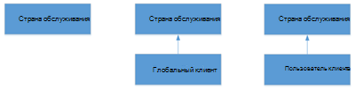

# Что такое абонентские группы?

Телефонная плана — это именованый набор правил нормализации, который преобразует номера телефонов конкретного пользователя в альтернативный формат (обычно E.164) для авторизации звонков и маршрутизации голосовой связи.

Телефонная группа состоит из одного или нескольких правил нормализации, которые определяют, как номера телефонов, выраженные в различных форматах, преобразуются в альтернативный формат. Та же строка набора может быть интерпретироваться и переводиться по-разному в разных наборах, поэтому в зависимости от того, какая из них назначена пользователю, один и тот же номер набора может быть переведен и перенаводиться по-разному. Может быть не более 1000 наборных планов клиента.

См. [создание телефонных планов клиента](create-and-manage-dial-plans.md) и управление ими.

## Область действия абонентской группы для клиента

Область действия абонентской группы определяет уровень иерархии, на котором возможно применение данной абонентской группы. Клиенты получают соответствующую телефонную шкалу с помощью параметров настройки, которые автоматически предоставляются при входе пользователей в Teams. Как администратор вы можете управлять и назначать уровни области действия телефонной группы с помощью Microsoft Teams центра администрирования или Удаленной powerShell.

В Teams есть два типа телефонных планов: на область обслуживания и на клиенте (для вашей организации). Для каждой страны или региона, в которых доступна телефонная система, определена плановая телефонная телефонная система обслуживания. Каждому пользователю автоматически назначена телефонная система страны обслуживания, которая соответствует расположению для использования, назначенной пользователю. Вы не можете изменить план набора страны обслуживания, но вы можете создать наборные планы на масштабе клиента, что увеличивает объем телефонной программы страны обслуживания. По мере подготовка клиентов они получают "эффективную телефонную план", которая является сочетанием страны обслуживания и соответствующей план набора номера клиента. Поэтому не обязательно определять все правила нормализации в наборах клиентов, так как они могут уже существовать в этой стране обслуживания.

Кроме того, можно разбить клиентский набор на две области: область действия клиента или область действия пользователя. Если клиент определит и назначит пользовательской телефонной сети, этому пользователю будет назначена эффективная телефонная плана для страны обслуживания и назначенной пользовательской телефонной программы. Если клиент определяет наборную план на клиенте, но не назначает план на пользовательском плане набора, этому пользователю будет назначаться эффективная телефонная плана для страны обслуживания и клиентской телефонной программы.

Ниже приводится модель наследования телефонных планов в Teams.

Ниже перечислены возможные эффективные абонентские группы.

 **Страна обслуживания** Если ни одна из клиентской телефонной программы не определена и пользователь не назначен пользователю, а пользователь не назначен, пользователь получит эффективную телефонную карту, связанную с стране обслуживания, связанной с местом использования.

 **Глобальный клиент — страна обслуживания** Если наборная группа пользователя клиента определена, но не назначена пользователю, предварительно задающий пользователь получит эффективную телефонную группу, состоящую из объединенной телефонной группы клиента и телефонной группы страны обслуживания, связанной с местом использования.

 **Пользователь клиента — страна обслуживания** Если для пользователя определена и назначена телефонная группа пользователя клиента, он получит эффективную телефонную группу, состоящую из объединенной клиентской телефонной группы пользователя и телефонной группы страны обслуживания, связанной с местом использования.

См. [создание наборных](create-and-manage-dial-plans.md) планов клиента и управление ими.

> [!NOTE]
> В сценарии, в котором к набраному номеру не применяются правила нормализации телефонной программы, строка набора по-прежнему будет нормализована до предварительного "+CC", где "CC" — это код страны использования пользователя, набираемого номера. Это относится к планам звонков, прямой маршрутике и конференциям по ЗВОНКОВ через ЗВОНКОВ. Кроме того, если в правиле нормализации клиентской телефонной программы вы округлите число, которое не начинается с "+", служба звонков попытается нормализовать номер, полученный от клиента Teams, на основе телефонной программы клиента и, если он не соответствует, в телефонной плане региона. Чтобы избежать двойной нормализации, клиентам прямой маршрутизации рекомендуется включить +, а затем удалить правила перевода с помощью линии связи. 

## Планирование абонентских групп клиента

Для планирования настраиваемых абонентских групп выполните следующие шаги.

- **Шаг 1** Решите, нужна ли настраиваемая телефонная плана для улучшения качества набора номера. Как правило, необходимо поддерживать набор номеров, не влияющих на E.164, например расширения или сокращенное national dialing.

- **Шаг 2** Определите, нужны ли глобальные или пользовательские наборные планы клиента. Наборные планы на уровне пользователей необходимы, если у пользователей разные требования к набору.

- **Шаг 3.** Определите допустимые шаблоны номеров для каждой из необходимых абонентских групп. Требуются только те шаблоны, которые не заданы в абонентских группах страны обслуживания.

- **Шаг 4.** Разработайте схему именования абонентских групп на уровне организации. Использование стандартной схемы именования обеспечивает согласованность работы, а также упрощает обслуживание и обновление системы.

## Создание новой телефонной программы

При создании абонентской группы следует указать необходимые сведения.

### Имя и простое имя

Для пользовательских наборов телефонных номеров следует указать описательное имя, которое определяет пользователей, которым будет назначена эта план. Поле Простое имя для абонентской группы предварительно заполнено строкой, производной от имени абонентской группы. Поле "Простое имя" доступно для редактирования, что позволяет создать для абонентских групп информативное соглашение об именовании. Поле Простое имя должно быть заполненным и содержать неповторяющееся значение. Рекомендуется разработать соглашение об именовании для всей организации и последовательно применять его для всех сайтов и пользователей.

### Описание

Рекомендуется указать общеупотребительное и узнаваемое название географического расположения или группы пользователей, к которому будет применена соответствующая абонентская группа.

### Префикс для внешнего доступа

Если пользователям нужно набирать одну или несколько начальных цифр (например, цифру 9) для доступа к внешней линии, можно указать префикс для внешнего доступа длиной до четырех символов (допускаются символы #, * и 0-9).

> [!NOTE]
> В случае указания префикса создавать дополнительное правило нормализации для него не требуется.

См. [создание наборных](create-and-manage-dial-plans.md) планов клиента и управление ими.

## Правила нормализации

Правила нормализации определяют, как преобразуются номера телефонов, указанные в разных форматах. Одна и та же строка номера может быть интерпретирована и преобразована по-разному, в зависимости от языкового стандарта, который применяется к набравшему ее пользователю. Правила нормализации могут потребоваться, если пользователям нужно набирать сокращенные внутренние или внешние номера.

Для набора номера должна быть назначена одна или несколько правил нормализации. Правила нормализации совпадают сверху вниз, поэтому важен порядок их появления в клиентской телефонной плане. Например, если в клиентской телефонной плане имеется 10 правил нормализации, будет попробована логика совпадения с номерами, начиная с первого правила нормализации, если совпадения нет, вторая и т. д. Если совпадение установлено, это правило используется и не требуется никаких усилий для того, чтобы совмедить какие-либо другие задатые правила. В заданной клиентской телефонной плане может быть не более 50 правил нормализации.

### Определение необходимых правил нормализации

Так как любая телефонная плана клиента фактически объединяются с телефонной планом страны обслуживания определенного пользователя, скорее всего, потребуется оценить правила нормализации для страны обслуживания, чтобы определить, какие правила нормализации нужно использовать. Для этого можно воспользоваться командлетом **Get-CsEffectiveTenantDialPlan**. Командлет использует удостоверение пользователя в качестве входного параметра и возвращает все правила нормализации, которые применяются к этому пользователю.

### Создание правил нормализации

Правила нормализации используют платформа .NET Framework регулярных выражений для указания шаблонов числов, которые используются сервером для перевода строк набора в формат E.164. Для создания правил нормализации можно указать регулярное выражение для проверки соответствия, и при обнаружении соответствия будет выполнено преобразование. После окончания настройки можно ввести тестовый номер, чтобы проверить работу правил нормализации.

Подробные сведения об использовании регулярных платформа .NET Framework см. в платформа .NET Framework [регулярных выражений.](/dotnet/standard/base-types/regular-expressions)

См. [создание и управление наборами](create-and-manage-dial-plans.md) телефонных планов для создания правил нормализации для ваших планов набора клиентов и управления ими.

> [!NOTE]
> Правила нормализации с первым необязательным токеном в настоящее время не поддерживаются на устройствах с 3pip (например, модели Polycom VVX 601). Если вы хотите применить правила нормализации с необязательностью на устройствах с 3pip, вместо одного следует создать два правила нормализации. Например, правило ^0? (999)$ следует заменить двумя правилами: (999)$ (Перевод:$1) и ^0(999)$ (Перевод:$1).

### Примеры правил нормализации

В следующей таблице приведены примеры правил нормализации, написанных в виде регулярных выражений .NET Framework. Эти примеры приведены только для справки, поэтому не следует рассматривать их в качестве рекомендаций по созданию правил.

 
 **Правила нормализации с платформа .NET Framework регулярных выражений**

| Имя правила  | Описание  | Шаблон номера  | Преобразование  | Пример  |
|:-----|:-----|:-----|:-----|:-----|
|4digitExtension    |Преобразует расширения из четырех цифр.    |^(\\d{4})$    |+1425555$1    |0100 преобразуется в +14255550100    |
|5digitExtension    |Преобразует расширения из пяти цифр.    |^5(\\d{4})$    |+1425555$1    |50100 преобразуется в +14255550100    |
|7digitcallingRedmond    |Преобразует номера из семи цифр в местные номера Редмонда.    |^(\\d{7})$    |+1425$1    |5550100 преобразуется в +14255550100   |
|RedmondOperator    |Преобразует 0 в номер оператора Редмонда.    |^0$    |+14255550100    |0 преобразуется в +14255550100    |
|RedmondSitePrefix    |Преобразует номера с внутрисетевым префиксом (6) и кодом Редмонда (222).    |^6222(\\d{4})$    |+1425555$1    |62220100 преобразуется в +14255550100    |
|5digitRange    |Преобразует расширения из пяти цифр, которые начинаются с цифры из диапазона от трех до семи включительно.    |^([3-7]\\d{4})$    |+142555$1   |54567 преобразуется в +14255554567    |
|ПрефиксAdded    |Добавляет префикс страны перед номером из девяти цифр с ограничениями для первой и третьей цифр.    |^([2-9]\\d\\d[2-9]\\d{6})$    |1$1    |4255554567 преобразуется в 14255554567    |
|NoTranslation    |Соответствует пяти цифрам, но преобразование не выполняется.    |^(\\d{5})$    |$1    |34567 преобразуется в 34567    |

 **Абонентская группа Редмонда основана на приведенных выше правилах нормализации.**

 В следующей таблице показан пример абонентской группы для города Редмонда (штат Вашингтон, США) на основе правил нормализации из предыдущей таблицы.

| Абонентская группа Редмонда  |
|:-----------------------|                                                                                                                      
| 5digitExtension   |                                                                                                                                    
| 7digitcallingRedmond   |
| RedmondSitePrefix   |
| RedmondOperator   |

> [!NOTE]
> Имена правил нормализации, показанные в предыдущей таблице, не содержат пробелов, но это можно сделать на свой выбор. Например, первое правило в таблице могло называться 5 digit extension или 5-digit Extension (добавочный номер из 5 цифр).

## Статьи по теме

[Создание и использование абонентских групп](create-and-manage-dial-plans.md)

[Типы номеров телефонов, используемые в планах звонков](different-kinds-of-phone-numbers-used-for-calling-plans.md)

[Управление номерами телефонов организации](manage-phone-numbers-for-your-organization/manage-phone-numbers-for-your-organization.md)

[Условия и положения, распространяющиеся на экстренные вызовы](emergency-calling-terms-and-conditions.md)

[Отказ от ответственности для экстренных вызовов](https://github.com/MicrosoftDocs/OfficeDocs-SkypeForBusiness/blob/live/Teams/downloads/emergency-calling/emergency-calling-label-(en-us)-(v.1.0).zip?raw=true)
